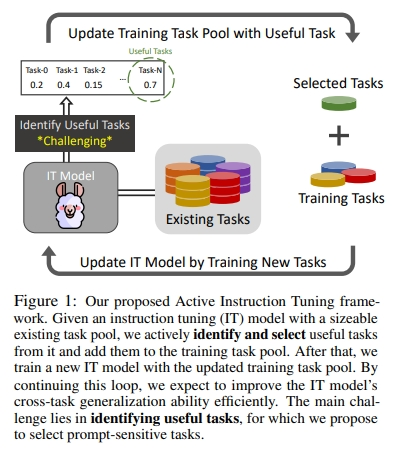
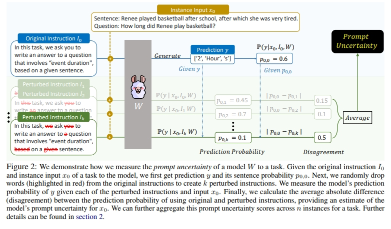
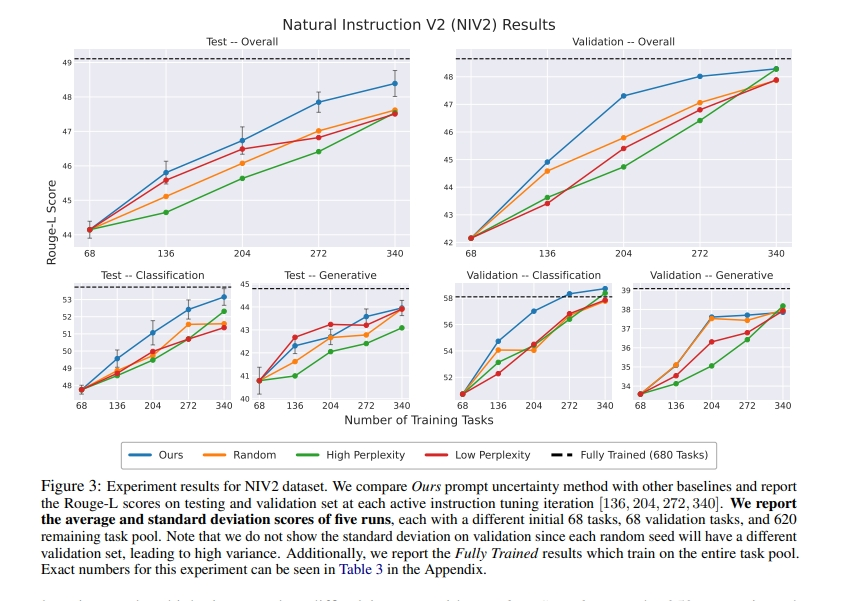
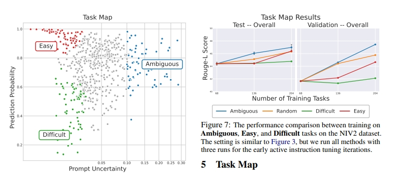

# Active Instruction Tuning：怎么更好的选择一个新任务来提高模型泛化性？

> 论文名称：Active Instruction Tuning: Improving Cross-Task Generalization by Training on Prompt Sensitive Tasks
> 
> 论文地址：https://arxiv.org/pdf/2311.00288.pdf

## 一、论文动机

从任务这一粒度（本质也是样本）来出发的即，怎么更好的选择一个新任务来提高模型泛化性。

## 二、论文思路

- 论文提出了一个Prompt Uncertainty概念：
  - 假设有一个原始样本对<prompt, response>，然后对prompt做一些扰动得到promot_v1，其中promot_v1还是要保留大部分prompt语义，然后将prompt和promot_v1分别传给模型，分别拿到response的输出，计算得到两者之间的likelihood值，该值即为Prompt Uncertainty。

> 注：这里的扰动作者采用的是随机drop掉部分单词。

- 理论假设：

从上下文学习的鲁棒性角度来看，如果模型不能稳定地将任务指令映射到特定的潜在概念（response），那么它对相应任务的泛化能力是有限的。

为了刻画量化这一假设，作者将其反映在对指令扰动的敏感性上，即假设在不确定prompt的任务上训练模型将提高其将prompt与特定潜在概念（任务）相关联的能力，从而在未见prompt的情况下获得更好的零样本性能。

作者将Prompt Uncertainty高的作为困难样本来进行active学习，为了说明当前方法的有效性，设计了三个baseline：

1. Random Sampling即随机抽样任务；
2. High Perplexity即在response上面高困惑度的任务；
3. Low Perplexity即在response上面低困惑度的任务。

## 三、论文实验

实验结果如下：可以看到当前方法是最好的。

除了Prompt Uncertainty，作者进一步算了Prediction Probability即模型对自己预测response的自信度。Prompt Uncertainty代表的是模型将一个prompt映射到特定概念的一致性，表明模型对任务的模糊性；Prompt Uncertainty表示模型执行任务的自信程度。有了这两个概念，作者将任务大概分为三类Easy、Difficult、Ambigous：

可以看到在Ambigous任务上可以有效的提高模型性能，而Easy、Difficult还不如随机抽取，特别是多加一些Easy任务还可以提高点，但是Difficult任务是没啥用的，作者认为这是因为Difficult太难了没法学。

说到这里不禁让笔者想到了WizardLM系列论文，他的核心是不断的进化出困难样本，而且很有效，本质原因就是既有简单样本又有困难样本，模型可以学到两者之间的diff也即有点对比学习的逻辑在里面，只学简单或者只学困难样本都是不行的，混在一起可能更好，甚至先学简单的，再学难的也可以尝试。

## 致谢

- 如何自动筛选高质量的指令微调数据喂给大模型？ https://mp.weixin.qq.com/s/YDIEhGdAejy4CSvN11PAXA