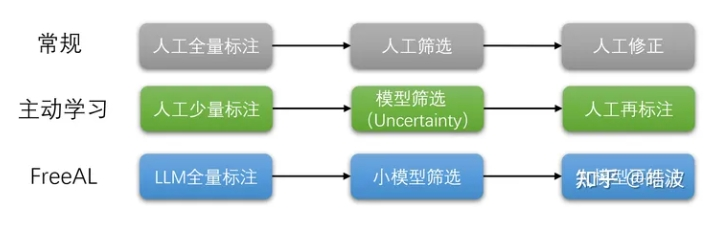
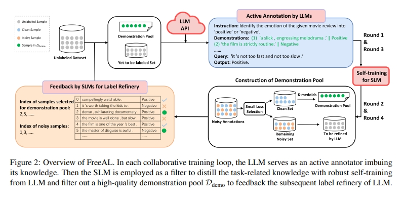

# EMNLP'23大模型时代的数据标注——FreeAL

> 论文名称：FreeAL: Towards Human-Free Active Learning in the Era of Large Language Models[J]. 
> 
> 论文地址： https://arxiv.org/pdf/2311.15614

## 一、论文背景

过去的5年里，弱监督学习——解决各种低质量的数据标注信息的一个方向——都是我的主要研究方向，也支撑着我完成了博士生涯。然而，在ChatGPT横空出世的时候，我一度非常焦虑，思考弱监督学习是否还有继续研究的必要（当然大家应该都在这么想）。如果大模型已经能够通过Few-shot ICL、Zero-shot完成绝大部分任务，那么弱监督将被扫进历史的垃圾堆。

恰巧当时，我们正在研究Distantly-supervised NER问题，顺手做了一下ChatGPT for NER，发现很奇怪的现象是，ChatGPT的zero-shot NER效果并不好，甚至比大部分DSNER的Baseline低。此时，有一篇工作[2]也发现，ChatGPT在绝大部分任务上的few-shot性能远远不如全监督训练的小模型，这也是大家目前比较认可的大模型在细分领域上是不够出色的。这个结论也不难解释，毕竟大模型在通用语料上进行训练，但没有真正曝光很多细分领域的监督数据，或者是这种通用任务的场景可能会导致模型产生一些负迁移作用。

也就是说，不论用大模型还是小模型，其实还是有很多问题：

1. 大模型：我们可以用Zero/few-shot ICL解决下游任务，人力标注几乎为0，但是光靠大模型呢，部署成本较高，效果不总是尽如人意。（精调成本更高）；
2. 小模型：直接用小模型的话，我们要收集很多标注数据，人力成本更高了。也许我们可以使用半监督、主动学习缓解一下标注成本，但总是需要一定的人力成本。

显然，数据标注仍然十分重要（毕竟数据是AI的“燃料”）。那么，如何能够在极低的人力成本条件下，达到更高的下游任务性能呢？我们的答案是大模型时代的主动学习技术FreeAL——大小模型协同工作，达到Human-Free的数据标注。

## 二、论文方法

要理解FreeAL，我们可以思考人类在数据标注的过程中做了什么。通常来说，我们会标完所有数据集，接着我们要做校验挑选出错误的数据，最后再进行修正，每个步骤都需要人力。

传统的主动学习呢，降低了第一步的标注成本，通过迭代标注小部分数据，然后通过模型的Uncertainty（或Feature-based Diversity）进行校验，筛选剩余有价值的样本进行再标注。这有两个问题，首先是，少量标注其实很难训练很好的模型，影响后续筛选的步骤，其次传统AL还是需要大量的人力成本，目前的AL论文大部分都得标10%~50%以上的数据才能达到较好的性能。

那么我们是否能够完全抛弃人工标注，自动化数据标注的过程呢？

1. 如何标注？ChatGPT可以作为一个完全无需人力的弱标注者，来全量标注整个数据集，当然这会带来一定的噪声。
2. 如何校验？传统AL能够提供一个启示，即小模型实际上是能够通过训练的过程自动挖掘一些样本来标注的。实际上，这也是弱监督学习里面一个重要的Topic——样本筛选，也就是定位干净样本，过滤出来错误的样本，两种样本分别用不同的技术进行处理。我们在IJCAI'23发表的ProMix算法就讨论了如何最大程度筛选干净样本，目前仍是CIFAR-N benchmark的SOTA方法。
3. 如何再标注？既然能定位到错误样本，那么也能找到干净样本，就可以用它们提升ICL的准确率，迭代演进。

没错，这就是我们FreeAL的框架——大模型提供标注，小模型进行蒸馏，再回流大模型进行更准的ICL。

### 2.1 大模型标注

对于大模型来说，我们要做的就是找到更多的示例样本去提升大模型的few-shot性能。不过，这在刚开始的标注轮次并不是显然的（毕竟我们选择了Human-Free这个完全抛弃人类标注的设定），所以本文我们选择让大模型自己生成一些demo样本，具体思想也比较简单，就是告诉ChatGPT，标签是什么，并给几个无标注样本作为示意，让大模型学习无标注文本的风格信息，然后生成符合标签信息的样本。那我们就可以用它得到一个初始的demo set，我们发现这在某些数据集（如SUBJ）可以提升28个点。

在后续的轮次呢，我们就等小模型筛选的结果去做ICL即可。

### 2.2 小模型蒸馏

这一块实际上我们采用了Small-Loss Selection的策略挑选干净样本，结合半监督完成噪声标记学习。相信做弱监督学习的同学应该不会陌生。不过，小模型训练的时候，其实筛选的“干净样本”里混一些错的也没什么问题，性能还是会提升，但是要做ICL的话，我们还是希望更干净的demo set，所以我们又根据loss逐类精心挑选了一些。这里逐类挑选还是为了考虑到diversity。最后，我们可以反馈给大模型进行修复即可。因为我们做了全量的标注，其实两个轮次基本就可以收敛到很好的结果。

## 三、总结

本文提纲如下
1. 数据标注依然重要，完全监督、弱监督的小模型在很多场景下比（未精调）大模型强；
2. 利用LLM进行标注是完全可行的，小模型可以协同进行过滤、精炼大模型的标签；
3. 弱监督学习、主动学习这两个领域，我想依然有活着的价值。

## 致谢

- EMNLP'23|大模型时代的数据标注——FreeAL  https://zhuanlan.zhihu.com/p/672287298

