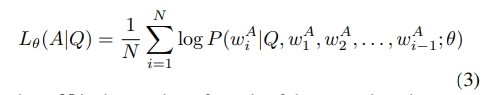
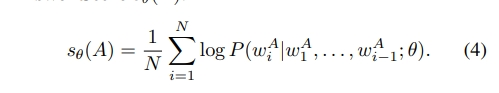
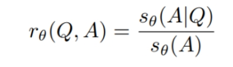
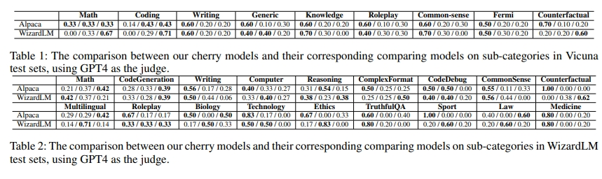
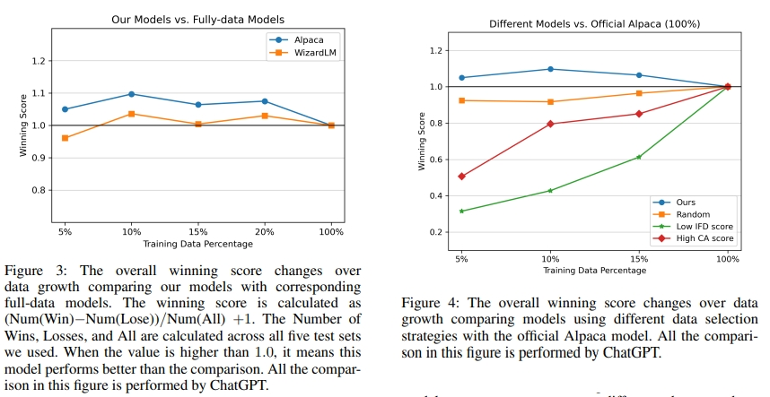

# From Quantity to Quality：如何挑选 具有增强LLM指令调优潜力的数据样例？

> 论文名称：From Quantity to Quality: Boosting LLM Performance with Self-Guided Data Selection for Instruction Tuning
> 
> 论文地址：https://arxiv.org/pdf/2308.12032.pdf
> 
> Github 地址：https://github.com/MingLiiii/Cherry_LLM

## 一、论文动机

如何挑选 **具有增强LLM指令调优潜力的数据样例**？

## 二、论文思路

### 2.1 Learning from Brief Experience

- 核心：选取有代表性的训练数据 训练 LLaMA
- 思路：

1. 使用base模型对数据进行向量化；
2. 将所有的SFT数据聚类，论文是聚了100个簇；
3. 从每个簇中心选10个代表样本，使用这些样本去训练基座模型（LLaMA ）得到一个初版的SFT；

### 2.2 Evaluating Based on Experience

- 核心：利用训练好模型计算原始数据中所有IFD指标
- 思路：

1. 使用训练好的模型对所有训练数据进行打分，计算CAS

> 模型输入为prompt，label为answer，计算得到的loss
> 
> SFT的loss
> 
> CAS越高，则模型根据prompt生成回答的难度越高

2. 使用训练好的模型打分，计算DAS

> 直接让模型续写回答，计算其loss
> 
> AR的loss
> 
> DAS得分越高，可能表明该答案对模型生成来说本身就更具挑战性或更复杂

3. 根据计算得到的CAS和DAS计算IDF

> 可以直接衡量给定prompt对模型生成答案的影响。
> 
> IFD越高表示该prompt的难道越高，即模型越难完成该任务

4. 将样本根据IDF进行排序选择5%的数据作为樱桃数据

### 2.3 Retraining from Self-Guided Experience

批量跑得到每个样本的IFD得分，然后选取较高得分（prompt困难样本）的样本，paper中称为cherry samples，用其重新训练模型。

## 三、论文实验

## 致谢

- 如何自动筛选高质量的指令微调数据喂给大模型？ https://mp.weixin.qq.com/s/YDIEhGdAejy4CSvN11PAXA
- 高质量数据From Quantity to Quality Boosting LLM Performance with Self-Guided Data Selection https://zhuanlan.zhihu.com/p/664562587