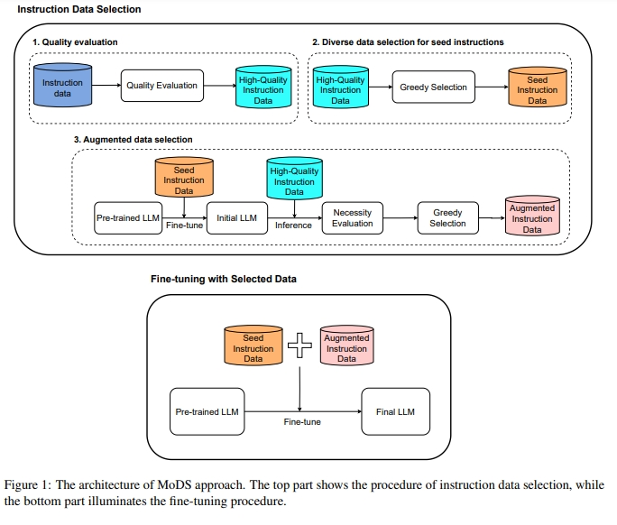
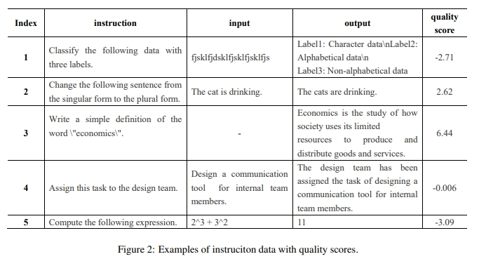
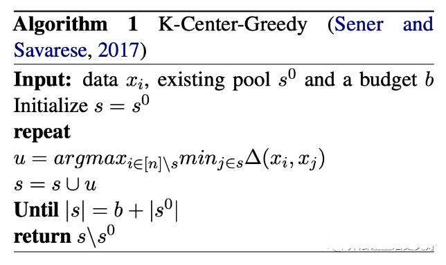
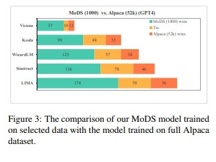
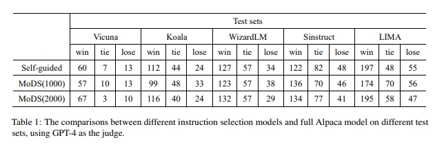

# MoDS: 如何自动筛选高质量数据？

> 论文名称：MoDS: Model-oriented Data Selection for Instruction Tuning
> 
> 论文地址：https://arxiv.org/pdf/2311.15653.pdf
> 
> GitHub 地址：https://github.com/CASIA-LM/MoDS

## 整体架构

## 一、论文动机

如何筛选出适合当前给定这个LLM的高质量数据，也就是说高质量是和模型深度绑定的。

## 二、“高质量”数据的标准是什么？

1. **质量**: **高质量的prompt**以及**对应的高质量response**可以很好的让模型学会遵循指令；
2. **覆盖率**: **prompt的多样性，越多样性越好**；
3. **必要性**: **同一条prompt对不同基座模型的重要度和必要性是不一样的**，如果一条prompt对于基座来说已经很好的输出response了，也就是说模型已经很好的遵循prompt了，不需要再训练了，相反则是模型需要的。

## 三、“高质量”数据的如何筛选？

既然定义好了上面三个维度，下面作者就逐个针对性的进行筛选：

1. Quality Evaluation

- 思路：基于模型打分筛选出高质量的SFT数据

> 打分模型：OpenAssistant/reward-model-deberta-v3-large-v2
> 打分模型链接：https://huggingface.co/OpenAssistant/reward-model-deberta-v3-large-v2/tree/main

- 打分case:

> 分数越高认为质量越高，最终是会选取一个门限值作为过滤。最终过滤得到High-Quality Instruction Data

2. Diverse Data Selection for Seed Instrucitons

经过上面过滤，可以得到一份高质量的SFT数据即High-Quality Instruction Data.

- 目的：**在这份高质量SFT数据集中继续过滤出一个子集，该子集的多样性要足够好，能表征整个数据集**。
- 方法：k-Center Greedy算法

- 核心做法：首先选一个初始点，然后每次迭代都选取离当前中心集合最远的点，最终得到一份Seed Instruction Data

3. Augmented Data Selection

- 动机：
  - Seed Instruction Data中的每条prompt对模型来说不一定都是需要的；
  - 被Diverse Data Selection for Seed Instrucitons阶段过滤掉的样本也不一定是模型不需要的；
- 思路：
  - 先用Seed Instruction Data训练了一下模型；
  - 然后用该模型去对High-Quality Instruction Data中的prompt进行推理得到response；
  - 然后同样用reward-model-deberta-v3-large-v2去打分筛选出得分低的那些样本，这些样本就是模型处理不好的，言外之意就是模型需要的样本，作者把这部分新筛选出了的样本叫做 augmented dataset

## 四、训练模型和结果

作者使用Seed Instruction Data + augmented dataset 来训练模型，具体的作者选用的初始数据是Alpaca、HC3、alpaca-evol-instruct等等混合而成，最终得到一份量级为214526的数据集。

测试集的选取的也是来着Self-instruct、LIMA等多个知名开源数据集。最终的打分借助的是GPT4打分。

作者训练的是Llama2，结果如下：

最终筛选过后的4k数据就能达到不错的效果。

## 致谢

- 如何自动筛选高质量的指令微调数据喂给大模型？ https://mp.weixin.qq.com/s/YDIEhGdAejy4CSvN11PAXA

