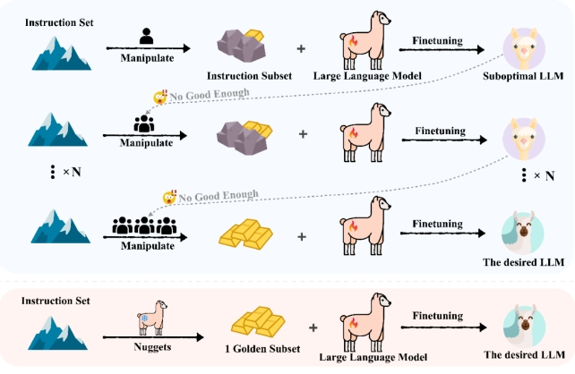
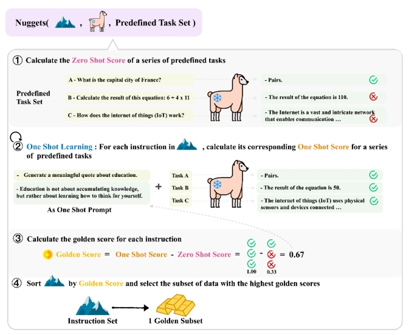
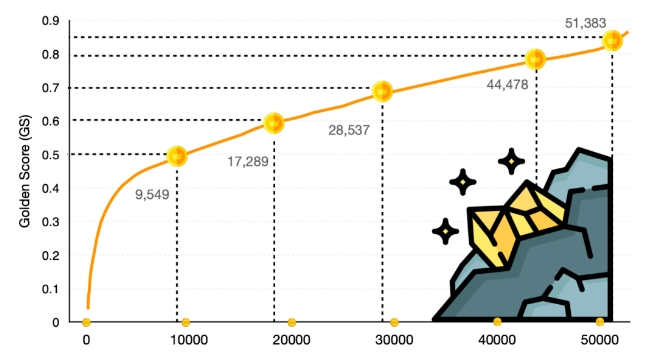
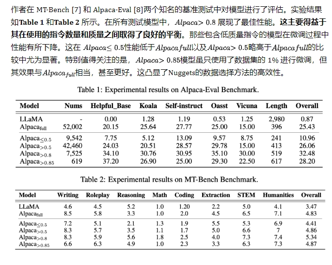
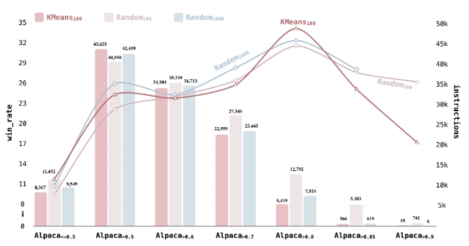
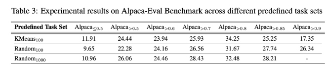
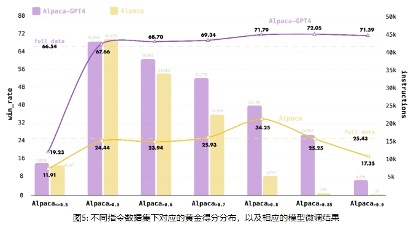

# 仅用1%的数据完胜全量数据微调模型!

- 论文名称：One Shot Learning as Instruction Data Prospector for Large Language Models
- 机构：
- 作者：Li, Yunshui and Hui, Binyuan and Xia, Xiaobo and Yang, Jiaxi and Yang, Min and Zhang, Lei and Si, Shuzheng and Liu, Junhao and Liu, Tongliang and Huang, Fei and others
- 论文地址：arxiv.org/pdf/2312.10302.pdf
- 相关领域：训练数据构建
- Github 地址：https://github.com/pldlgb/nuggets

## 一、动机

指令微调是大语言模型（LLM）训练中的一个关键环节，它不仅激活了模型在预训练阶段获得的知识，还使模型能够以更流畅和自然的方式与人类进行交流。在指令微调的工作中，人们投入了大量精力来收集更大、更多样、更复杂的数据集，这通常是通过人工众包或从更大的模型中蒸馏出数据来实现的。

- 问题一：**数据集质量对模型微调效果的影响**。虽然用于指令微调的数据集规模在不断扩大，但有研究表明[1]，**相对规模较小但质量高的数据集在激发大语言模型（LLM）的潜能方面可能更为有效。盲目增加指令数据的量而忽视质量，可能会引入误导信息，从而导致模型产生错误的输出**。
- 问题二：**选取指令数据缺乏统一标准**。正如图 1 所示，**常规的做法是依靠实践经验来选择数据，并根据实际效果来微调数据组合，这种试错的方法增加了模型微调的成本并且可能存在一定的偏差**。作者认为，在庞大的数据中肯定有最佳的指令组合，但如何高效、低成本地找到这些组合还有待进一步探索。

> 图1: Nuggets（橙色区域）与经验性方法（蓝色区域）的比较，不同于经验性方法，Nuggets能够直接抽取高质量的子集用于模型微调。

## 二、论文方法

论文中提出了一种名为“Nuggets”的方法，意欲**从堆积如山的指令微调数据中挖掘出黄金数据**。这种方法利用大语言模型（LLM）自身作为数据探索工具，通过**One shot learning** 或者说是 **In context learning**，从庞大的指令数据集中挑选出有益的数据。直观来说，**如果某个指令对于某个特定任务的少样本学习(Few shot learning)有帮助，那么这个指令就值得被用于训练。如果这个指令能对多个任务有益，那么它就应该成为主要的数据重点**。另外，有研究显示[2,3,4]，In context learning通过提示(Demonstrations)来隐式微调模型，相当于语言模型在幕后以元优化器的角色进行梯度下降操作。因此，利用在In context learning下的性能来预测指令微调的效果是很有前景的。

## 三、论文整体思路

> 图2: Nuggets 方法框架的示意图。值得注意的是，作者并不是直接让模型生成答案来进行评估。而是通过计算模型对实际正确答案的 logit 得分，来得出零样本（zero shot）得分或单样本（few shot）得分。

1. 利用一系列**预定义的任务(Predefined Task Set)来测试大语言模型在不同任务上的表现，这个测试结果称为零样本得分(Zero Shot Score)**。
2. 把指令数据集中的每个示例当作单样本提示(One Shot Prompt)，将其拼接在预定义任务之前，再次评估模型对这些任务的处理能力，这个评估结果称为单样本得分(One Shot Score)。
3. 通过比较单样本得分和零样本得分的差异，为每个指令计算出一个黄金得分(Golden Score)。**在宏观层面，黄金得分用于衡量模型在接受了特定指令的少样本学习(One Shot Learning)后所实现的性能提升幅度，也即相当于衡量如果将这个指令用于模型的微调后模型能力的提升幅度**。
4. 一旦获得所有指令的黄金得分后，就可以挑选出那些拥有高黄金得分的关键样本，作为黄金子集(Golden Subset)，仅用这些样本对基础模型进行指令微调，以期达到比使用整个数据集更优的效果。

> 注：预定义的任务（Predefined Task Set）：主要目的是评估模型在多样化任务上的泛化能力，因此只要预定义任务集包含了足够的数据量并覆盖了多种任务类型，它就被视为是适用的。由于 Alpaca 数据集本身就是多任务的数据集，作者从中随机挑选了 1,000 个例子，构成预定义的任务集。

## 四、论文实验

### 4.1 黄金分数分布

为了验证“Nuggets”方法的有效性，作者使用 LLaMA [5] 作为基础模型，首先采用Alpaca指令数据集[6]进行实验，Alpaca 数据集包括了总共 52,002 个指令示例，

> 图3: 黄金得分（Golden Score)在Alpaca数据集上的分布情况

黄金得分（Golden Score)的分布情况如图3所示，其中，有42,460 个指令的得分超过了 0.5。特别关注那些得分超过 0.8 和 0.85 的指令，因为它们倾向于被认为是高质量的指令。其中得分超过 0.8 的示例有 7,525 个，得分超过 0.85 的则有 619 个，后者仅占整个数据集的 1%。作者使用这些不同得分的指令示例子集对 LLaMA 进行了指令调整，包括得分低于 0.5、高于 0.5、高于 0.8、高于 0.85 和完整数据集。

### 4.2 模型微调结果

### 4.3 预定义任务集的消融实验

为了评估不同的预定义任务集对指令数据选择的影响，文中引入了两种额外的预定义任务集变体。第一种是从 Alpaca 数据集中随机抽取的样本，但限制任务集的大小为 100 个样本。第二种是利用 KMeans 算法将 Alpaca 数据集分成 100 个类别，并选取每个类别的中心点作为预定义任务集的样本。作者使用这两个预定义的任务集分别对 Alpaca 数据集进行黄金得分（Golden Score）的打分，其分布情况如图 4 所示。作者根据黄金得分的不同阈值（小于或等于 0.5、大于 0.5、大于 0.6、大于 0.7、大于 0.8、大于 0.85、大于 0.9）选择指令数据，分别用于模型的微调。

> 图4: 不同预定义任务集下，黄金得分的分布情况以及对应的微调模型在Alpaca_eval上的结果

Table 3 的结果显示，在随机抽样的情况下，增加任务集的规模能够提高识别高质量指令数据的能力。这是因为更大的任务集包含了更丰富的数据多样性，有助于更精准地评估指令对于模型在各种任务上泛化能力的影响。但当采用 KMeans 算法精选更具代表性的样本作为任务集时，情况发生了变化。即使仅有 100 个样本，KMeans 的效果也超过了随机抽样获取的 1,000 个样本。在这个案例中，仅使用 5,419 个样本的 Alpaca_{>0.8} 就实现了优异的性能，相比之下，随机抽样的 1,000 个样本（Random1000）需要使用 7,524 个样本。这一结果还间接证明了文中对于黄金得分的假设是有效的。

### 4.4 指令数据集的消融实验

为了深入探索 Nuggets 在不同指令数据集上的泛化能力，作者采用了 Alpaca-GPT4 数据集 [9] 进行了一系列实验。该数据集利用强大的 GPT-4 模型 [10] 生成指令数据，其数据质量被认为更为卓越。此外，它指令中Question与 Alpaca 数据集相同，便于直接进行比较。受到表 3 的启发，作者在 Alpaca-GPT4 数据集上应用 KMeans 算法选取了 100 个样本，形成了预定义的任务集。然后，作者使用 Nuggets 方法对 Alpaca-GPT4 数据集中的所有指令进行黄金得分的评分，如图 5 所示。与 Alpaca 数据集相比，Alpaca-GPT4 数据集拥有更多高黄金得分的指令：超过 0.8 的指令有 25,100 个，超过 0.85 分的有 16,943 个，超过 0.9 分的有 4,250 个。这些数字远超 Alpaca 数据集中的对应指令。这也表明，黄金得分可以作为衡量指令数据质量的一个重要指标。在 Alpaca-GPT4 数据集上进行模型微调的结果与之前的实验保持一致。在 Alpaca-Eval 的评估中，那些仅用黄金得分不高于 0.5 的子集进行微调的大语言模型表现最差，win_rate仅为 19.23%。相反，那些用黄金得分高于 0.85 的子集进行微调的模型表现出色，win_rate高达 72.05%。这种成功归因于这一特定子集中数量和质量的双重保障。值得强调的是，使用小型且高质量的数据集进行微调，其效果始终显著优于在整个数据集上进行的微调。总的来说，使用 Alpaca-GPT4 数据集微调的模型显著优于使用 Alpaca 数据集的模型，这也间接证明了 Alpaca-GPT4 数据集相比于 Alpaca 数据集具有更高的质量。

## 致谢

- 这你受得了么？仅用1%的数据完胜全量数据微调模型！ https://mp.weixin.qq.com/s/kbUqYmTb76E0OVjwHQeMaw

