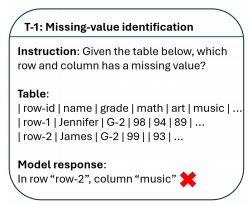
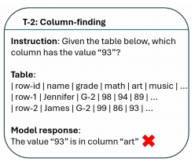
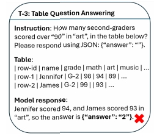
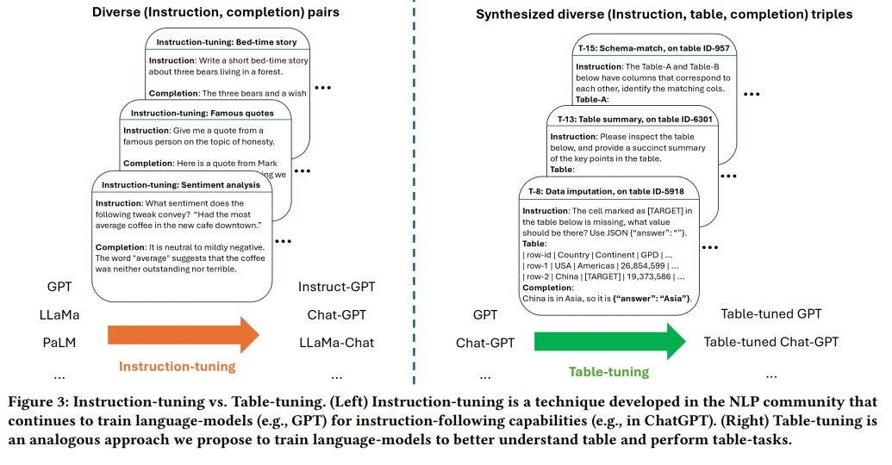
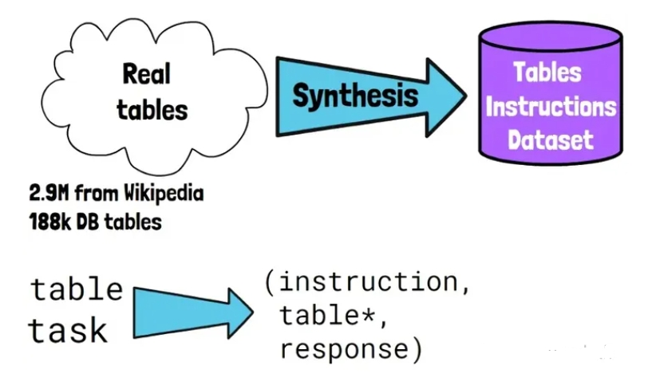
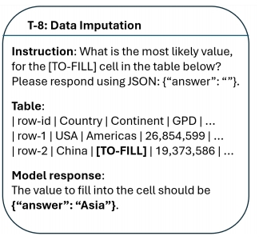
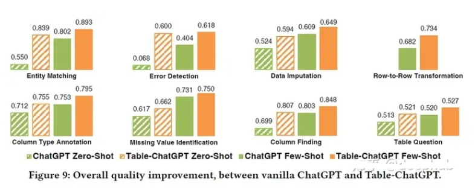
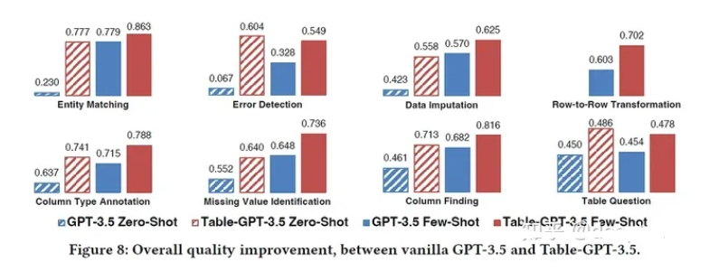

# Table-GPT: 一种让大语言模型理解表格数据的 GPT

> 论文名称：Table-GPT: Table- tuning GPT for Diverse Table Tasks
> 
> 论文地址：https://arxiv.org/abs/2310.09263

## 前言

llm对文本指令非常有用，**但是如果我们尝试向模型提供某种文本格式的表格数据和该表格上的问题，LLM更有可能产生不准确的响应**。

在这篇文章中，我们将介绍微软发表的一篇研究论文，“Table-GPT: Table- tuning GPT for Diverse Table Tasks”，研究人员介绍了Table-GPT，**一种针对该问题的GPT模型，可以更好地理解输入中的表并产生准确的响应**。我们将解释这篇论文，以了解如何创建Table-GPT，以及与其他大型语言模型相比它的性能如何。

## 一、动机

让我们从目前的大型语言模型是否能够理表的问题开始。大型语言模型大多是在来自网络或书籍的自然语言文本和代码上进行预训练的。表格数据不同于自然语言文本和代码，因此**llm可能无法可靠地读取表格**。**一个主要的区别是文本和代码是一维的，而表格是二维的。对于表格，为了能够回答某些类型的问题，能够垂直阅读是很重要的**。

llm 读取表格 会出现以下问题：

- 问题一：缺失值识别

> 解释：从上图可以看到用于查找表中缺少值的行和列的指令。第2行中“art”列的值缺失，但是经过测试的语言模型能够得到行，但列是错误的。这样的例子意味着**模型更擅长水平推理而不是垂直推理**。实际上，当在1000个样本上评估ChatGPT时，ChatGPT提供了92.3%的正确行号和42.2%的正确列。研究人员将这项任务称为“missing-value identification”。

- 问题二：缺失值识别

> 解释：在列过滤任务中可以看到（这里的指令是查找哪个列有某个值）“art”的回答是不准确的，因为它应该是“music”。ChatGPT能够在69.9%的情况下为该任务获得正确的列。

- 问题三：表格问题解答

> 解释：针对更复杂表格问答任务（根据表格提出问题）。有多少二年级学生的美术成绩超过90分，可以看到模型的回答是2，而Jennifer的分数是94,James的分数缺失，所以答案应该是1。ChatGPT仅在51.2%的情况下为该任务提供了正确的结果。

以上任务可以看到，针对于表格的理解，目前的LLM还存在缺失

## 二、论文优化策略

### 2.1 优化策略一：表调优

- 目标：如何创建一个在这些表格任务上做得更好的模型？
- 方法名称：表调优（Table-tuning）方法
- 思路：

表调优可以在预训练的LLM上运行，也可以在指令调优的LLM上运行，如果在表指令数据集上微调模型。数据集中的每个样本都是一个带有指令、表和响应的三元组，类似于前面看到的示例。

> 左侧指令调优，大型语言模型在指令和响应元组上进行训练，在这里称为补全，以创建聊天专家语言模型，如ChatGPT。
> 
> 在右边表调优，其中使用指令、表和响应的三元组进一步训练大型语言模型(如GPT)或指令调优模型(如ChatGPT)，以便创建模型的表调优版本。

### 2.2 优化策略二：创建数据集:合成增强

- 动机：用于表调优的数据集是如何创建的呢？
- 方法名称：合成增强方法
- 思路：

首先注意到，现有标记数据的多样性有限。所以目标是创建一个多样化的足够大的标记数据集，但不需要昂贵的人工标记。从大量真实的表开始，没有说明或标签，其中290万张表来自维基百科，18.8万多张是数据库表。

1. 第一步是合成

生成标记表指令的数据集。在每个合成步骤中，从一组支持的任务中采样一个真实的表和一个任务，创建(指令、表、响应)的新样本。生成的示例中的表不一定与输入表相同。在前面已经看到的示例中，我们对数据输入任务进行采样，其中模型需要填充缺失的值。我们对一个表进行采样，并用[TO-FILL]标记随机替换一个单元格，并使用原始单元格值作为标签。对于指令可以手工制作它们，并在具有不同表的相同任务的其他示例中重用它们。

另一个例子是查找列，其中要求确定哪个列包含某个值。对于一个采样表，可以检测到在表中只出现一次的值，并自动生成查找该值的指令，在本例中为“93”。我们使用值的列作为标签，比如是“music”。

研究人员还为其他各种任务合成了数据，比如错误检测，其中一个错别字被自动注入到随机单元格中，原始单元格的值被用作标签。另一种是表摘要，其中使用维基百科表的标题作为标签。我们可以从论文的下表中看到不同任务的总结。

2. 第二步是增强阶段

在合成步骤之后，就已经有了一个多样化的表指令数据集，为了创建更多样化的数据集，论文使用了三种类型的增强。

指令级增强——指令在同一任务的不同实例之间共享。例如，如果要求模型总结一个表，指令可以对不同的表保持相同。为了避免过度拟合并创建更多样化的样本，研究人员使用llm来解释手工制作的指令。

表级增强——通过改变表本身来创建更多的样本，但不改变表的语义。通过重新排序列或行来实现这一点，这基本上不会影响表的语义。

标签级\响应级增强-通过提供具有正确答案的LLM来创建额外的样本，并要求它为答案添加推理。

## 三、论文效果

8种任务类型的结果，绿色条形图是ChatGPT，橙色条形图是表调优版本。通过表调优，可以清楚地看到大多数任务的改进。值得注意的是错误检测，其中表调优版本的零样本性能得到了显着提高。底部的4个图表是表调优模型没有训练的任务，但它仍然能够在ChatGPT之上提高性能。

GPT 3.5 vs表调优

上图中可以再次看到类似的趋势，GPT 3.5是蓝色的，而表调优版本是红色的。它也获得了更好的性能，并且能够很好地泛化我们在底部的4个图表中看到的未知任务。

## 致谢

- Table-GPT:让大语言模型理解表格数据：https://zhuanlan.zhihu.com/p/663412729