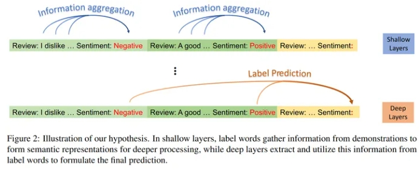
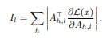

# 从信息流角度理解In-Context Learning

> 论文名称：Label Words are Anchors: An Information Flow Perspective for Understanding In-Context Learning
> 
> 论文地址：https://aclanthology.org/2023.emnlp-main.609/
> 
> Github 地址：
> 
> 会议：EMNLP 2023

## 论文要点

1. 本文对LLM的上下文学习ICL的作用机制提出了两个假设，并通过saliency score验证了这两个假设；
2. 基于这两个假设，提出了：
   1. 提升ICL性能的方法；
   2. 提升ICL的inference效率的方法；
   3. 对于实际问题错误分析；

## 一、要点1：上下文学习的作用机制假设

> 图1：对于标签词作为锚的信息流具体两个假设的图示

> 标签词作为锚的信息流 H1 ：在LLM的浅层，标签词聚集示例具体内容的信息，为深层形成语义表示。H2 ：在LLM的深层，模型从聚集后的标签词位置中提取信息，形成最终预测。

### 1.1 Information flow 的构造

本文提出的一种受启发于saliency score的信息流表示方法；

表示第l层的saliency matrix，其通过对该层所有注意力矩阵A（h表示第h个注意力头）进行显著分数计算得到；

## 致谢

- 【EMNLP 2023 Best Paper Award】从信息流角度理解In-Context Learning https://zhuanlan.zhihu.com/p/671460818

