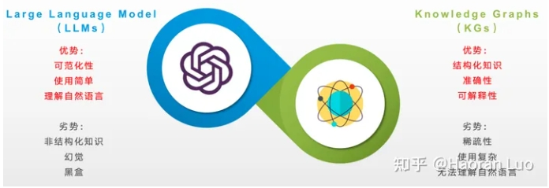
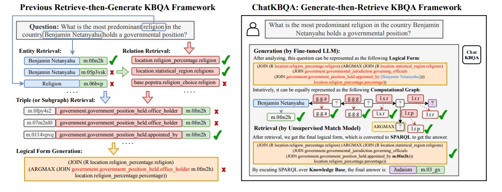
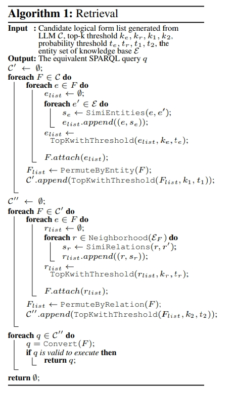

# ChatKBQA：基于微调大语言模型的知识图谱问答框架

> 论文名称：ChatKBQA: A Generate-then-Retrieve Framework for Knowledge Base Question Answering with Fine-tuned Large Language Models
> 
> 论文地址：https://arxiv.org/abs/2310.08975
> 
> Github 地址：https://github.com/LHRLAB/ChatKBQA

## 前言

随着ChatGPT 的问世，属于大模型的时代就此开始。无可否认，大型语言模型（LLMs）如ChatGPT和GPT4在自然语言处理和人工智能领域中展现出了无与伦比的优势，它们凭借“大数据、大算力、强算法”的支持，不仅具有优越的文本生成能力，还拥有深度的语义理解能力。但是，尽管LLMs在这些领域中显示出强大的实力，**其操作过程却如同一个不透明的黑箱，具体的决策逻辑难以被跟踪和解释。这就意味着在实际应用中，它可能无法完整、准确地呈现背后的知识体系，同时也有可能产生错误的答案**。

另一方面，知识图谱（KGs），例如Wikidata、Freebase和DBpedia，通过图谱结构，显式地呈现了大量事实性知识及其间的关联。这种结构化的方式让人们能够更直观地看到知识的连贯性和丰富性，从而在推理和问答等任务中获得更高的可解释性。**但知识图谱规模庞大，创建和维护需要付出巨大努力，并且天然无法使用自然语言进行问答和查询，这无疑增加了其在实际应用中的困难度。**

> 大模型（LLMs）与知识图谱（KGs）优劣势对比

不难发现，**大模型所缺少的可解释性以及推理过程和依据正是知识图谱的优势所在，而知识图谱的复杂性和对自然语言的陌生又是大模型旨在解决的问题**，那么二者能否相结合从而达到完美互补的效果呢？在这种背景下，ChatKBQA应运而生。

ChatKBQA在**利用大模型强大的学习能力以及自然语言理解能力的同时，利用知识图谱的准确性和可解释性来弥补了大模型可能的幻觉现象以及本身的黑盒短板，将知识从大模型中解耦出来，实现可解释推理问答的LLM+KG新范式，对医疗、法律等专精垂域知识库上的可解释推理问答提供了新思路**。

## 一、论文动机

- 研究问题：利用微调开源大模型进行自然语言问题到逻辑形式的转换，再利用无监督实体关系检索生成图数据库查询语言，实现自然语言的知识图谱问答框架。

### 1.1 知识库问答（KBQA）局限性

- 知识库问答（KBQA）思路：
  - **知识检索（knowledge retrieval）**：**根据问题从KB中定位最相关的实体、关系或三元组，从而缩小考虑范围**；
  - **语义解析（semantic parsing）**：**将问题从非结构化自然语言转化为结构化的逻辑形式（logical form），然后可以将其转化为可执行的图数据库查询语言（例如SPARQL）以获得精确的答案和可解释的路径**。

> 以往的检索-再生成知识库问答（KBQA）框架示例（左）与本文提出的生成-再检索KBQA框架ChatKBQA（右）对比

- 知识库问答（KBQA）存在问题：

1. **检索效率低**：传统方法首先确定候选实体的范围，然后进行实体检索和关系检索。由于自然语言问题的结构与知识库事实不同，大多数方法需要为提取和链接训练专用模型，效率较低；
2. **错误的检索结果会对语义解析产生误导**：传统的方法还将检索到的三元组作为参考的输入提供给seq2seq模型，与原始问题一起。然而，由于检索到的三元组并不总是准确的，它们会对语义解析结果产生不利影响。此外，如果检索到的三元组很多，seq2seq模型需要更长的上下文长度；
3. **以往方法多个处理步骤使得KBQA成为一个复杂的任务**：以前的研究将KBQA任务分解为多个子任务，形成了一个复杂的流水线处理，这使得复制和迁移变得困难。在大型语言模型（LLMs）改造传统自然语言处理任务的时代，利用大模型重塑KBQA范式的方式成为了可能

## 二、论文整体思路

- 论文方法：提出了ChatKBQA，**这是一种基于微调开源LLMs（大型语言模型），如Llama-2-7B，ChatGLM2-6B和Baichuan2-7B等，的新型生成-检索KBQA框架**；

1. 首先微调生成逻辑形式，然后对生成的逻辑形式中的实体和关系在知识库中的实体库和关系库分别做检索，避免了以前方法存在的先检索对逻辑形式生成的影响，并提高检索效率；
2. 在生成阶段，使用指令微调技术对开源LLMs进行微调，赋予它们感知和生成逻辑形式的能力

## 三、相关工作（Related Work）

### 3.1 知识库问答（KBQA）

知识库问答（KBQA） 分为 基于信息检索（IR-based）和基于语义解析（SP-based）的方法：

1. 基于信息检索的方法
   1. 介绍：根据自然语言问题从知识库（KBs）中检索相关的事实三元组或文本，形成一个子图来确定答案；
   2. 代表：
      1. KV-Mem通过在内存访问期间使用不同编码来增强文档阅读；
      2. GRAFT-Net从包含文本和KB实体的问题特定子图中提取答案；
      3. PullNet、EmbedKGQA、NSM+h、TransferNet、Relation Learning、Subgraph Retrieval、UniK-QA和SKP引入了创新的机制和框架来优化与子图相关的KBQA模型。
2. 基于语义解析的方法
   1. 介绍：侧重于将问题翻译成可对知识库执行的逻辑形式（logical form）
   2. 代表：
      1. SPARQL、查询图和S表达式。一些基于语义解析的方法；
      2. 如STAGG、UHop、Topic Units、TextRay、QGG、EMQL、GrailQA Ranking、Rigel、UniKGQA、BeamQA、HGNet、StructGPT和PanGu，采用逐步查询图生成和语义解析的搜索策略；
      3. 其他基于语义解析的方法，如ReTraCk、CBR-KBQA、RnG-KBQA、Program Transfer、TIARA、ArcaneQA、GMTKBQA、Uni-Parser、UnifiedSKG、DECAF和FC-KBQA，采用序列到序列模型生成S表达式，并为语义解析过程提供了不同的增强放阿飞。

### 3.2 大语言模型

随着ChatGPT和GPT-4的推出，展示了具有大量参数的仅解码大型语言模型（LLMs）的威力，这些模型表现出新兴现象，许多传统的自然语言处理任务正在变得更加简化。随后，出现了开源模型，如Llama-2-7B，ChatGLM2-6B和Baichuan2-7B，可以使用指令微调技术进行监督微调（SFT），例如LoRA、QLoRA、P-Tuning v2和Freeze，增强了LLMs在特定任务中的能力。虽然LLMs通常会产生幻觉，但技术如Chain-of-Thought（CoT）、Tree of Thoughts（ToT）、Graph-of-Thought（GoT）和Program of Thoughts（PoT）在一定程度上减轻了这些幻觉，但仍会发生事实错误。因此，由大模型生成知识库上的可解释图查询是可解释且需要外部知识的问题回答的一种有前途的方法。

### 3.3 KBQA的知识检索

一般的检索方法通常分为：

- 传统的词汇模型，如BM25；
- 密集检索模型，如密集通道检索（DPR），SimCSE和Contriever

在KBQA任务中，为了更好地利用来自知识库的与问题相关的知识，需要高效的检索算法来提取最相关的知识。

- ELQ和FACC1是常用的实体检索方法；
- CBR-KBQA和RnG-KBQA都采用ELQ进行基于密集检索的实体链接；
- GMT-KBQA则通过FACC1补充ELQ的检索结果，增强了候选实体的覆盖范围；
- 对于关系检索，GMT-KBQA采用了一个双编码器和交叉编码器架构的两阶段关系检索模块，并利用FAISS进行邻近关系检索。
- TIARA利用交叉编码器学习问题和模式之间的交互表示，基于匹配分数对类别和关系进行排名。

## 四、背景概念（Preliminaries）

### 4.1 什么是 知识库（KB）？

一个知识库 K = {(s, r, o)|s ∈ E, r ∈ R, o ∈ E ∪ L} 是一个RDF图，由三元组 (s, r, o) 组成，其中 s 是实体，r 是关系，o 可以是实体或文字。

> 实体集合 E 中的每个实体 e ∈ E 都用唯一的ID表示，例如 e.id="m.0fm2h"，并且可以查询以获取实体的英文标签，如 e.label="Benjamin Netanyahu"。
> 关系集合 R 中的每个关系 r ∈ R 都包含多层标签，例如 r="government.government position held.appointed by"。此外，文字值 l ∈ L 通常是“整数”（例如，l="32"）、“浮点数”（例如，l="3.2"）、“年份”（例如，l="1999"）、“年月”（例如，l="1999-12"）或“日期”（例如，l="1999-12-31"）

### 4.2 什么是 逻辑形式（logical form）？

逻辑形式是自然语言问题的结构化表示。以S表达式为例，逻辑形式通常由投影和各种运算符组成。投影操作表示在s或o上进行三元组 (s, r, o) 的一跳查询，其中，(?, r, o) 表示为 (JOIN r o)，而 (s, r, ?) 表示为 (JOIN (R r) s)。各种运算符包括“AND”(AND E1 E2)，表示获取 E1 和 E2 的交集， “COUNT”(COUNT E1)，表示对 E1 进行计数，“ARGMAX”(ARGMAX E1 r)，表示在 r 关系中对 E1 投影后得到的最大文字值，“ARGMIN”(ARGMIN E1 r)，表示在 E1 上投影 r 关系后得到的最小文字值，“GT”(GT E1 l)，表示获取大于 l 的 E1 部分，“GE”(GE E1 l)，表示获取大于等于 l 的 E1 部分，“LT”(LT E1 l)，表示获取小于 l 的 E1 部分，“LE”(LE E1 l)，表示获取小于等于 l 的 E1 部分，其中 E1 或 E2 表示子层逻辑形式。

### 4.3 什么是 知识图谱问答（KBQA）？

对于KBQA任务，给定一个自然语言问题 Q 和一个知识库 K，我们首先需要将 Q 转化为逻辑形式 F = Sp(Q)，其中 Sp(.) 是语义解析函数。然后将 F 转化为等效的SPARQL查询 q = Convert(F)，其中 Convert(.) 是固定的转换函数。最后，通过执行 q 对 K 进行查询，得到最终的答案集合 A = Execute(q|K)，其中 Execute(.) 是查询执行函数。

## 五、论文方法

### 5.1 ChatKBQA的概述

ChatKBQA是一个使用经过微调的开源大模型的生成-然后检索的知识库问答（KBQA）框架。

1. 首先，ChatKBQA框架需要通过指令调整在KBQA数据集中的（自然语言问题，逻辑形式）对来高效微调开源大模型；
2. 微调后的大模型用于通过语义解析将新的自然语言问题转化为相应的候选逻辑形式；
3. 然后，ChatKBQA在短语级别检索这些逻辑形式中的实体和关系，并在将其转化为SPARQL后搜索可以针对知识库执行的逻辑形式；
4. 最后，通过转化获得的SPARQL用于获取最终的答案集，并实现对自然语言问题的可解释和需要知识的回答。下图给出了ChatKBQA 的整体框架描述。

### 5.2 对大模型进行高效微调

#### 5.2.1 如何 构建指令微调的训练数据？

1. 首先将KBQA数据集中测试集的自然语言问题对应的SPARQL查询转化为相应的逻辑形式；
2. 然后将这些逻辑形式中的实体ID（例如“m.06w2sn5”）替换为相应的实体标签（例如“[Justin Bieber]”），从而使大模型能够更好地理解实体标签，而不是无意义的实体ID；
3. 然后，我们将自然语言问题（例如“What is the name of justin bieber brother?”）和处理后的对应逻辑形式（例如“(AND (JOIN [people, person, gender] [Male]) (JOIN (R [people, sibling relationship, sibling]) (JOIN (R [people, person, siblings]) [Justin Bieber])))”）组合成“输入”和“输出”，并添加“指令”为“生成一个逻辑形式查询，检索与给定问题相对应的信息”；
4. 构成了针对开源大模型的指令微调训练数据。

#### 5.2.2 如何 减小对具有大量参数的大模型进行微调的成本？

ChatKBQA使用参数高效微调（PEFT）方法，仅微调少量模型参数，以实现与完全微调相当的性能。

> 其中，
> LoRA通过使用低秩近似来改变微调期间大语言模型的权重，从而减小内存占用。
> QLoRA通过将梯度传播到冻结的4位量化模型，同时保持完全16位微调任务的性能，进一步减小内存使用
> P-tuning v2采用了一种前缀微调方法，将可微调参数添加到输入前的每个层。
> Freeze通过仅微调变换器的最后几层的全连接层参数而冻结所有其他参数，加速模型的收敛。

ChatKBQA可以在所有上述高效微调方法以及大模型之间切换，如Llama-2-7B和ChatGLM2-6B。

### 5.3 微调后的大模型进行逻辑形式的生成

**经过微调，大模型已经拥有了一定的自然语言问题转化为逻辑形式的语义解析能力。**

因此，我们使用经过微调的大模型对测试集中的新问题进行语义解析，发现大约63%的样本已经与基准逻辑形式完全相同。当我们使用beam search时，大模型输出的候选逻辑形式列表C中，包含了约74%的样本与基准逻辑形式一致，这表明经过微调的大模型在语义解析任务的学习和解析能力方面表现出色。

此外，如果我们将生成的候选逻辑形式中的实体和关系替换为“[]”（例如，“(AND (JOIN [] []) (JOIN (R []) (JOIN (R []) []))”），形成逻辑形式的骨架，那么基准逻辑形式的骨架中出现在候选骨架中的样本比例超过91%。这表明我们只需将逻辑形式中相应位置的实体和关系替换为KB中存在的实体和关系，就可以进一步提高性能。

### 5.4 无监督的实体和关系检索

由于经过微调的LLMs对逻辑形式框架具有良好的生成能力，所以**在检索阶段，我们采用一种无监督检索方法，将候选逻辑形式中的实体和关系经过短语级语义检索和替换**，以获得最终的逻辑形式，可以转化为可在KB上执行的SPARQL查询。

具体来说，如上图所示，输入是生成的候选逻辑形式列表C，我们按顺序遍历这些逻辑形式F。首先，我们执行实体检索。对于F中的每个实体e，我们计算它与知识库K实体集合E中每个实体e'的相似度se ← SimiEntities(e, e′)，根据相似度对检索到的实体进行排序，取相似度排名前ke位且大于阈值te的实体，以获取该实体的检索结果elist ← TopKwithThreshold(elist, ke, te)。PermuteByEntity函数对每个位置的检索到的实体进行排列，我们在实体检索后得到结果Flist。基于Flist中的概率，我们取排名前k1位且大于阈值t1的结果，得到一个新的候选逻辑形式列表C'。附加(TopKwithThreshold(Flist, k1, t1))。

然后，我们执行关系检索。与实体检索类似，但不同的是，对于C'中的每个逻辑形式F中的关系r，我们根据逻辑形式ɛF的实体集合邻近情况，计算它与每个候选关系r'的相似度sr ← SimiRelations(r, r′)。我们也根据相似度对检索到的关系进行排序，取相似度排名前kr位且大于阈值tr的关系，以获取检索结果rlist ← TopKwithThreshold(rlist, kr, tr)。通过对每个位置的关系检索结果进行排列，我们在关系检索后得到结果Flist，然后取排名前k2位且大于阈值t2的结果，得到一个新的候选逻辑形式列表C''。附加(TopKwithThreshold(Flist, k2, t2))。

对于给定的查询，无监督检索方法无需额外的训练，可以选择语义上与候选集最相似的前k个作为检索到的答案集。BM25使用词项频率和逆文档频率根据其与给定查询的相关性来对文档进行排名。SimCSE和Contriever是使用比较学习模型的无监督密集信息检索方法。ChatKBQA可以在实体检索和关系检索之间切换所有上述无监督检索方法。

### 5.5 可解释的查询执行

在检索之后，我们获得了最终的候选逻辑形式列表 C′′，然后我们依次遍历 C′′ 中的逻辑形式 F 并将其转换为等效的 SPARQL 查询 q = Convert(F)。当找到可以对知识库 K 进行执行的第一个 q 时，我们执行它以获取最终的答案集 A = Execute(q|K)。通过这种方法，我们还可以基于 SPARQL 查询获得自然语言问题的完整推理路径，具有良好的可解释性。**综上，ChatKBQA提出了一种思考方式，既利用大模型执行自然语言语义解析以生成图查询，又通过调用外部知识库进行可解释的查询推理，我们将其称为“思考的图查询”(GQoT)，这是一种有前途的LLM+KG组合范式，可更好地利用外部知识，提高问答的可解释性，避免LLM的幻觉**。

## 六、总结

在这项工作中，我们提出了ChatKBQA，这是一个基于生成-检索的框架，用于知识库问答（KBQA），充分利用了现代经过微调的大型语言模型（LLMs）的强大能力。通过将重点放在检索之前的逻辑形式生成上，我们的方法与传统方法有了显著的不同，解决了检索效率低和检索错误对经过微调的开源大模型和无监督检索方法的语义解析的误导性影响等固有挑战。我们的实验结果基于两个标准的KBQA基准数据集，WebQSP和CWQ，证实ChatKBQA在KBQA领域取得了新的最佳表现。此外，我们的框架的简单性和灵活性，特别是其即插即用的特性，使其成为将大模型与知识图集成以进行更具解释性和知识要求的问答任务的有前途的方向。

## 致谢

- ChatKBQA：基于微调大语言模型的知识图谱问答框架 https://zhuanlan.zhihu.com/p/663463273

