# 大模型事实性综述(Survey on Factuality in Large Language Models)

> 论文名称：Survey on Factuality in Large Language Models
> 
> 论文地址：https://arxiv.org/pdf/2310.07521.pdf

## 前言

大模型在掌握事实性知识上展现出巨大的能力和潜力，但是其仍然存在一些问题，**比如缺乏领域知识，缺乏实时知识，可能会产生幻觉等等**，这极大的**限制了大模型的应用和可依靠性**。

近期已经有一些工作针对大模型的事实性进行了研究，但仍未有文章对大模型事实性的定义、影响、评估、分析和增强进行完整的梳理。

## 一、动机

大型语言模型（LLMs）的出现，如 GPT-4，已经在学术界和工业界被视为一个重大的飞跃，特别是它们在掌握和应用知识上展现出巨大的能力和潜力。

使用 LLMs 作为知识载体的优势是多方面的：

1. **LLMs 减少了构建和维护专用知识库所需的开销和成本**；
2. **LLMs 提供了一种更灵活的知识处理和利用方法，允许进行上下文感知的推理，并具有适应新信息或提示的能力**。

LLMs 存在问题：

1. 尽管 LLMs 具有无与伦比的能力，其**产生非事实或误导性内容的可能**也让人产生担忧；
2. **对一些特定领域知识或者实时事实知识的缺乏也极大限制了大模型的使用**；

> 一个常见的例子是，当你问 LLM 关于某个知名人士的问题，它可能会根据它所掌握的信息生成答案，但这些信息可能已经过时或者错误。如果该人士最近有重要的生涯变动，例如换工作或获得奖项，而这些信息并不在 LLM 的训练数据中，那么它生成的答案就会落后于现实。同样，如果其训练数据中包含了错误的信息，例如错误的出生日期或误报的死亡，那么它也可能会复制这些错误。

## 二、论文介绍

论文旨在为 LLMs 中的事实性研究提供一个详尽的概览，深入探讨四个关键维度：

1. **事实性问题的定义及其影响**；
2. **评估事实性的技术及其定量评估**；
3. **分析 LLMs 中事实性的基本机制并确定事实错误的根本原因**；
4. **增强 LLMs 事实性的方法**。

论文将 LLMs 的使用分为两个主要设置：

1. 没有外部知识的 LLMs，如 ChatGPT
2. 检索增强型 LLMs，如 BingChat

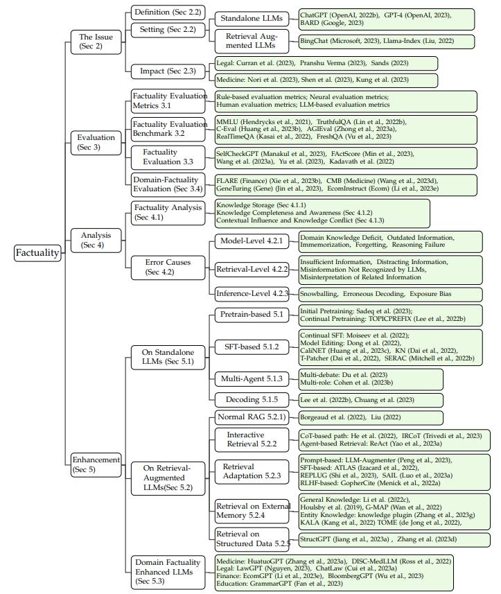

### 2.1 事实性问题

当作者谈到大模型中的事实性时，指的是**大型语言模型生成符合事实信息的内容的能力，这些事实信息包括常识、世界知识和领域事实知识，这些事实信息的来源可以是词典、维基百科或来自不同领域的教科书**。作者在上表中展示了 LLMs 中的各种事实性问题实例。

> eg：LLM 可能在特定领域的事实知识，如医学或法律领域，上存在缺陷。

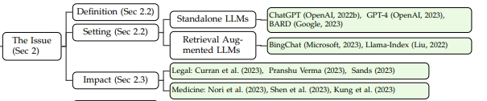

此外，LLM 可能不知道其最后更新后发生的事实。还有一些情况，**尽管 LLM 拥有相关的事实，但未能推理出正确的答案。在某些情况下，它甚至可能忘记或无法回忆之前学到的事实**。

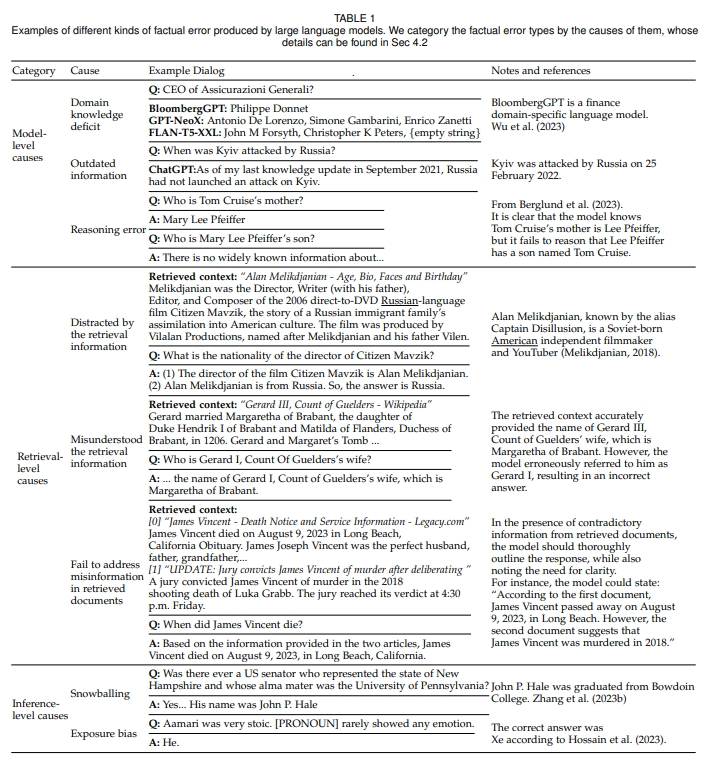

**事实性问题与大型语言模型领域的几个热门话题密切相关，包括幻觉、过时的信息和领域特异性**。

这些话题的核心都是解决同一个问题：**LLMs 生成与某些事实相矛盾的内容的潜力，无论这些内容是凭空产生的、过时的信息，还是缺乏领域特定的知识**。

因此，作者认为这三个话题都属于事实性问题的范畴。

然而，值得注意的是，尽管这些话题是相关的，但它们各自有一个独特的焦点。

- **幻觉和 LLMs 中的事实性问题都涉及到生成内容的准确性和可靠性**，但它们解决的是不同的方面。幻觉主要围绕 LLMs 生成无根据或不合理的内容。从 GPT4 technical report和一些Hallucination相关工作的定义中，作者将幻觉理解为模型倾向于 “产生与某些来源不符的无意义或不真实的内容”。这与强调模型学习、获取和利用事实知识的事实性问题是不同的。具体对比如下表：

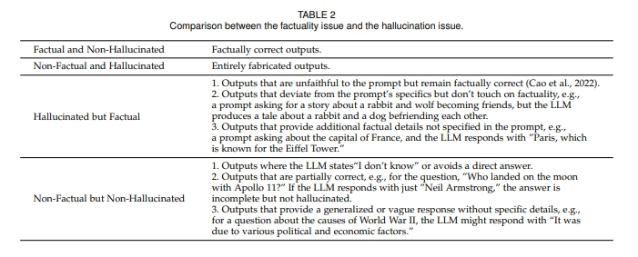

- **过时的信息则关注先前准确的信息被更近期的知识所取代，或者新的不存在的事件发生的情况**;
- **领域特异性强调生成需要特定、专门知识的内容**。

尽管存在这些差异，但这三个话题都有助于更深入地了解 LLMs 中更广泛的事实性问题。

这篇综述关注两种设定：

1. 标准 LLMs：直接使用 LLMs 进行回答和聊天；
2. 检索增强型 LLMs：检索增强的生成。

### 2.2 事实性的评估

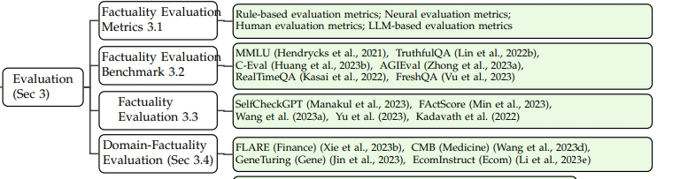

本章关注于大模型事实性的评估指标、基准测试、评估方法、特定领域的事实性评估。

- 事实性评估指标：

作者介绍了通常用于 NLG 的几种自动评价指标，同时特别检查了事实性的指标。

- 本文将这些指标分为以下几类：

1. 基于规则的评价指标；
2. 基于神经网络评价指标；
3. 人类评价指标；
4. 大模型评价指标。

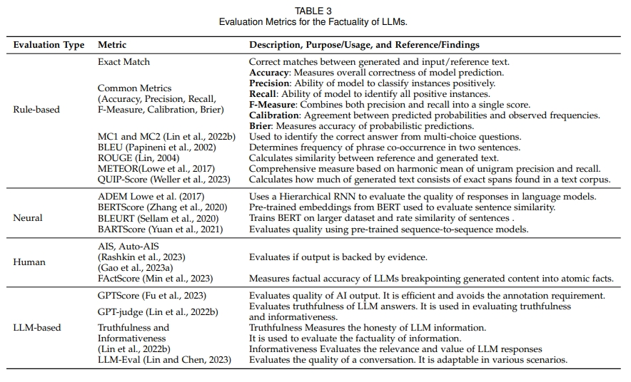

- 事实性基准测试：

作者介绍了用于大模型事实性评估的基准测试，同时介绍了其任务类型、数据集、评价指标、以及目前代表性大模型在其上的表现，具体内容如下表所示：

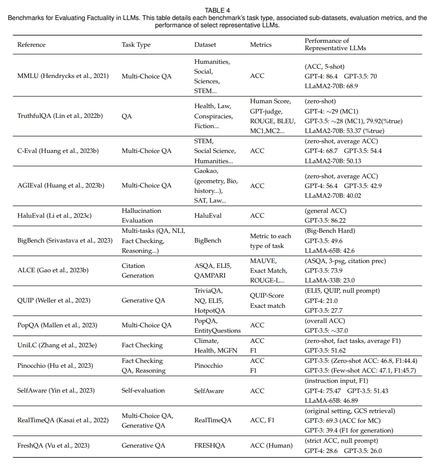

- 事实性评估方法：

作者介绍了评估大模型事实性但没有引入新评价基准的工作，重点在于那些开创了评估技术、指标的工作，或为 LLMs 的事实性评估提供了独特见解的研究。

作者介绍了每个工作的任务、数据集、指标、是否有人类评估、被评估的大模型以及粒度，具体如下图所示：

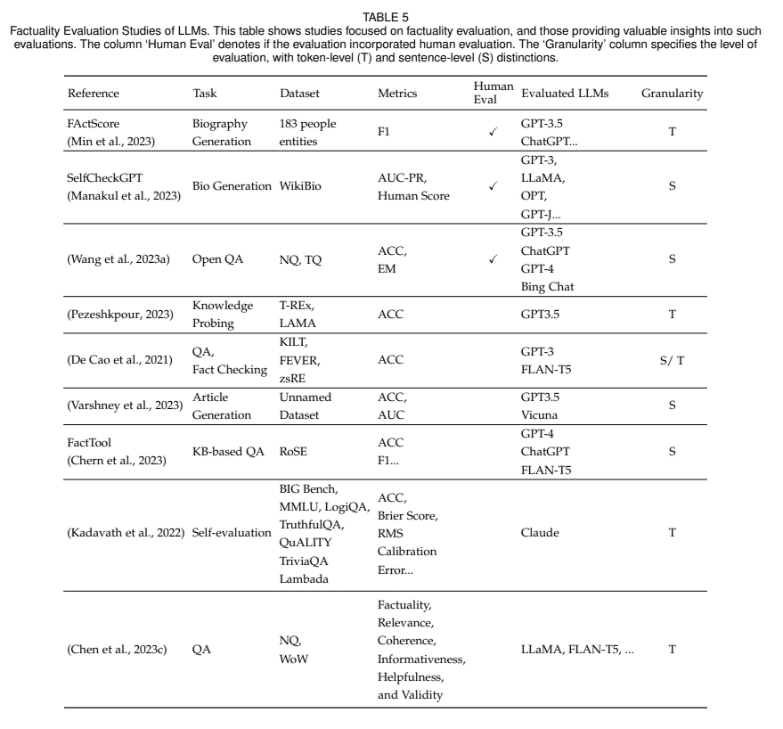

同时有一些增强模型事实性的工作也使用了一些传统任务的数据集，作者也将这些工作的评价方式和数据集囊括其中，如下表所示：

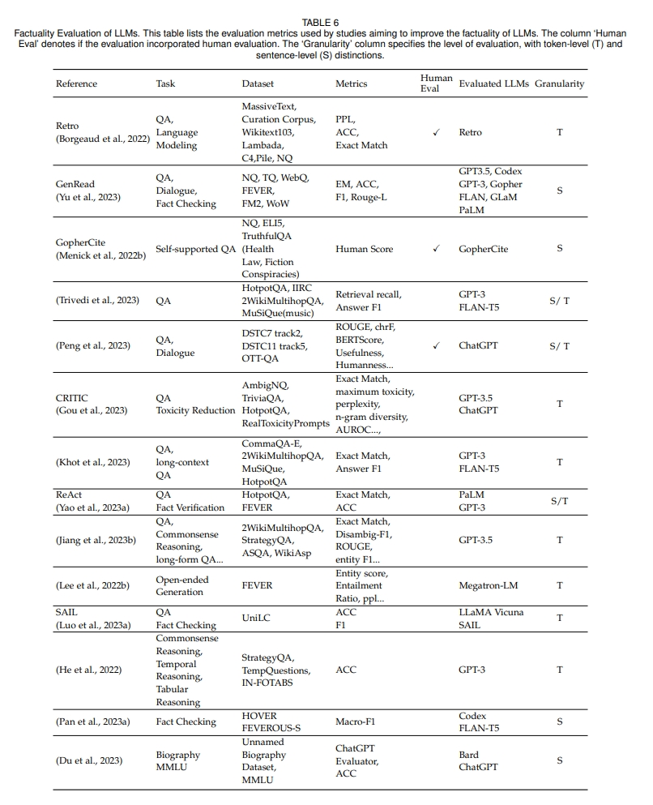

- 特定领域的事实性评估：

针对特定领域事实性评估的基准。该表展示了领域、任务、数据集，以及在相应研究中评估的 LLMs：

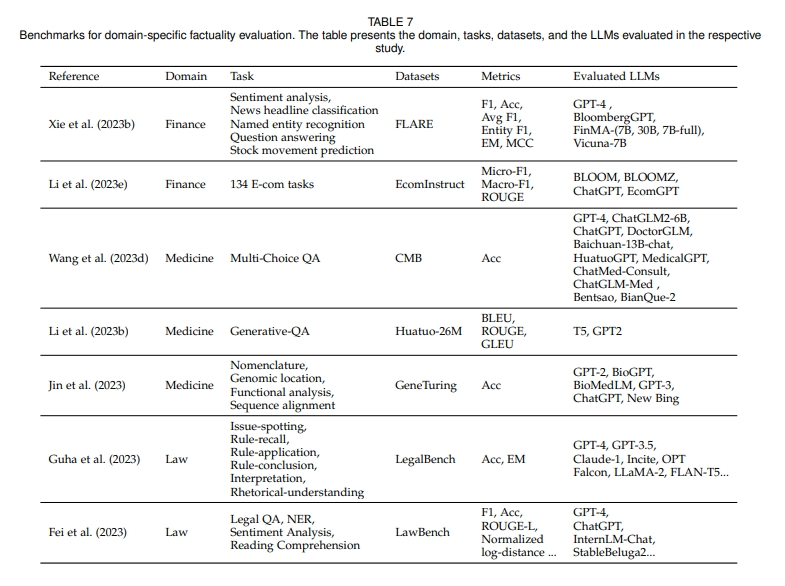

### 2.3 事实性的评估

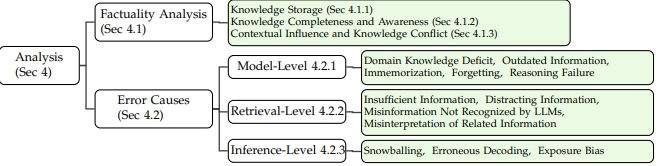

本章关注于大模型事实性的内在机制以及大模型产生事实性错误的原因。

具体来说，大模型事实性内在机制的分析包括大模型存储、处理事实知识和产生事实性内容的机制，尤其是知识存储、知识完整性和认知、上下文影响和知识冲突的方面的分析；而事实性错误的来源分为三个层面，分别是模型层面，包括领域知识缺乏、信息过时、记忆不全、遗忘和推理错误等；检索层面，包括信息不足、扰乱性信息、信息不被模型接受、误解相关信息等；推理层面，包括雪球效应、错误解码和展示误差等。

### 2.4 事实性的增强

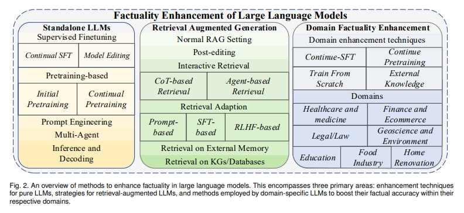

本章关注于大模型事实性增强的方法，包括应用在独立大模型（Standalone LLMs）上的和检索增强的大模型（Retrieval Augmented LLMs）上，以及对领域知识增强的大模型（Domain Factuality Enhanced LLMs）也进行了详细的讨论。

当关注独立大模型生成时，增强策略可以大致分为三大类：

1. 从无监督语料库中获取事实知识：这涉及在预训练期间优化训练数据，例如通过去重和强调信息性词汇;
2. 从有监督数据中获取事实知识：这一类别的例子包括有监督的微调策略，重点是使用带标签的数据进行微调，或从知识图谱这样的结构化知识中进行整合，或对模型参数进行精确调整;
3. 生成时从模型中最好地提取事实知识：这一类是为了模型能够输出事实性知识，包括了像 Multi-agent 这样的方法和创新的 prompts，也包括新的解码方法，如事实核心抽样;

当关注检索增强的大模型生成时，增强策略可以大致分为三大类：

1. 交互式检索和生成：尽管检索系统旨在获取相关信息，但它们有时可能无法检索到准确或全面的数据。此外，LLMs 可能难以识别或甚至被检索到的内容误导。实施交互式检索机制可以指导 LLM 进行更好的内容生成。相关工作包括将 Chain-of-Thoughts 推理中间步骤应用到检索中，以及使用基于 LLM 的 agent 框架，让LLM和外部知识 API 进行交互，反馈修正LLM生成的事实错误;
2. 让 LLMs 适应检索生成：仅仅使用 LLMs 中的检索信息并不总是能增强它们回答事实性问题的能力，这可能是模型不能适应检索到的数据。而有些适应策略能帮大模型更好得使用检索的数据，具体来说，作者探索了三类方法：基于提示的方法、基于 SFT 的方法和基于 RLHF 的方法。这些方法增强了检索的准确率，或是让LLM有了引用检索来源的能力;
3. 从其他知识库中检索：这一类别包括从外部参数记忆或知识图谱中检索的方法，以增强模型的事实性知识。

作者选取了一部分事实性增强的方法，展示其效果，包括评估的数据集、指标，以及 baseline 效果和使用他们方法后的效果，如下图所示：

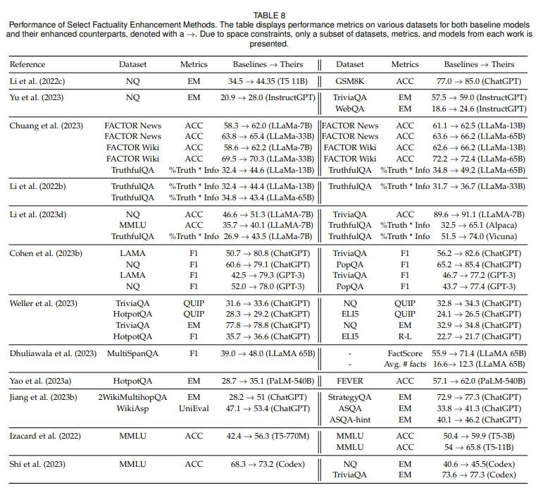

- 领域事实性增强的大模型：

作者列出了针对特定领域事实性增强的 LLMs。其中涵盖了多个领域，包括医疗 / 健康（H）、金融（F）、法律 / 法务（L）、地球科学 / 环境（G）、教育（E）、食品检测（FT）和家居装修（HR）。基于特定领域 LLMs 的实际应用场景和作者之前对增强方法的分类，他们总结了几种常用的增强技术：

1. 持续预训练：一种通过使用特定领域数据持续更新和微调预训练语言模型的方法。这个过程确保模型在特定领域或领域内保持最新和相关性。它从一个初始的预训练模型开始，通常是一个通用语言模型，然后使用特定领域的文本或数据对其进行微调。随着新信息的出现，模型可以进一步微调以适应不断发展的知识领域。持续预训练是维持 AI 模型在快速变化的领域，如技术或医学中的准确性和相关性的强大方法;
2. 持续 SFT：另一种增强 AI 模型事实性的策略。在这种方法中，模型使用特定领域的标记或注释数据进行微调。这个微调过程使模型能够学习和适应领域的细微差别和特点，提高其提供准确和与上下文相关的信息的能力。当随着时间的推移可以获得特定领域的标记数据时，它尤其有用，例如在法律数据库、医疗记录或财务报告的情况下;
3. 从零开始训练：这涉及从最小的先验知识或预训练开始学习过程。这种方法可以类比为用一个空白的板子教机器学习模型。虽然它可能没有利用预先存在的知识的优势，但在处理完全新的领域或任务时，如果只有有限的相关数据可用，从零开始训练可能是有利的。它允许模型从头开始建立其理解，尽管它可能需要大量的计算资源和时间;
4. 外部知识：这涉及用外部来源的信息增强语言模型的内部知识。这种方法允许模型访问数据库、网站或其他结构化数据存储库，以验证事实或在回应用户查询时收集额外的信息。通过整合外部知识，模型可以增强其事实检查能力，并提供更准确和与上下文相关的答案，特别是在处理动态或快速变化的信息时。

对于每一个特定领域大模型，作者列出了其领域、模型名称、评估任务和数据集，以及各自的增强方法，如下表中呈现：

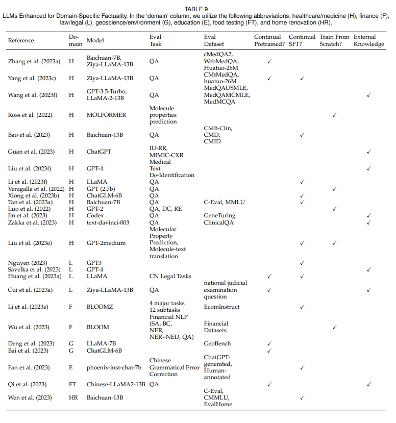

## 三、结论

在这次的综述中，作者系统地探索了大型语言模型（LLMs）中事实性问题的复杂景观。首先，作者定义了事实性的概念，然后讨论了其更广泛的影响。之后，作者进入事实性评估部分，包括基准测试、评估指标、特定的评估研究和特定领域的评估。随后，作者深入探讨了大模型事实性的内在机制。作者进行了事实性增强技术的讨论，无论是对于纯大模型还是检索增强的大模型，并关注了特定领域知识增强的大模型。

尽管这次综述中详细描述了许多进展，但仍然存在一些巨大的挑战。由于自然语言固有的复杂性，事实性的评估仍然是一个复杂的难题。此外，大模型如何存储、更新事实知识和产生事实性内容的核心过程尚未完全揭示。尽管某些事实增强技术，如持续训练和检索，显示出前景，但它们仍存在局限性。

展望未来，寻求忠实于事实的大模型既带来了挑战，也带来了机会。未来的研究可能会更深入地了解大模型的神经结构，开发更稳健的评估指标，并在增强技术上进行创新。随着大模型越来越多地融入数字生态系统，确保它们的事实可靠性将始终是至关重要的，这将对 AI 社区及其以外的领域产生影响。

## 致谢

- Survey on Factuality in Large Language Models：https://arxiv.org/pdf/2310.07521.pdf
- 大模型事实性综述(Survey on Factuality in Large Language Models) https://zhuanlan.zhihu.com/p/663163409