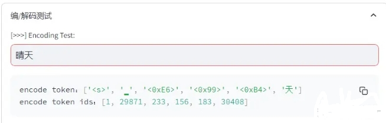
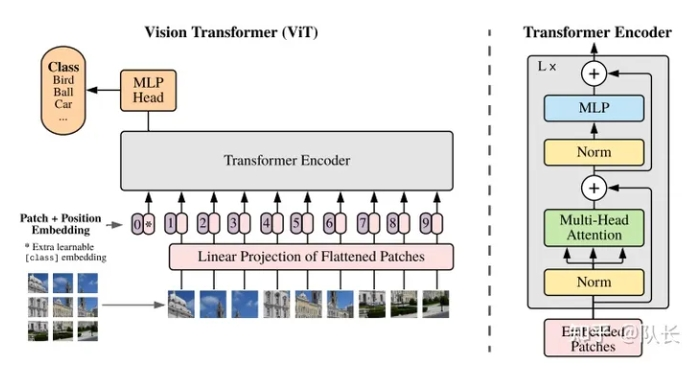
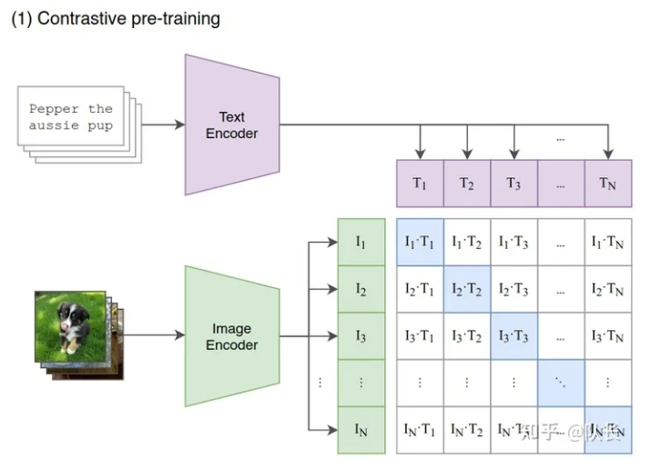
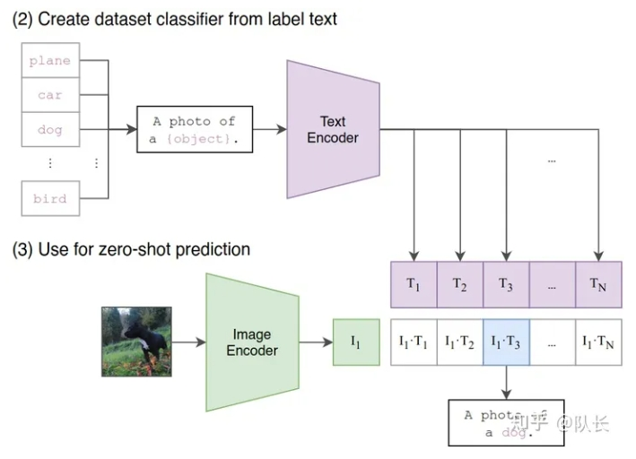
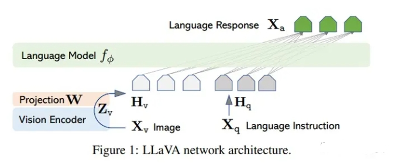
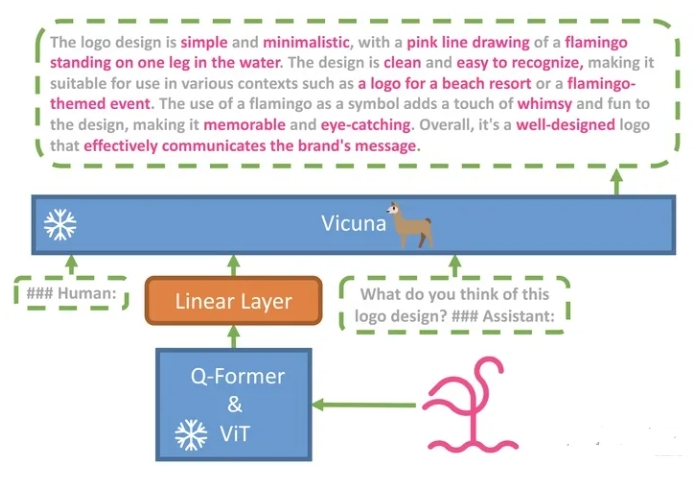

# Vary: Scaling up the Vision Vocabulary forLarge Vision-Language Models

- 论文名称：Vary: Scaling up the Vision Vocabulary forLarge Vision-Language Models
- 论文地址：https://arxiv.org/abs/2312.06109

## 一、论文动机

1. 文档解析的难点及解决方案：

PDF 类文档的难点在于，如何完整恢复图片、表格、标题、段落等内容，形成一个文字版的文档。这里使用了多个开源模型进行协同分析，例如版面分析使用了百度的 PP-StructureV2，能够对 Text、Title、Figure、Figure caption、Table、Table caption、Header、Footer、Reference、Equation10 类区域进行检测，统一了 OCR 和文本属性分类两个任务。

当然，这里还没有解决出图片信息如何还原的问题。大量的文档使用了图文混排的形式，例如上述的 PPT 文件，转换成 PDF 后，仅仅是能够识别出这一块是一幅图片，对于图片，直接转换成向量，不利于后续的检索。所以我们只能通过一个较为昂贵的方案，即部署了一个多模态模型，通过 prompt 来对文档中的图片进行关键信息提取，形成一段摘要描述，作为文档图片的索引。效果类似下图。

2. 现有开源多模态大模型的问题

这里把多模态大模型限定在开源这个范围，因为不开源的 GPT4V 或者 Google 的 Gemini 以及阿里的 Qwen-VL-Plus 还是挺强大的，文档图像级别的问答试了下基本上没太多问题。

但目前主流开源的多模态大模型，在应对文档时，主要有以下两个问题：

- 对中文支持较差，毕竟大部分训练数据还是以英文为主。
- 文档级的识别程度不高，毕竟多模态大模型也不是单纯做 OCR 任务的，所以训练数据可能有欠缺，在识别文档图像时出现容易缺少内容，导致回答出现幻觉或者不准确。

## 二、词表扩充

### 2.1 为什么 需要 词表扩充？

比如当初Meta的LLaMA大模型开源后，国人发现LLaMA 原生仅支持 Latin 或 Cyrillic 语系，对于中文支持不是特别理想。模型在遇到中文汉字时，它的分词器会将一个汉字切分成多个token，显著降低了编解码的效率。

所以中文的LLaMA模型，就是在中文语料库上训练一个中文分词模型，然后将中文分词模型与LLaMA原生的分词进行合并，通过组合它们的词汇表，最终获得一个合并后的分词模型。

接着拓展了词表后，再在中文语料进行预训练或者微调，模型生成中文的能力就大大地提高了。

### 2.2 如何进行视觉词表扩充？

实际上视觉词表这个词并不准确，对于语言来说，模型在训练中，看到的每一个词列下来，就是一个词表。

那对于视觉来说，显然没有像语言中”词“或者”字“这么个单位。

要回答这个问题，我们得从多模态大模型的训练方式说起。

首先来讲讲Clip这个经典的模型。Clip当初的提出，是为了解决一个问题。

我们知道，传统的图像分类，在训练的过程中，模型接受的数据集是有标签的。比如猫狗分类，那么每张图就会标注到底是猫还是狗。

比如上图是经典的ViT模型，图片使用Transformer编码后，使用MLP head向量来做图片分类预测。这和以前BERT类模型的微调是很相似的。

这导致了两个缺点，

- 如果出现了一个图，里面不是猫也不是狗，那模型就没法知道它到底是啥。
- 另外，如果输入的数据，和训练数据出现了比较大的偏移，例如输入的是一个画出来的猫，而不是照相机拍出来的猫相片。那么模型估计也分辨不出真正的结果。

对于缺点一，我们希望当下游任务是接受一串标签时，比如[猫，狗，老虎，斑马]，即使训练时候没见过其它两类的图片，模型也能告诉我们是什么类别。这也就是模型的zero-shot能力。

对于缺点二，其实是缺点一的一个拓展。但是缺点二显示的问题很突出，如果解决的话，那就说明模型具备了很强的捕捉特征能力。

Clip具体是怎么做的呢？

首先，准备了大量的（图片，文本）对数据，每一个文本是对图片的描述，可以理解成prompt。接着将图片和文本，分别输入进相应的编码器。编码器选择Transformer Encoder，图文都经过编码后，分别生成相应的向量，比如图中T1是第一段文本的向量，I1是第一张图片的向量。

那么针对每一对 Ti*Ii，在训练时，我们都希望它们的点积（余弦相似度）是最大的。总之，这个训练目标就是，让每一对图文的向量，都能产生最大的相似性。

模型训练完成后，推理过程如下：

我们先定义好需要分类的标签，每一个标签经过编码后，也会生成一组向量。然后需要判断分类的图像经过编码后生成的一个向量，和这组向量分别进行点积，取点积最大的 Ti*Ii，那么 Ti 就是这个图片所属的类别。

Clip的训练过程不是我们要讨论的重点。这里的重点是，Clip中的图片编码器，在经过了训练后，实际上是具备了一定的文本->图片的解释能力的。所以相当于，每一个经过这个编码器的图片生成的向量，可以看作词表。

然后我们回到现在多模态大模型的结构，

## 致谢

- 多模态王炸开源大模型来了 https://zhuanlan.zhihu.com/p/676109563

