# DyLoRA：使用动态无搜索低秩适应的预训练模型的参数有效微调

> 论文名称：DyLoRA: Parameter-Efficient Tuning of Pretrained Models using Dynamic Search-Free Low Rank Adaptation
> 论文地址：https://arxiv.org/pdf/2210.07558v2.pdf
> github 地址：https://github.com/huawei-noah/KD-NLP/tree/main/DyLoRA

## 一、动机

LoRA存在的问题：

- rank的值是固定的，训练完成后不能修改。
- 优化rank的值需要大量的搜索和努力。

## 二、论文方法

论文引入了一种**动态低秩适应（Dy-LoRA）技术**。通过**对适配器模块在训练期间的不同秩所学到的表示进行排序，为一系列的秩而不是单一的秩训练LoRA块**。

## 三、论文解读

在每一个LoRA模块中，有一个向上投影 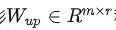 和向下投影 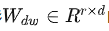的矩阵。设我们想训练LoRA模块在 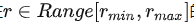 的范围内操作，其中 rmin 和 rmax 可以被视为新的超参数。为了 LoRA 使模块在一系列的秩中工作，而不是单一的秩，我们需要确保增加或减少秩不会明显阻碍模型的性能。实现这种行为的一种方法是在 LoRA 模块的训练过程中对不同秩的信息内容进行排序。在这方面，在每个训练步骤中，我们对 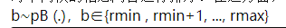 进行抽样。形成一个预先定义的分类分布其（支持度为 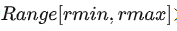），并相应地截断 Wup 和 Wdw 矩阵。

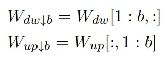

Wdwb 和 Wupb 是的截断版本。

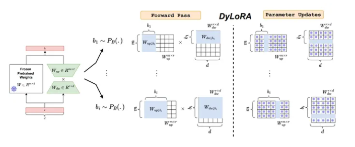

前向传播计算时是这么计算的：

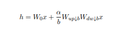

损失的计算：

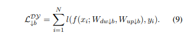

另外在训练的时候增加了一个新的模块：frozen，即只更新截断块中第b个相关的行或者列。

整个流程如下：

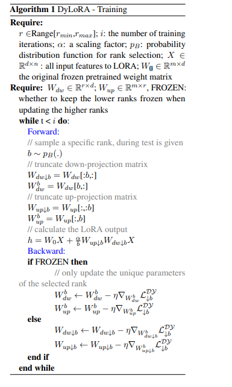

> 需要注意反向传播时是否是更新整个截断块还是第b个行或列。

## 四、论文实验结果

首先是说明不同rank对结果的影响：

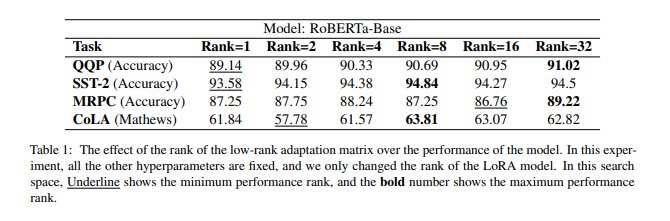

接着是该方法和其他方法的对比：

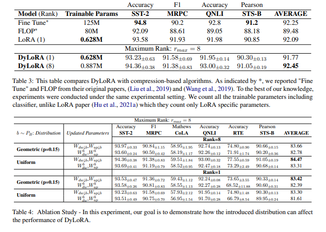

## 五、论文主要贡献

- 动态LoRA：在LoRA的基础上，我们开发了一种新的算法（DyLoRA），使其在推理时是动态的，而不会产生额外的费用。
- 无需搜索的LoRA：我们证明，通过在性能上做出可忽略不计的妥协，有可能避免为LoRA选择最佳秩的昂贵的搜索过程。

## 参考

1. [DyLoRA: Parameter-Efficient Tuning of Pretrained Models using Dynamic Search-Free Low Rank Adaptation](https://arxiv.org/pdf/2210.07558v2.pdf)
2. [KD-NLP/DyLoRA](https://github.com/huawei-noah/KD-NLP/tree/main/DyLoRA)
3. [DyLoRA：使用动态无搜索低秩适应的预训练模型的参数有效微调](https://zhuanlan.zhihu.com/p/623455592)