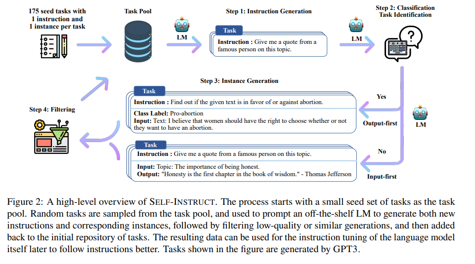
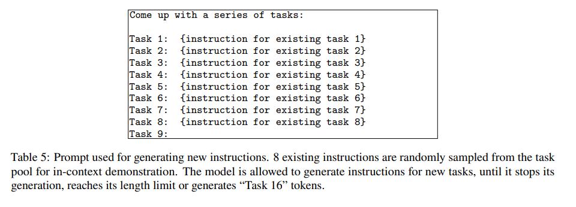
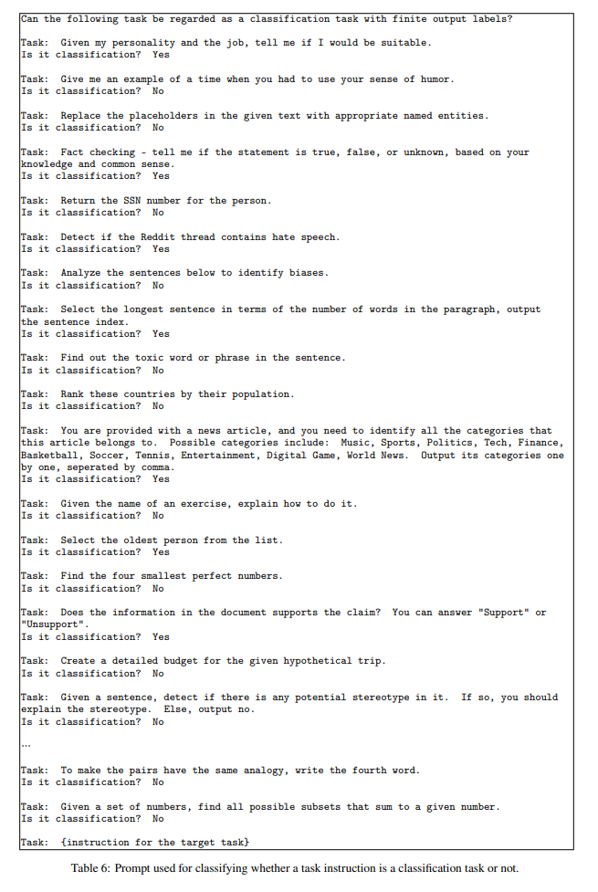
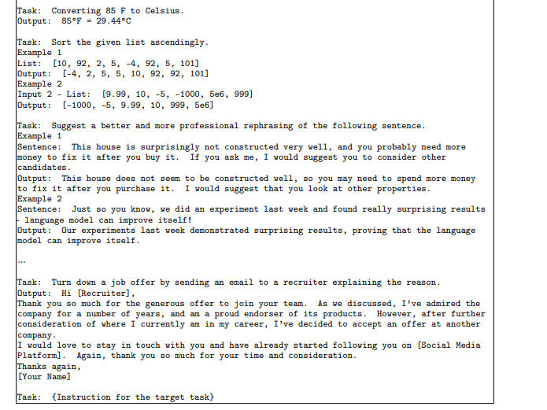
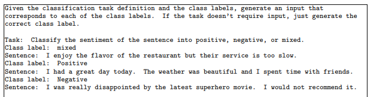

# self-instruct 学习

> 论文：Self-Instruct: Aligning Language Model with Self Generated Instructions
> 论文地址：https://arxiv.org/abs/2212.10560
> github 地址：https://github.com/yizhongw/self-instruct

## 1 self-instruct 整体思路

self-instruct 提供了一种从高质量的LLM模型中蒸馏知识的一种有效方式，即用公开可用的预训练好的LLM的接口生成高质量的数据，再用生成的数据以有监督的方式对目标模型进行调优。

## 2 为什么需要 self-instruct？

- 动机：**在训练好的LLM上进行“指令调优”具有很好的将Zero-shot设置下的指令理解能力泛化到新任务上的超凡能力**。然而，这种方法**很大程度上依赖于大型的语言模型以及人工编写的高指令数据，这需要极大的人力和物力**。
- self-instruction框架：**通过在公开的LLM的接口上引导模型自己生成指令来提高LLM的指令跟随能力**。这在LLM时代是一种高效的蒸馏方法，即通过**从高质量的预训练好的LLM上接口获取有监督的数据，来调优模型，将大模型的知识蒸馏出来，部署到目标模型上**。

## 3 self-instruct 实现思路？

### 3.0 self-instruct 整体框架

如图，self-instruct 整个流程分为：**生成任务指令，任务分类，生成输入和输出样本，过滤样本，对原始模型进行微调**；

### 3.1 self-instruct 整体框架——生成任务指令

1. 初始化一个任务池，该任务池中包含175个任务，每个任务都有一条人工编写的指令和实例；
2. 通过自举的方法生成指令：
   1. 从任务池中抽样8条指令（6条人工编写的，2条之前步骤中模型编写的）作为学习样例；
   2. 通过提示模板组合在一起，输入模型，让模型提出新的任务；

### 3.2 self-instruct 整体框架——任务分类

因为 **self-instruct 定义了两种不同的方法来处理分类任务和非分类任务**，所以需要确定生成的指令是否代表分类任务。

具体的方法是**将来自任务池中的12条分类指令和19条非分类指令作为学习样例，和模型在上一步提出的任务指令组合在一起输入模型让模型进行分类**。提示模板如下表：

### 3.3 self-instruct 整体框架——生成输入和输出样本

- 动机：为了让模型理解任务；
- 方法：**从模型池中取出其它任务的instruction-input-output作为学习样例，让模型对给定的任务生成输入和输出**；
- 思路：一种自然的方法是输入优先方法，在这种方法中，LM首先根据指令提出输入字段，然后产生相应的输出。

这种生成顺序类似于模型用来响应指令和输入的方式，提示模板如下：

但是对于分类任务，输入优先可能倾向于生成偏向于一个标签的输入，例如对于语法错误检测，它通常会生成正确的语法。因此提出输出优先方法，在这种方法中，LM首先根据指令提出输出字段，然后产生相应的输入，提示模板如下：

### 3.4 self-instruct 整体框架——过滤样本

为了鼓励多样性，只有当一条新指令与任何现有指令的ROUGE-L相似度小于0.7时，才会添加到任务池中。还排除了包含一些特定关键词(例如，图像，图片，图形)的指令。当为每条指令生成新实例时，过滤掉完全相同或具有相同输入但不同输出的实例。并基于启发式方法(例如，指令太长或太短，实例输出是输入的重复)过滤掉无效的指令。

### 3.5 self-instruct 整体框架——模型调优

在创建大规模指令数据后，使用它来微调原始语言模型(即self - instruction)。具体的做法是将指令和实例输入作为提示连接起来，并训练模型以标准的监督方式生成实例输出。为了提高模型的鲁棒性，使用多个模板将指令和实例输入编码在一起。