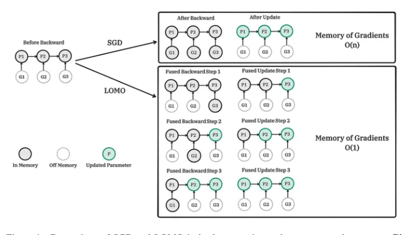

# LOMO：利用有限的资源对大型语言模型进行全参数微调

> 论文名称：FULL PARAMETER FINE-TUNING FOR LARGE LANGUAGE MODELS WITH LIMITED RESOURCES
> 论文地址：https://arxiv.org/abs/2306.09782
> github 地址：https://github.com/OpenLMLab/LOMO

## 一、前言

1. 大型语言模型（LLMs）已经彻底改变了自然语言处理（NLP），但是**训练LLMs需要大量的GPU资源**;
2. 虽然现有的方法着重于参数高效微调，即微调或添加少量参数，但**很少有人解决了有限资源下调整LLMs的全部参数的挑战**，而全参数微调被认为比参数高效微调更为强大;

论文提出了一种新的优化器LOw-Memory Optimization（LOMO），它**将梯度计算和参数更新融合在一步中以减少内存使用**。通过**将LOMO与现有的内存节省技术集成**，将内存使用降低到10.8％，与标准方法（DeepSpeed解决方案）相比。因此，该方法使单台机器上的65B模型的全参数微调成为可能，该机器配有8×RTX 3090，每个显存为24GB。

## 二、论文整体介绍

论文通过分析LLMs中内存使用的四个方面，即**激活，优化器状态，梯度张量和参数**，并在三个方面优化训练过程：

1. 从**算法的角度重新思考了优化器的功能，并发现SGD是用于LLMs的全参数微调的很好的替代方法**。这使其能够删除整个优化器状态的部分，因为SGD不存储任何中间状态；
2. 提出的**优化器LOMO**如图1所示，**将梯度张量的内存使用降低到 O(1)**，相当于最大梯度张量的内存使用；
3. **为了稳定使用LOMO的混合精度训练，集成了梯度归一化，损失缩放和在训练期间转换某些计算以进行完全精度**；

> 图1：比较 SGD 和 LOMO 在反向传播和参数更新阶段的表现。Pi 是模型的参数，Gi 是与 Pi 对应的梯度。LOMO 将梯度计算和参数更新合并为一个步骤，以减少梯度张量的大小。反向过程的计算量不应低于单独的前向过程。值得注意的是，当使用 LOMO 来节省内存时，确保微调流程仍保持不变，因为参数更新流

> 注：LOMO 方法 使得 内存使用量等于参数使用量加上激活和最大梯度张量的使用量。将全参数微调的内存使用推向极限，使其仅相当于推理过程的使用量。这是因为前向+反向过程的内存使用量不应少于仅有前向过程的使用量。值得注意的是，在使用LOMO来节省内存时，确保微调过程保持不受影响，因为参数更新过程仍然等同于随机梯度下降（SGD）的过程。

## 三、相关工作介绍

### 3.1 激活检查点技术（Activation Checkpointing）

- 动机：
  - 在标准**反向传播**中，**所有正向过程中的激活变量都会被存储在内存中以计算梯度**，这可能是巨大的内存开销，尤其是对于大型语言模型；
  - 虽然**可以舍弃所有激活变量**，并**在计算梯度时重新计算这些变量以节省内存**。但这可能会**产生大量的额外计算代价**
- 激活检查点技术（Activation Checkpointing）介绍：
  - 同时考虑了内存使用和计算成本，提供了一种折中解决方案（Chen等人，2016）。计算图中策略性地选择的检查点节点的激活变量在正向阶段后保留在内存中，而其余节点的激活变量在梯度计算时最多重新计算一次。激活内存可以降低原始内存使用量的平方根，代价是需要多一次正向传递

### 3.2 混合精度训练（Mixed-Precision Training）

- 动机：由于其加速训练速度和降低内存占用的能力，混合精度训练已成为训练大型语言模型的流行方法（Narayanan等，2021; Rajbhandari等，2020）
- 介绍：通过**为参数，激活和梯度使用半精度存储**，**混合精度训练在正向传播和反向传播期间实现高吞吐计算**。为了保持稳定性和模型准确性，Micikevicius等（2018）提出了三种技术，包括使用完整精度权重副本，损失缩放和在完整精度下执行特定算术运算。

### 3.3 异构训练系统（Heterogeneous Training System）

- 动机：多项研究（Rhu等，2016; Wang等，2018; Ren等，2021a）尝试通过利用异构内存（如CPU和NVMe内存）来减少GPU内存消耗。
- 介绍：L2L（Pudipeddi等，2020）采用逐层策略，仅将计算特定层所需的张量传输到GPU内存，而将其余张量保留在CPU内存中。ZeRO-Offload（Ren等，2021b）是ZeRO-2（Rajbhandari等，2020）的扩展，将梯度和优化器状态预留在CPU内存中，并通过CPU计算更新参数。张量和计算操作根据数据流图分配给GPU或CPU。ZeRO-Infinity（Rajbhandari等，2021）是ZeRO-Offload在ZeRO 3（Rajbhandari等，2020）上的后续进展，可进一步扩展模型大小。分区模型状态和其他张量不仅可以卸载到CPU内存中，还可以卸载到NVMe以充分利用异构架构。

## 四、相关工作介绍

## 四、论文实验结果

## 五、论文主要贡献

## 致谢

1. [LOMO：利用有限的资源对大型语言模型进行全参数微调](https://zhuanlan.zhihu.com/p/638463057)
