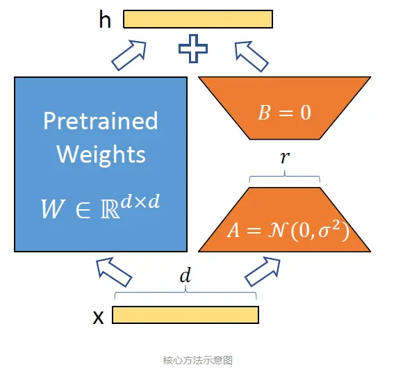
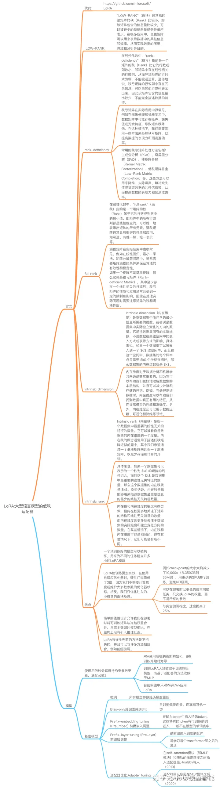
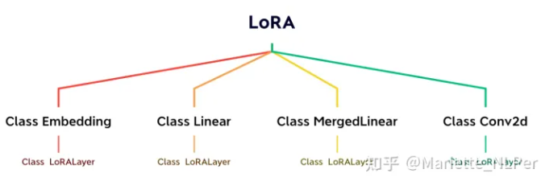

# LORA: LOW-RANK ADAPTATION OF LARGE LANGUAGE MODELS

> 论文：LORA: LOW-RANK ADAPTATION OF LARGE LANGUAGE MODELS
> 
> github 地址：https://github.com/microsoft/LoRA
> 
> 公开模型：
>
> 作者：杨夕
>
> NLP论文学习笔记 地址：https://github.com/km1994/nlp_paper_study
> 
> 推荐系统论文学习笔记 地址： https://github.com/km1994/RS_paper_study
> 
> GCN论文学习笔记 地址  https://github.com/km1994/GCN_study
> 
> NLP 百面百搭地址：https://github.com/km1994/NLP-Interview-Notes
> 
> 推荐系统 百面百搭地址：https://github.com/km1994/RES-Interview-Notes
> 
> 推广搜 军火库地址： https://github.com/km1994/recommendation_advertisement_search
> 
> LLMs 九层妖塔地址： https://github.com/km1994/LLMsNineStoryDemonTower
> 
> LLMs 千面郎君地址： https://github.com/km1994/LLMs_interview_notes

## 动机

随着语言模型容量的不断增大，如从GPT-2，RoBERTa-L到GPT-3，可训练参数量已增长到175B。如果要微调以适应下游任务，**如此大的参数量对于时间和显存要求都带来很大的挑战**。

然而，现存的两种显著范式为了规避这一问题，存在一些不足:

- **增加adapter**： 主要问题**在于推理时带来的额外计算量和延迟**。
- **优化prompt**： **前缀微调(Prefix Tuning)较难优化，而且随着参数量增长性能并非单调变化**。

那有什么方法可以 解决这个问题么？

最近在 图像生成领域 的 lora 成为了 NLPer 关注的焦点。

> 注：（不知道有没有人和小编一样，第一眼在 NLP领域 看到lora，是不是也是不敢相信是 stable diffusion webUI 中用到的 lora，因为 小编一直 以为lora是某种风格或者某个美女的工具，怎么可能和 大语言模型 搞上关系）。

看到这，小编疯狂狂补各种关于 lora 相关资料之后，才 发自内心的说了句：“lora，缺卡人的福音，真香！！！”

## 一、lora 之 第一层理解— — 介绍篇

问题来了：**什么是lora？为什么香？**

**lora是大模型的低秩适配器，或者就简单的理解为适配器**，在图像生成中可以将lora理解为某种图像风格（比如SD社区中的各种漂亮妹子的lora，可插拔式应用，甚至组合式应用实现风格的融合）的适配器，在NLP中可以将其理解为某个任务的适配器（比如最近各种开源chatgpt复现中使用的lora技术，不过限于文本领域的特性，目前组合式应用似乎还不多）。

## 二、lora 之 第二层理解 —— 做法篇

说了这么多：**那 lora 是 怎么做的呢？**

1. 在原模型旁边增加一个旁路，通过低秩分解（先降维再升维）来模拟参数的更新量；
2. 训练时，原模型固定，只训练降维矩阵A和升维矩阵B；
3. 推理时，可将BA加到原参数上，不引入额外的推理延迟；
4. 初始化，A采用高斯分布初始化，B初始化为全0，保证训练开始时旁路为0矩阵；
5. 可插拔式的切换任务，当前任务W0+B1A1，将lora部分减掉，换成B2A2，即可实现任务切换；

## 三、lora 之 第三层理解 —— 原理篇

听着云里雾里：**lora 为什么可以做做？**

前人的工作中[1][2]发现**过度参数化的模型实际上位于一个低内在维度的空间**，因此作者提出假设，**微调时权重的变化同样有一个低的"内在维度"**，因此可以进行低秩矩阵分解。



将预训练权重矩阵 W 冻结不动，额外增加一个可训练的矩阵 △W 来表示参数的变化量，那么微调后的参数变成 W+△W 。这已变化量可以分解为:

$$△W=B·A$$

对于一个权重矩阵 $W∈R^{d*k}$，$B∈R^{d*r}$，$A∈R^{r*k}$，满足 $r<<min(d,k)$，其中 A 用高斯分布初始化，B 用 0 值初始化。

新的输出等于原来的输出加上新添加部分的输出，即:

$$h=Wx+△Wx=Wx+BAx$$

由于 B 初始化为0，一开始的输出等于预训练后的输出。

因此，各种下游任务都可以共享原来的预训练权重 W ，只需要搭配上在不同任务上微调获得的变化量权重 △W . 如果要进一步减小延迟，还可以将 △W 合并进 W 中，得到新的完全权重 $W'=W+△W$ .

## 四、lora 之 第四层理解 —— 总结篇

一句话总结 lora：**固定大模型，增加低秩分解的矩阵来适配下游任务。**

## 五、lora 之 第五层理解 —— 优点篇

貌似很有道理：**lora 有哪些优点？**

1. 一个中心模型服务多个下游任务，节省参数存储量
2. 推理阶段不引入额外计算量
3. 与其它参数高效微调方法正交，可有效组合
4. 训练任务比较稳定，效果比较好

## 六、lora 之 第六层理解 —— 缺点篇

产生疑惑：**lora 完美无缺？**

生成任务上效果 欠佳

## 七、lora 之 第七层理解 —— 总结篇



## 八、lora 之 第八层理解 —— 使用篇

### 8.1 Loralib库的使用

LoRA 已经被作者打包到了loralib中。

```s
    $ pip install loralib
```

可以选择用loralib中实现的对应层来替换一些层。目前loralib只支持 nn.Linear、nn.Embedding 和 nn.Conv2d。loralib还支持一个 MergedLinear，用于单个 nn.Linear 代表一个以上的层的情况，比如在一些关注 qkv 投影的实现中（self- attention）

```s
    # ===== Before =====
    # layer = nn.Linear(in_features, out_features)

    # ===== After ======
    import loralib as lora
    # Add a pair of low-rank adaptation matrices with rank r=16
    layer = lora.Linear(in_features, out_features, r=16)
```

在训练之前，设置仅LorA模块的参数可被训练

```s
    import loralib as lora
    model = BigModel()
    # This sets requires_grad to False for all parameters without the string "lora_" in their names
    lora.mark_only_lora_as_trainable(model)
    # Training loop
    for batch in dataloader:
    ...
```

在保存checkpoint时，生成一个仅包含LoRA参数的state_dict

```s
    # ===== Before =====
    # torch.save(model.state_dict(), checkpoint_path)
    # ===== After =====
    torch.save(lora.lora_state_dict(model), checkpoint_path)
```

当载入checkpoint时，设置strict为False

```s
    # Load the pretrained checkpoint first
    model.load_state_dict(torch.load('ckpt_pretrained.pt'), strict=False)
    # Then load the LoRA checkpoint
    model.load_state_dict(torch.load('ckpt_lora.pt'), strict=False)
```

lora.MergedLinear的使用

```s
    # ===== Before =====
    # qkv_proj = nn.Linear(d_model, 3*d_model)
    # ===== After =====
    # Break it up (remember to modify the pretrained checkpoint accordingly)
    q_proj = lora.Linear(d_model, d_model, r=8)
    k_proj = nn.Linear(d_model, d_model)
    v_proj = lora.Linear(d_model, d_model, r=8)
    # Alternatively, use lora.MergedLinear (recommended)
    qkv_proj = lora.MergedLinear(d_model, 3*d_model, r=8, enable_lora=[True, False, True])
```

可以在调用mark_only_lora_as_trainable时，通过给bias= 传递 "all "或 "lora_only "来标记一些bias为可训练。

```s
    # ===== Before =====
    # lora.mark_only_lora_as_trainable(model) # Not training any bias vectors
    # ===== After =====
    # Training all bias vectors associated with modules we apply LoRA to 
    lora.mark_only_lora_as_trainable(model, bias='lora_only')
    # Alternatively, we can train *all* bias vectors in the model, including LayerNorm biases
    lora.mark_only_lora_as_trainable(model, bias='all')
    # When saving a checkpoint, use the same bias= ('all' or 'lora_only')
    torch.save(lora.lora_state_dict(model, bias='all'), checkpoint_path)
```

### 8.2 Apply to GPT

参见：LoRA/examples/NLG/src/model.py

```s
class Attention(nn.Module):
    def __init__(self, nx, n_ctx, config, scale=False):
        super(Attention, self).__init__()
        n_state = nx  # in Attention: n_state=768 (nx=n_embd)
        # [switch nx => n_state from Block to Attention to keep identical to TF implem]
        
        assert n_state % config.n_head == 0
        self.register_buffer("bias", torch.tril(torch.ones(n_ctx, n_ctx)).view(1, 1, n_ctx, n_ctx))
        self.n_head = config.n_head
        self.split_size = n_state
        self.scale = scale
        self.c_attn = Conv1D(n_state * 3, nx)
        self.c_attn = lora.MergedLinear(
            nx, n_state * 3, 
            r=config.lora_attn_dim, 
            lora_alpha=config.lora_attn_alpha, 
            lora_dropout=config.lora_dropout, 
            enable_lora=[True, False, True], 
            fan_in_fan_out=True,
            merge_weights=False
        )
        self.c_proj = Conv1D(n_state, nx)

        self.config = config
```

### 8.3 源代码解读

总的来说loralib的源代码比较简洁，可以在LORA/loralib/layers.py 查看



### 8.3.1 Class LoRALayer

```s
class LoRALayer():
    def __init__(
        self, 
        r: int, 
        lora_alpha: int, 
        lora_dropout: float,
        merge_weights: bool,
    ):
        
        self.r = r
        self.lora_alpha = lora_alpha
        # Optional dropout
        if lora_dropout > 0.:
            self.lora_dropout = nn.Dropout(p=lora_dropout)
        else:
            self.lora_dropout = lambda x: x
        # Mark the weight as unmerged
        self.merged = False
        self.merge_weights = merge_weights
```

LoRA layer可以添加到任何一个可以有参数训练的层里。但文章中也提到了we only apply LoRA to Wq and Wv in most experiments for simplicity

### 8.3.2 LoRA Embedding

（注释在代码块中）

“During training, W0 is frozen and does not receive gradient updates, while A and B contain trainable parameters. ”

“We use a random Gaussian initialization for A and zero for B”

```s
class Embedding(nn.Embedding, LoRALayer):
    # LoRA implemented in a dense layer
    def __init__(
        self,
        num_embeddings: int,
        embedding_dim: int,
        r: int = 0,
        lora_alpha: int = 1,
        merge_weights: bool = True,
        **kwargs
    ):
        nn.Embedding.__init__(self, num_embeddings, embedding_dim, **kwargs)
        LoRALayer.__init__(self, r=r, lora_alpha=lora_alpha, lora_dropout=0,
                           merge_weights=merge_weights)
        
        # Lora 部分
        # Actual trainable parameters
        if r > 0:
            self.lora_A = nn.Parameter(self.weight.new_zeros((r, num_embeddings)))
            self.lora_B = nn.Parameter(self.weight.new_zeros((embedding_dim, r)))
            #  scale ∆W x by α/r 
            self.scaling = self.lora_alpha / self.r
            # Freezing the pre-trained weight matrix
            #冻结pre-trained 参数
            self.weight.requires_grad = False
        self.reset_parameters()

    def reset_parameters(self):
        nn.Embedding.reset_parameters(self)
        if hasattr(self, 'lora_A'):
          #初始化
          # We use a random Gaussian initialization for A and zero for B, so ∆W = BA is zero at the beginning of training.
            # initialize A the same way as the default for nn.Linear and B to zero
            nn.init.zeros_(self.lora_A)
            nn.init.normal_(self.lora_B)

    def train(self, mode: bool = True):
        nn.Embedding.train(self, mode)
        if self.merge_weights and self.merged:
            # self.merged = Ture
            # Make sure that the weights are not merged
            # weight=weight-B * A * scale 需要剪掉merge的部分
            if self.r > 0:
                self.weight.data -= (self.lora_B @ self.lora_A).T * self.scaling
            self.merged = False
    
    def eval(self):
        nn.Linear.eval(self)
        if self.merge_weights and not self.merged:
            # Merge the weights and mark it
            # self.merged= False
            if self.r > 0:
                self.weight.data += (self.lora_B @ self.lora_A) * self.scaling
            self.merged = True

    def forward(self, x: torch.Tensor):
        if self.r > 0 and not self.merged:
           # self.merged= False
            result = nn.Embedding.forward(self, x)
            if self.r > 0:
                after_A = F.embedding(
                    x, self.lora_A.T, self.padding_idx, self.max_norm,
                    self.norm_type, self.scale_grad_by_freq, self.sparse
                )  # W0x + BAx
                result += (after_A @ self.lora_B.T) * self.scaling
            return result
        else:
            return nn.Embedding.forward(self, x)
```

### 8.3.3 Class Linear

kaiming_uniform_ kaiming 初始化
fin in fin out 含义

https://towardsdatascience.com/understand-kaiming-initialization-and-implementation-detail-in-pytorch-f7aa967e9138

因为加了fin in fin out 参数的原因，比之前的embedding层多了一个def T

```s
class Linear(nn.Linear, LoRALayer):
    # LoRA implemented in a dense layer
    def __init__(
        self, 
        in_features: int, 
        out_features: int, 
        r: int = 0, 
        lora_alpha: int = 1, 
        lora_dropout: float = 0.,
        fan_in_fan_out: bool = False, # Set this to True if the layer to replace stores weight like (fan_in, fan_out)
        merge_weights: bool = True,
        **kwargs
    ):
        nn.Linear.__init__(self, in_features, out_features, **kwargs)
        LoRALayer.__init__(self, r=r, lora_alpha=lora_alpha, lora_dropout=lora_dropout,
                           merge_weights=merge_weights)

        self.fan_in_fan_out = fan_in_fan_out
        # Actual trainable parameters
        if r > 0:
            self.lora_A = nn.Parameter(self.weight.new_zeros((r, in_features)))
            self.lora_B = nn.Parameter(self.weight.new_zeros((out_features, r)))
            self.scaling = self.lora_alpha / self.r
            # Freezing the pre-trained weight matrix
            self.weight.requires_grad = False
        self.reset_parameters()
        if fan_in_fan_out:
            self.weight.data = self.weight.data.T

    def reset_parameters(self):
        nn.Linear.reset_parameters(self)
        if hasattr(self, 'lora_A'):
            # initialize A the same way as the default for nn.Linear and B to zero
            nn.init.kaiming_uniform_(self.lora_A, a=math.sqrt(5))
            nn.init.zeros_(self.lora_B)

    def train(self, mode: bool = True):
        def T(w):
            return w.T if self.fan_in_fan_out else w
        nn.Linear.train(self, mode)
        if self.merge_weights and self.merged:
            # Make sure that the weights are not merged
            if self.r > 0:
                self.weight.data -= T(self.lora_B @ self.lora_A) * self.scaling
            self.merged = False
    
    def eval(self):
        def T(w):
            return w.T if self.fan_in_fan_out else w
        nn.Linear.eval(self)
        if self.merge_weights and not self.merged:
            # Merge the weights and mark it
            if self.r > 0:
                self.weight.data += T(self.lora_B @ self.lora_A) * self.scaling
            self.merged = True

    def forward(self, x: torch.Tensor):
        def T(w):
            return w.T if self.fan_in_fan_out else w

            #Merge = False
        if self.r > 0 and not self.merged:
            result = F.linear(x, T(self.weight), bias=self.bias)
            if self.r > 0:
                result += (self.lora_dropout(x) @ self.lora_A.T @ self.lora_B.T) * self.scaling
            return result
        #Merge =True
        else:
            return F.linear(x, T(self.weight), bias=self.bias)
```

### 8.3.4 Class MergedLinear

这个针对self- attention模块使用

```s
class MergedLinear(nn.Linear, LoRALayer):
    # LoRA implemented in a dense layer
    def __init__(
        self, 
        in_features: int, 
        out_features: int, 
        r: int = 0, 
        lora_alpha: int = 1, 
        lora_dropout: float = 0.,
        enable_lora: List[bool] = [False],
        fan_in_fan_out: bool = False,
        merge_weights: bool = True,
        **kwargs
    ):
        nn.Linear.__init__(self, in_features, out_features, **kwargs)
        LoRALayer.__init__(self, r=r, lora_alpha=lora_alpha, lora_dropout=lora_dropout,
                           merge_weights=merge_weights)
        assert out_features % len(enable_lora) == 0, \
            'The length of enable_lora must divide out_features'
        
        #一个true false list
        self.enable_lora = enable_lora
        self.fan_in_fan_out = fan_in_fan_out
        # Actual trainable parameters
        if r > 0 and any(enable_lora):
            self.lora_A = nn.Parameter(
                self.weight.new_zeros((r * sum(enable_lora), in_features)))
            self.lora_B = nn.Parameter(
                self.weight.new_zeros((out_features // 
                                       len(enable_lora) * sum(enable_lora), r))
            ) # weights for Conv1D with groups=sum(enable_lora) 计算有几个True
            self.scaling = self.lora_alpha / self.r
            # Freezing the pre-trained weight matrix
            self.weight.requires_grad = False

            #因为针对像attention计算中需要Wq Wk Wv 三种linear merge 一起的情况
            # Compute the indices
            # input (out_features) output (len(enable_lora) , out_features/len(enable_lora))
            self.lora_ind = self.weight.new_zeros(
                (out_features, ), dtype=torch.bool
            ).view(len(enable_lora), -1)
            #对应的那一行就设为True
            self.lora_ind[enable_lora, :] = True
            self.lora_ind = self.lora_ind.view(-1)
        self.reset_parameters()
        if fan_in_fan_out:
            self.weight.data = self.weight.data.T

    def reset_parameters(self):
        nn.Linear.reset_parameters(self)
        if hasattr(self, 'lora_A'):
            # initialize A the same way as the default for nn.Linear and B to zero
            nn.init.kaiming_uniform_(self.lora_A, a=math.sqrt(5))
            nn.init.zeros_(self.lora_B)

    def zero_pad(self, x):
        result = x.new_zeros((*x.shape[:-1], self.out_features))
        result = result.view(-1, self.out_features)
        result[:, self.lora_ind] = x.reshape(
            -1, self.out_features // len(self.enable_lora) * sum(self.enable_lora)
        )
        return result.view((*x.shape[:-1], self.out_features))

    def train(self, mode: bool = True):
        def T(w):
            return w.T if self.fan_in_fan_out else w
        nn.Linear.train(self, mode)
        if self.merge_weights and self.merged:
            # Make sure that the weights are not merged
            if self.r > 0 and any(self.enable_lora):
                delta_w = F.conv1d(
                    self.lora_A.data.unsqueeze(0), 
                    self.lora_B.data.unsqueeze(-1), 
                    groups=sum(self.enable_lora)
                ).squeeze(0)
                self.weight.data -= self.zero_pad(T(delta_w * self.scaling))
            self.merged = False
    
    def eval(self):
        def T(w):
            return w.T if self.fan_in_fan_out else w
        nn.Linear.eval(self)
        if self.merge_weights and not self.merged:
            # Merge the weights and mark it
            if self.r > 0 and any(self.enable_lora):
                delta_w = F.conv1d(
                    self.lora_A.data.unsqueeze(0), 
                    self.lora_B.data.unsqueeze(-1), 
                    groups=sum(self.enable_lora)
                ).squeeze(0)
                self.weight.data += self.zero_pad(T(delta_w * self.scaling))
            self.merged = True

    def forward(self, x: torch.Tensor):
        def T(w):
            return w.T if self.fan_in_fan_out else w
        if self.merged:
            return F.linear(x, T(self.weight), bias=self.bias)
        else:
            result = F.linear(x, T(self.weight), bias=self.bias)
            if self.r > 0:
                after_A = F.linear(self.lora_dropout(x), self.lora_A)
                after_B = F.conv1d(
                    after_A.transpose(-2, -1), 
                    self.lora_B.unsqueeze(-1), 
                    groups=sum(self.enable_lora)
                ).transpose(-2, -1)
                result += self.zero_pad(after_B) * self.scaling
            return result
```

## 参考

1. [Measuring the Intrinsic Dimension of Objective Landscapes.](http://arxiv.org/abs/1804.08838)
2. [Intrinsic Dimensionality Explains the Effectiveness of Language Model Fine-Tuning](http://arxiv.org/abs/2012.13255)
3. [LORA: LOW-RANK ADAPTATION OF LARGE LANGUAGE MODELS](https://arxiv.org/abs/2106.09685)
4. [microsoft/LoRA](https://github.com/microsoft/LoRA)
5. [peft/tuners/lora.py](https://github.com/huggingface/peft/blob/main/src/peft/tuners/lora.py)
6. [LoRA:大模型的低秩适配-最近大火的lora到底是什么东西？为啥stable diffusion和开源ChatGPT复现都在用？](https://zhuanlan.zhihu.com/p/620327907)
7. [论文速读：LORA: LOW-RANK ADAPTATION OF LARGE LANGUAGE MODELS](https://zhuanlan.zhihu.com/p/617966779)
8. [LoRA论文回顾](https://zhuanlan.zhihu.com/p/619468521)
9. [Stable Diffusion爱好者常说的LoRa是什么？](https://zhuanlan.zhihu.com/p/610031713)
10. [LoRA:大型语言模型的低秩适配器](https://zhuanlan.zhihu.com/p/610943445)
11. [论文阅读：LORA-大型语言模型的低秩适应](https://zhuanlan.zhihu.com/p/611557340)
12. [微软LoRA: Low-Rank Adaptation of Large Language Models 代码解读](https://zhuanlan.zhihu.com/p/515954218)
