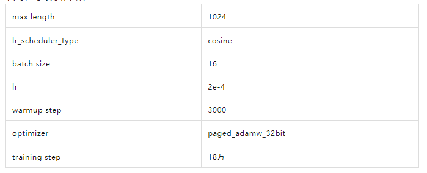
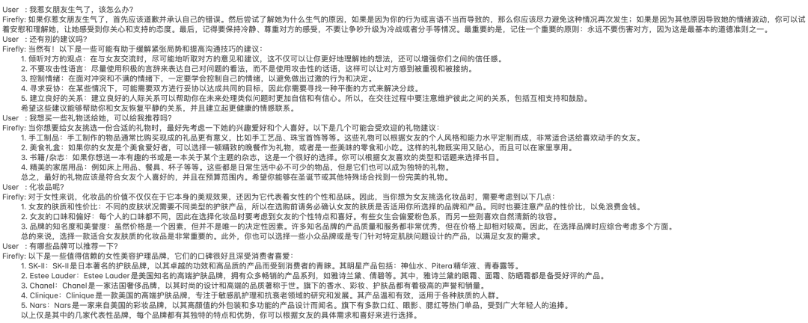
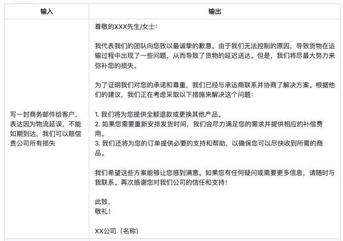
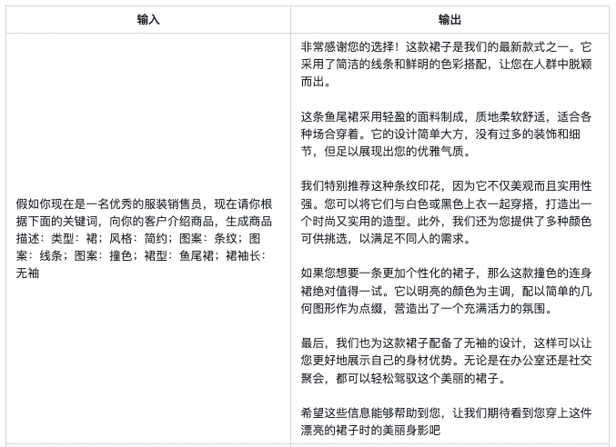
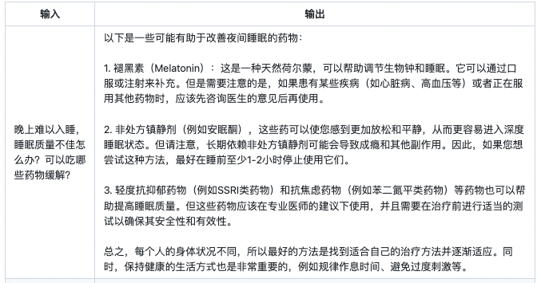
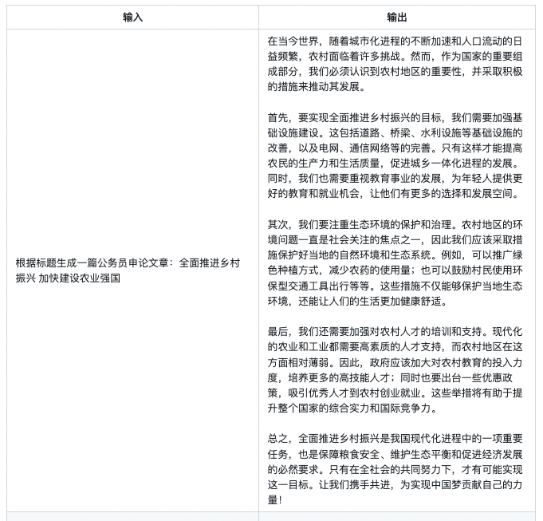

# 【LLMs 入门实战 —— 二十七 】【QLoRA实战】使用单卡高效微调bloom-7b1
 
1. [https://huggingface.co/BlinkDL](https://huggingface.co/BlinkDL)
2. 代码：[artidoro/qlora](https://github.com/artidoro/qlora)
3. 模型：[timdettmers (Tim Dettmers)](https://huggingface.co/timdettmers)
4. 量化代码：[TimDettmers/bitsandbytes](https://github.com/TimDettmers/bitsandbytes)
5. BLOG : [Making LLMs even more accessible with bitsandbytes, 4-bit quantization and QLoRA](https://huggingface.co/blog/4bit-transformers-bitsandbytes)
6. Demo环境：[Guanaco Playground Tgi - a Hugging Face Space by uwnlp](https://huggingface.co/spaces/uwnlp/guanaco-playground-tgi)


## 一、前言

### 1.1 动机

5月24日华盛顿大学的研究者发布了QLoRA技术及用其生成的Guanaco大模型。

- 特点：
  - 在Vicuna基准测试中表现优于所有先前公开发布的模型，达到ChatGPT性能水平的99.3%，仅需要单个GPU上的24小时微调时间；
  - QLORA引入了一些创新来节省内存而不牺牲性能：
    - （a）4位NormalFloat（NF4），这是一种对于正态分布权重来说在信息论上是最优的数据类型；
    - （b）双量化，通过量化量化常数来减少平均内存占用；
    - （c）分页优化器，用于管理内存峰值。

### 1.2 LoRA简介

在介绍QLoRA之前，简单回顾一下LoRA。

- LoRA的本质：
  - 在原模型的基础上插入若干新的参数，称之为adapter；
  - 在训练时，冻结原始模型的参数，只更新adapter的参数

> 注：对于不同的基座模型，adapter的参数量一般为几百万~几千万。


- LoRA的优点：
  - 在于能够使用较少的GPU资源，在下游任务中对大模型进行微调

- LoRA微调中存在以下三个痛点：
  - **参数空间小**：LoRA中参与训练的参数量较少，解空间较小，效果相比全量微调有一定的差距；
  - **微调大模型成本高**：对于上百亿参数量的模型，LoRA微调的成本还是很高；
  - **精度损失**：针对第二点，可以采用int8或int4量化，进一步对模型基座的参数进行压缩。但是又会引发精度损失的问题，降低模型性能。

### 1.3 QLoRA简介

- QLoRA 具体思路：
  - **4-bit NormalFloat**：提出一种理论最优的4-bit的量化数据类型，优于当前普遍使用的FP4与Int4；
  - **Double Quantization**：相比于当前的模型量化方法，更加节省显存空间。每个参数平均节省0.37bit，对于65B的LLaMA模型，大约能节省3GB显存空间；
  - **Paged Optimizers**：使用NVIDIA统一内存来避免在处理小批量的长序列时出现的梯度检查点内存峰值；
  - **增加Adapter**：4-bit的NormalFloat与Double Quantization，节省了很多空间，但带来了性能损失，作者通过插入更多adapter来弥补这种性能损失。**在LoRA中，一般会选择在query和value的全连接层处插入adapter。而QLoRA则在所有全连接层处都插入了adapter，增加了训练参数，弥补精度带来的性能损失。**

> 注：如果对上面的内容没什么概念，通俗点说明就是 微调LLaMA-65B模型 只需要 41G 显存，相当于 使用两个 V100 即可 微调LLaMA-65B模型，是不是很香？

### 1.4 软件资源

- CUDA 11.7
- Python 3.10
- pytorch 1.13.1+cu117

## 二、环境搭建

### 2.1 下载代码 

```s
    $ 
```

### 2.2 构建环境

```s
    $ conda create -n py310_chat python=3.10       # 创建新环境
    $ source activate py310_chat                   # 激活环境
```

### 2.3 安装依赖 

```s
    $ 
```

## 三、模型训练代码

### 3.1 数据构建

在本项目中，我们使用bloom-7b1作为基座模型。数据集为moss-003-sft-no-tools，这是由MOSS项目开源的中文指令微调数据集，我们随机抽取了29万条作为训练数据，训练得到firefly-7b1-qlora-v0.1。

训练时，我们将多轮对话拼接成如下格式，然后进行tokenize。

```s
  <s>input1</s>target1</s>input2</s>target2</s>...
```

### 3.2 模型微调超参数

在一张32G显卡上使用QLoRA进行训练，在所有全连接层处都插入adapter，最终参与训练的参数量超过1亿，相当于一个bert-base的参数量。训练时只计算target部分的损失函数。

训练超参数如下所示：



### 3.3 模型推理

firefly-7b1-qlora-v0.1的使用方式如下：

```s
from peft import PeftModel
from transformers import AutoModelForCausalLM, AutoTokenizer, LlamaTokenizer, BitsAndBytesConfig
import torch

model_name = 'bigscience/bloom-7b1'
adapter_name = 'YeungNLP/firefly-7b1-qlora-v0.1'
device = 'cuda'
input_pattern = '<s>{}</s>'

model = AutoModelForCausalLM.from_pretrained(
    model_name,
    low_cpu_mem_usage=True,
    torch_dtype=torch.float16,
    device_map='auto'
)
model = PeftModel.from_pretrained(model, adapter_name)
model.eval()
model = model.to(device)
tokenizer = AutoTokenizer.from_pretrained(model_name)

text = input('User：')
while True:
    text = input_pattern.format(text)
    input_ids = tokenizer(text, return_tensors="pt").input_ids
    input_ids = input_ids.to(device)
    outputs = model.generate(input_ids=input_ids, max_new_tokens=250, do_sample=True, top_p=0.75, temperature=0.35,
                             repetition_penalty=1.2, eos_token_id=tokenizer.eos_token_id)
    rets = tokenizer.batch_decode(outputs)
    output = rets[0].strip().replace(text, "").replace('</s>', "")
    print("Firefly：{}".format(output))
    text = input('User：')
```

> 多轮对话


> 邮件生成


> 商品文案生成


> 医疗问答


> 创意性写作



## 填坑笔记


## 总结

在本文中，我们介绍了QLoRA的基本原理，以及论文中一些比较重要的实验结论。并且使用QLoRA对bloom-7b1模型进行中文指令微调，获得了非常不错的效果。

从firefly-7b1-qlora-v0.1的生成效果来看，虽然没有做定量的评测(对LLM做评测确实比较困难)，但就生成效果来看，丝毫不逊色于全量微调的firefly-2b6-v2。

一些碎碎念：

1. 论文中表明QLoRA能够媲美全量参数微调的效果，虽然可能需要更丰富、多角度的实验进行验证，但如果【增大基座模型的参数量+QLoRA】能够优于【全量微调较小的模型】，也是非常有意义的。
2. 对基座模型进行量化压缩，通过增加adapter来弥补量化导致性能损失，是一个非常不错的idea，论文中的实验也证实了这一点。并且从我们的实践效果看来，确实惊艳，效果远胜LoRA。
3. 最后，如果你手边的训练资源不足，QLoRA非常值得一试。


## 参考

1. [https://huggingface.co/BlinkDL](https://huggingface.co/BlinkDL)
2. 代码：[artidoro/qlora](https://github.com/artidoro/qlora)
3. 模型：[timdettmers (Tim Dettmers)](https://huggingface.co/timdettmers)
4. 量化代码：[TimDettmers/bitsandbytes](https://github.com/TimDettmers/bitsandbytes)
5. BLOG : [Making LLMs even more accessible with bitsandbytes, 4-bit quantization and QLoRA](https://huggingface.co/blog/4bit-transformers-bitsandbytes)
6. Demo环境：[Guanaco Playground Tgi - a Hugging Face Space by uwnlp](https://huggingface.co/spaces/uwnlp/guanaco-playground-tgi)
7. [【QLoRA实战】使用单卡高效微调bloom-7b1，效果惊艳](https://mp.weixin.qq.com/s/DED7yeiE0DibsVzTmMeDOw)

