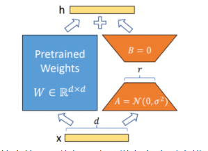

# QLoRA 

## 1.1 动机

5月24日华盛顿大学的研究者发布了QLoRA技术及用其生成的Guanaco大模型。

- 特点：
  - 在Vicuna基准测试中表现优于所有先前公开发布的模型，达到ChatGPT性能水平的99.3%，仅需要单个GPU上的24小时微调时间；
  - QLORA引入了一些创新来节省内存而不牺牲性能：
    - （a）4位NormalFloat（NF4），这是一种对于正态分布权重来说在信息论上是最优的数据类型；
    - （b）双量化，通过量化量化常数来减少平均内存占用；
    - （c）分页优化器，用于管理内存峰值。

## 1.2 LoRA简介

在介绍QLoRA之前，简单回顾一下LoRA。

- LoRA的本质：
  - 在原模型的基础上插入若干新的参数，称之为adapter；
  - 在训练时，冻结原始模型的参数，只更新adapter的参数

> 注：对于不同的基座模型，adapter的参数量一般为几百万~几千万。

- LoRA的优点：
  - 在于能够使用较少的GPU资源，在下游任务中对大模型进行微调

- LoRA微调中存在以下三个痛点：
  - **参数空间小**：LoRA中参与训练的参数量较少，解空间较小，效果相比全量微调有一定的差距；
  - **微调大模型成本高**：对于上百亿参数量的模型，LoRA微调的成本还是很高；
  - **精度损失**：针对第二点，可以采用int8或int4量化，进一步对模型基座的参数进行压缩。但是又会引发精度损失的问题，降低模型性能。

## 1.3 QLoRA简介

- QLoRA 具体思路：
  - **4-bit NormalFloat**：提出一种理论最优的4-bit的量化数据类型，优于当前普遍使用的FP4与Int4；
  - **Double Quantization**：相比于当前的模型量化方法，更加节省显存空间。每个参数平均节省0.37bit，对于65B的LLaMA模型，大约能节省3GB显存空间；
  - **Paged Optimizers**：使用NVIDIA统一内存来避免在处理小批量的长序列时出现的梯度检查点内存峰值；
  - **增加Adapter**：4-bit的NormalFloat与Double Quantization，节省了很多空间，但带来了性能损失，作者通过插入更多adapter来弥补这种性能损失。**在LoRA中，一般会选择在query和value的全连接层处插入adapter。而QLoRA则在所有全连接层处都插入了adapter，增加了训练参数，弥补精度带来的性能损失。**

> 注：如果对上面的内容没什么概念，通俗点说明就是 微调LLaMA-65B模型 只需要 41G 显存，相当于 使用两个 V100 即可 微调LLaMA-65B模型，是不是很香？
