# VeRA：可调参数比LoRA小10倍的低秩微调方法

> 论文名称：VeRA：Vector-based Random Matrix Adaptation
> 
> 论文地址：https://arxiv.org/pdf/2310.11454.pdf

## 一、动机

### 1.1 什么是 LoRA?

**LoRA使用低秩矩阵来近似微调过程中的权重变化，从而有效地减低训练所需的参数量**。其还可以使用量化模型权重来进一步降低要求。与基于adapter的微调方法相比，LoRA在部署时不会产生额外的推理时间成本，因此训练矩阵可以和权重合并。

### 1.2 什么是 ​AdaLoRA?

​AdaLoRA扩展了LoRA方法，**在微调过程中引入了低秩矩阵的动态调整**。

- 核心思想：**通过基于重要性度量来选择性的修剪矩阵中不太重要的分量，从而优化参数预算的分配**。

### 1.3 LoRA 和 ​AdaLoRA 参数效率问题？

- LoRA：需要大量的可训练参数。基于Aghajanyan等人的研究，内在维度的上限比这种方法中通常使用的秩要小的多。因此，参数量可以进一步减少。
- AdaLoRA：通过动态分配参数，从而进一步减少了可微调参数。但是，我们认为存在另一种可以显著减少可训练参数，且效果不会下降的方法。

### 1.4 是否可以通过 随机模型和投影 方式 提升 模型微调效率？

- Frankle&Carbin发现随机初始化的神经网络中包含训练时能够达到高性能的子网络；
- Ramanujan等人了存在的子网络即使没有训练也能够取得令人印象深刻的结果；
- Aghajanyan等人展示了仅训练少量参数，随机投影会完整空间，能够实现全参数模型效果的90%。

证明冻结的随机初始化模型加上小部分的微调，表现出奇的好。

## 二、VeRA 的 核心思想是什么？

**​VeRA的核心思想**：低秩矩阵的重参数化。具体来说，冻结一对随机初始化的矩阵，这些矩阵在所有适配层之间共享，然后引入可以逐层自适应的可训练缩放向量。如图所示，类似于LoRA，训练的缩放向量和低秩矩阵可以合并至原始权重中，从而消除额外的推理延迟。

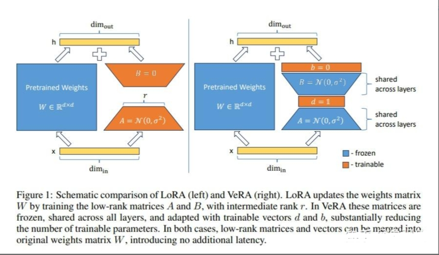

## 三、VeRA 公式介绍？

- LoRA微调思路:
​ 
LoRA微调两个低秩矩阵的乘积来适应LLM。正式来说，对于预训练权重矩阵 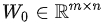 ,权重更新矩阵被约束为低秩分解，即

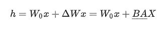

其中带有下划线的参数通过梯度更新。这种近似可以使得模型保持原始权重 W0 冻结，同时仅优化低秩矩阵 A 和 B 。它们的尺寸要远比原始矩阵小。A 的形状是 m*r，B 的形状是 r*n ，而 r<<min(m,n) 。

- VeRA微调思路:

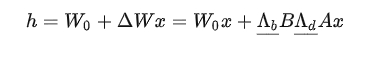

在本方法中， B 和 A 是冻结、随机且跨层共享的，而缩放向量 b 和 d 是可训练的，形式上表达为对角矩阵 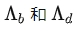 。在这种情况下，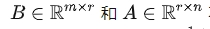 不需要是低秩的。这是因为这两个矩阵是静态的，并且不需要存在这些值。相反，由于 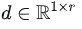，改变  仅会线性增加可训练参数的数量。

## 四、LoRA vs VeRA 参数计数？

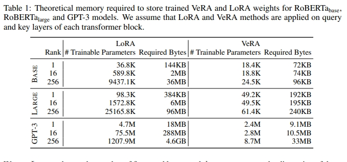

- LoRA的可微调参数:

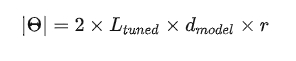

- VeRA的可训练参数:

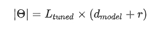

> 注： $L_{tuned}$ 为 微调层数量，$d_{model}$ 为 这些层的维度

具体来说，对于最低的秩(r=1)，VeRA大约需要LoRA一半的可训练参数。此外，随着秩的增加，VeRA的可训练参数一次仅增加 $L_{tuned}$ ，而LoRA则增加 $2*L_{tuned}*d_{model}$ 。对于极大的模型，这种参数效率则极为显著，例如GPT-3有96个注意力层且hidden size为12288。

​ VeRAA的主要优势是存储训练的权重占用非常小的存储空间。因此随机冻结矩阵可以从随机数生成器种子中重新生成，所以这些矩阵不需要存储。这大大减少了内存的需求，现有的内存需要仅限于训练向量 b 和 d 以及单个随机数种子所需要的字节。与LoRA相比的内存效率如表1所示。

## 五、VeRA 初始化策略？

- **共享矩阵**。利用Kaiming初始化方法来初始化冻结低秩矩阵 A 和 B。通过基于矩阵维度的缩放至，其能确保 A 和 B 的矩阵乘积对所有秩保存一致的方差，从而消除对每个秩的学习率进行微调的需求。

​- **缩放向量**。缩放向量b被初始化为0，这与LoRA中矩阵B的初始化是一致的，能确保权重矩阵在第一次前向传播时不受影响。缩放向量d的所有元素使用单个非零值进行初始化，从而引入了一个新的超参数。调整该超参数可以带来更好的效果。

​ 图1展示了VeRA中低秩矩阵和缩放向量的初始化示例。具体来说看，使用正态分布来初始化低秩矩阵，并使用1来初始化d向量。

## 六、论文实验

论文对比了 全参微调、Bitfit(仅微调bias向量，其他参数保存固定)、Adapter tuning、LoRA。

1. GLUE Benchmark

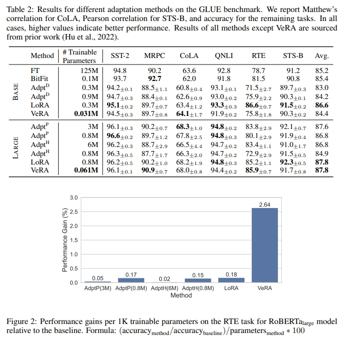

2. E2E Benchmark

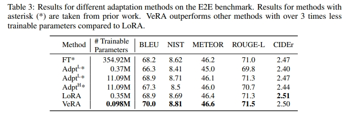

3. LLaMA-2-7B指令遵循

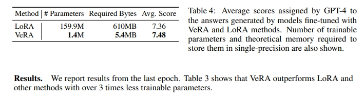

4. 可训练参数数量的影响

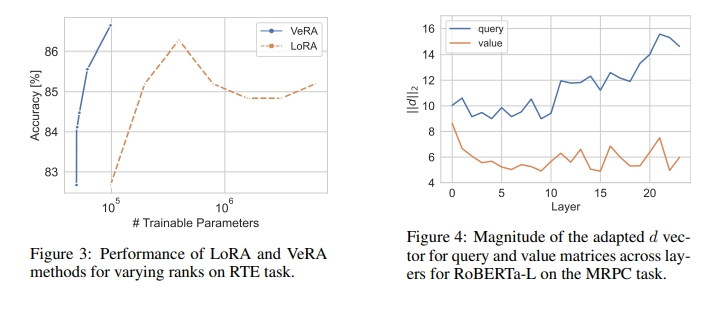

## 致谢

- 【自然语言处理】【大模型】VeRA：可调参数比LoRA小10倍的低秩微调方法 https://zhuanlan.zhihu.com/p/664188901

