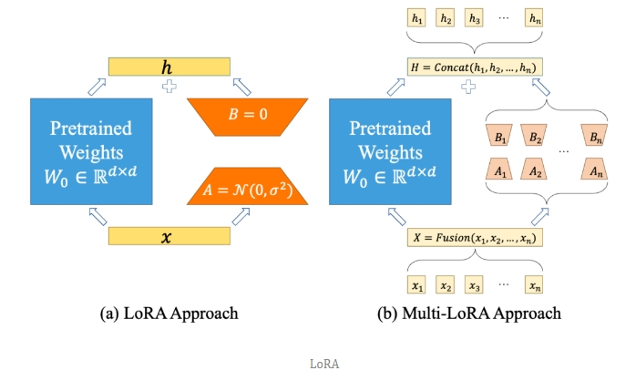
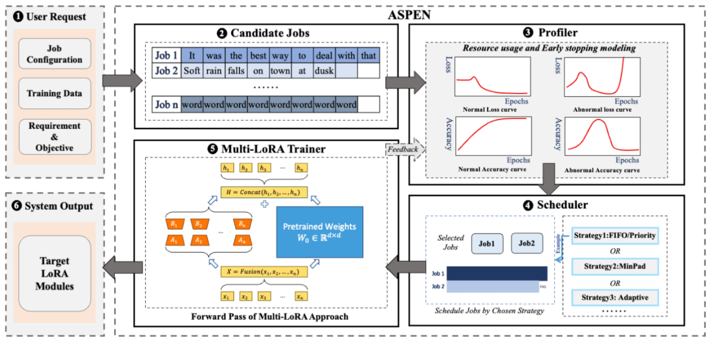

# m-LoRA：如何在单GPU上高效微调数十个大语言模型

- 论文：m-LoRA: High-Throughput LoRA Fine-Tuning of Large Language Models with a Single GPU
- 论文地址：https://arxiv.org/abs/2312.02515
- GitHub - TUDB-Labs/multi-lora-fine-tune: Provide efficient lora fine tune with the same base model（https://github.com/TUDB-Labs/multi-lora-fine-tune）

## 一、论文动机

大型语言模型（LLM）对现代应用产生了显著影响，应用领域从自然语言处理拓展到包括OpenAI的Chatgpt及微调的LLM在内的更多特定领域任务。通常LLM先在大数据集上预训练，再根据具体应用进行微调。然而，传统微调方法成本高昂，涉及更新所有预训练参数。LoRA技术通过创建小型模块，有效地实现了预训练模型的高效微调，仅更新少量参数。截至2023年11月，基于LoRA的数千个LLaMA模型被微调并展示在Hugging Face Hub上。在HuggingFace排行榜上，前20名模型的40%采用了LoRA或其衍生技术进行微调，LoRA在保持高精度的同时大幅减少了微调所需的计算资源。

在处理多个LoRA微调任务的情境中，有两种典型的场景：相同数据集和不同数据集。每种场景都有其特点和挑战：

1. 相同数据集上的多个LoRA微调任务

- 在这种场景中，所有的微调任务都集中在同一个数据集上，通常面向不同的特定任务或目标。
- 微调任务可能共享很多公共特征和语言模式，这使得在某种程度上可以实现资源和学习策略的共享。但不同的微调任务可能依然需要区分对待，以适应各自独特的目标和需求。
- 主要挑战：**如何在不牺牲个别任务特定需求的前提下，有效地共享学习资源和模型参数**。

2. 不同数据集上的多个LoRA微调任务

- 在这种场景中，每个微调任务处理的数据集各不相同，可能针对完全不同的应用领域或问题。
- 这种多样性要求微调过程必须更加灵活和个性化，以适应不同数据集的特性和需求。由于数据集的差异性，可能无法有效共享学习资源或模型参数，每个任务都需要独立的注意和优化策略。
- 主要挑战：**如何在多任务环境中平衡资源分配，同时保证每个任务都能获得针对其特定数据集和目标的最优训练效果**。

## 二、论文方法

m-LoRA采用一种名为Batch Fusion的新型并行微调方法，实现多个LoRA微调任务并行训练。与此同时，m-LoRA提出了一种细粒度、高效率的作业级调度器来调度多个并行微调任务，解决了资源管理和数据对齐中的挑战。通过一系列微调实验，m-LoRA在GPU利用率、内存使用和训练吞吐量方面表现出优于现有方法。

- 能够单卡同时微调超过30个任务，尤其适用于处理多个不同微调任务的场景（如多语言模型训练、不同领域的定制化模型训练等）。
- 在NVIDIA A100 80GB GPU上训练多个LLaMA-7B模型时，实现了高达53%的GPU内存节约。对于其它模型的训练，GPU内存节约也相当显著。
- 减少了24%的整体周转时间和12%的端到端训练延迟。
- 相比现有的参数高效微调方法，将训练吞吐量提升了约17%。

## 致谢

- m-LoRA：如何在单GPU上高效微调数十个大语言模型 https://mp.weixin.qq.com/s/hAYgCL3xM-uu9hrGmE8mBA

