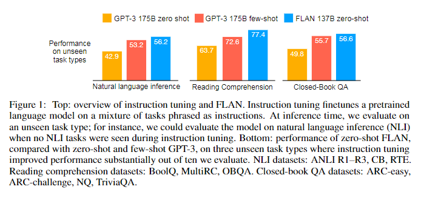
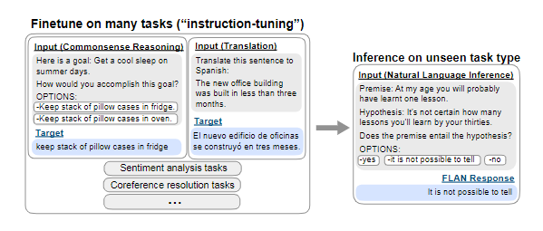

# 【关于 Instruction Tuning】 那些你不知道的事

> 作者：杨夕
> 
> Paper：Finetuned Language Models Are Zero-Shot Learners
> 
> Paper 地址：https://arxiv.org/abs/2109.01652
> 
> Code：https://github.com/google-research/flan
> 
> NLP论文学习笔记：https://github.com/km1994/nlp_paper_study
> 
> **[手机版NLP论文学习笔记](https://mp.weixin.qq.com/s?__biz=MzAxMTU5Njg4NQ==&mid=100005719&idx=1&sn=14d34d70a7e7cbf9700f804cca5be2d0&chksm=1bbff26d2cc87b7b9d2ed12c8d280cd737e270cd82c8850f7ca2ee44ec8883873ff5e9904e7e&scene=18#wechat_redirect)**
> 
> 个人介绍：大佬们好，我叫杨夕，该项目主要是本人在研读顶会论文和复现经典论文过程中，所见、所思、所想、所闻，可能存在一些理解错误，希望大佬们多多指正。
> 
> NLP 百面百搭 地址：https://github.com/km1994/NLP-Interview-Notes
> 
> **[手机版NLP百面百搭](https://mp.weixin.qq.com/s?__biz=MzAxMTU5Njg4NQ==&mid=100005719&idx=3&sn=5d8e62993e5ecd4582703684c0d12e44&chksm=1bbff26d2cc87b7bf2504a8a4cafc60919d722b6e9acbcee81a626924d80f53a49301df9bd97&scene=18#wechat_redirect)**
> 
> 推荐系统 百面百搭 地址：https://github.com/km1994/RES-Interview-Notes
> 
> **[手机版推荐系统百面百搭](https://mp.weixin.qq.com/s/b_KBT6rUw09cLGRHV_EUtw)**

- [【关于 Instruction Tuning】 那些你不知道的事](#关于-instruction-tuning-那些你不知道的事)
  - [一、动机](#一动机)
  - [二、instruction tuning 是什么？](#二instruction-tuning-是什么)
  - [参考](#参考)

## 一、动机

PLM 在 Few-Shot 上表现一般都很好，但是在 Zero-Shot 上就很一般了，一个潜在的原因是模型很难执行和预训练不一样格式的 prompt。

FLAN（Fine-tuned Language Net）却通过「指示微调」（instruction tuning） 实现了不错的效果，如下图所示：

## 二、instruction tuning 是什么？

Instruction Tuning 通过 激发语言模型的理解能力，利用给出更明显的指令/指示，让模型去理解并做出正确的action。比如NLI/分类任务：

## 参考

1. [Finetuned Language Models are Zero-Shot Learners](https://arxiv.org/abs/2109.01652)
2. [google-research/flan](https://github.com/google-research/flan)
3. [Instruction Tuning：无/少样本学习新范式](https://zhuanlan.zhihu.com/p/607598155)
4. [Instruction Tuning｜谷歌Quoc V.Le团队提出又一精调范式](https://zhuanlan.zhihu.com/p/408166011)
5. [打开模型Zero-Shot新范式：Instruction Tuning](https://zhuanlan.zhihu.com/p/559102540)
