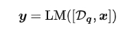
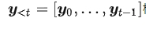
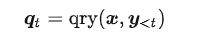
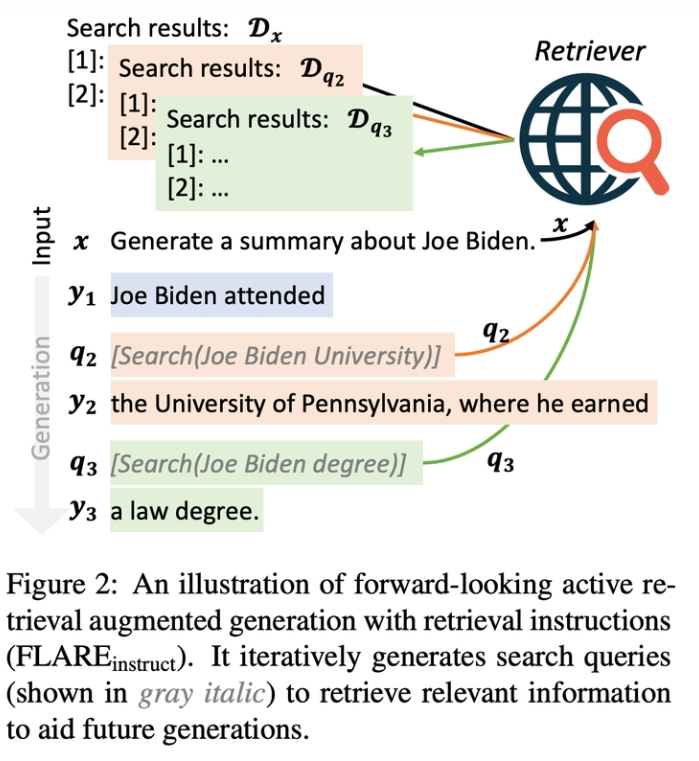
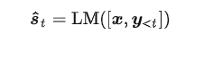
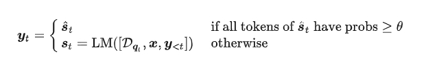
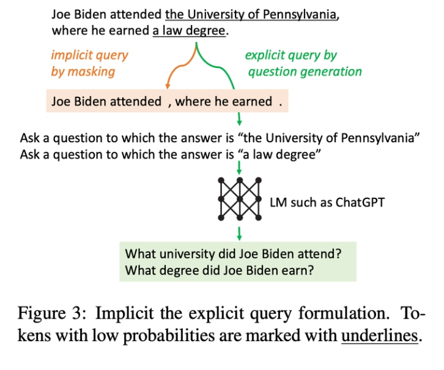
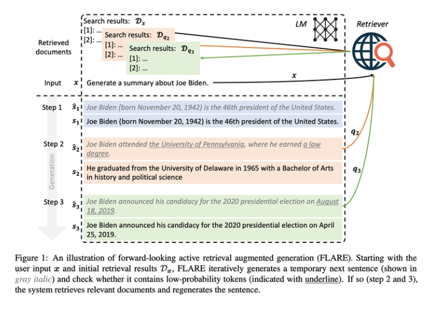

# Active RAG：一种主动判断需不需要进行检索，需要时再检索的 RAG 策略

> 论文名称：Active Retrieval Augmented Generation
> 
> 论文地址：https://arxiv.org/pdf/2305.06983.pdf
> 
> 论文 Github地址：https://github.com/jzbjyb/FLARE

## 一、前言

### 1.1 什么是基于检索增强的语言模型？

将用户的输入 x 和检索到的相关文档 Dq 一起送入语言模型来生成回答

### 1.2 什么是 主动检索增强生成？

生成模型是逐步生成，因此这里考虑的方式：

1. 每个step基于用户输入和当前已经生成的回复 构造用于检索的query：

2. 检索后再结合起来进行生成:

但是 **如果每一个step都去进行检索显然是有点冗余的**

## 二、论文方法

### 2.1 方法一：FLARE with Retrieval Instructions

- 思路：**通过prompt的方式让LLM来决定什么时候需要进行检索**，比如当LLM生成“[Search(query)]”这样一个文本片段的时候就会执行检索操作。

- 存在问题：

1. **语言模型认为需要检索的情况会比实际需要检索的情况少**，也就是太自信了漏查；
2. **当生成过多搜索查询时可能会打断原本的答案生成，甚至产生负面效果**；

- 优化方案：对"["这个token的生成上做了点策略。
  - 优化方案一：为了提高语言模型生成“[Search(query)]”的可能性，将“[”的概率值提高了2.0；
  - 优化方案二：每当语言模型产生一个搜索查询时，利用它来检索相关数据后立即从生成内容中移除它。在产生下一段内容时，降低这个token的概率从而避免再次生成“[”。

### 2.2 方法二：Direct FLARE

- 动机：通过instructions的方式存在 不可靠 风险
- 解决方法：直接法（Direct FLARE）
- 主要思想：

1. 每次先往后生成一个临时的句子

2. 看看这个句子里每个token的概率怎么样:

如果都很高就认为模型比较有信心，不需要检索了

3. 当需要检索的时候，就把概率低的token去掉，基于LLM生成一个相关的提问作为query用来检索

- 整个生成过程的示意图如下

## 三、实验结果

## 致谢

- Active Retrieval Augmented Generation: https://arxiv.org/pdf/2305.06983.pdf
- 大语言模型检索增强：该出手时再出手：https://zhuanlan.zhihu.com/p/654736924

