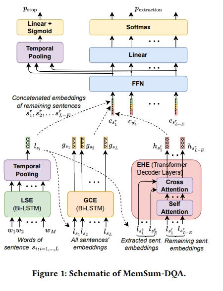

# MINPROMPT 文档QA问答  

> 论文名称：MemSum-DQA: Adapting an Efficient Long Document Extractive Summarizer for Document Question Answering
> 
> 论文地址：https://arxiv.org/pdf/2310.06436v1.pdf
> 
> 论文 Github地址：https://github.com/nianlonggu/MemSum-DQA
> 
> 会议：CIKM 2023

## 一、论文动机

## 二、论文思路

本文作者提出了**「MemSum-DQA，这是一种高效的文档问答 (DQA) 系统」**，它利用了MemSum（一种长文档提取摘要器），通过在解析文档中的每个文本块中添加所提供的问题和问题类型的前缀，MemSum-DQA 有选择地从文档中提取文本块作为答案。 

## 三、实验结果

在完整文档回答任务中，与之前最先进的基线相比，这种方法的精确匹配精度提高了9%。 值得注意的是，**「MemSum-DQA 擅长解决与子关系理解相关的问题」**，强调了提取摘要技术在 DQA 任务中的潜力。

## 致谢

- MINPROMPT: Graph-based Minimal Prompt Data Augmentation for Few-shot Question Answering：https://arxiv.org/pdf/2310.05007v1.pdf

