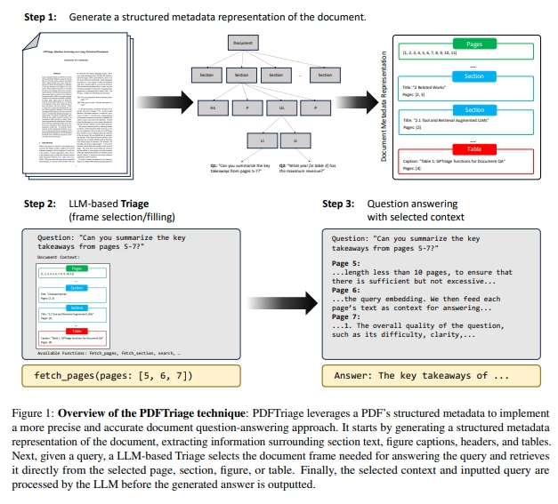
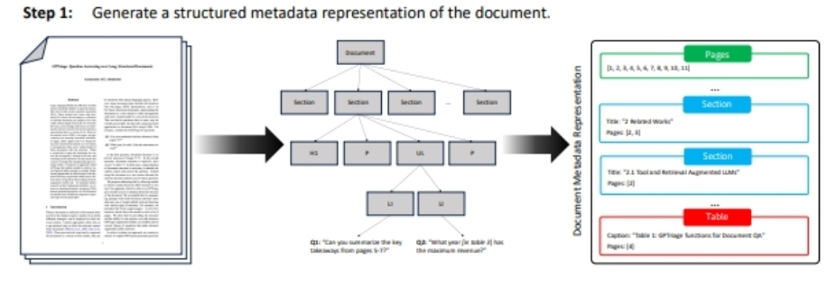
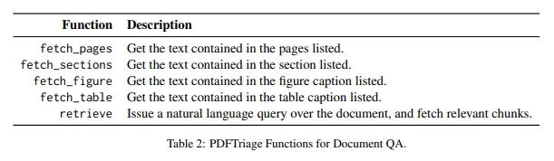
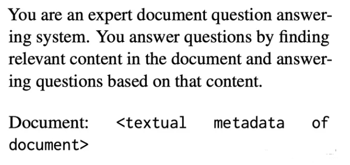

# PDFTriage：针对长结构化文档的问答

> 论文名称：PDFTriage: Question Answering over Long, Structured Documents
> 
> 论文地址：https://arxiv.org/pdf/2309.08872.pdf

## 一、前言

当文档无法适应 LLM 的小上下文长度时，大型语言模型 (LLM) 会出现文档问答 (QA) 问题。为了克服这个问题，大多数现有的工作都集中于从文档中检索相关上下文，并将它们表示为纯文本。

然而，**PDF、网页和演示文稿等文档自然是由不同的页面、表格、部分等构成的**。将此类结构化文档表示为纯文本与用户对这些结构丰富的文档的心理模型不相符。当系统必须查询文档的上下文时，这种不协调性就会凸显出来，看似微不足道的问题可能会妨碍 QA 系统。

为了弥补处理结构化文档方面的这一根本差距，我们提出了一种称为 PDFTriage 的方法，该方法**使模型能够根据结构或内容检索上下文**。我们的实验证明了所提出的 PDFTriage 增强模型在解决现有检索增强LLM无法解决的几类问题上的有效性。为了促进对这一基本问题的进一步研究，我们发布了基准数据集，其中包含 900 多个人工生成的问题，超过 80 个结构化文档，来自 10 种不同类别的问题类型，用于文档 QA。我们的代码和数据集很快就会在 Github 上发布。

## 二、动机

- 问题：当文档不适合LLM的有限上下文窗口时，可以部署不同的策略来获取相关上下文。
- 当前解决方法：

1. 方法一：依赖于预检索步骤从文档中获取相关上下文（Pereira 等人，2023；Gao 等人，2022）。这些预检索步骤倾向于将文档表示为纯文本块，与用户查询共享一些相似性并可能包含答案。
   1. 存在问题：许多文档类型具有丰富的结构，例如网页、PDF、演示文稿等。对于这些结构化文档，将文档表示为纯文本通常与用户对结构化文档的心理模型不一致。这可能会导致一些问题，对于用户来说，这些问题可能很容易回答，但使用LLM记录质量检查的常见/当前方法却失败了。

> 对于 以下两个问题：

```s
    问题 1：“您能总结一下第 5-7 页的要点吗？”
    问题 2 “[表 3] 哪一年的收入最高？”
```

> 在第一个问题中，明确引用了文档结构（“第 5-7 页”）。在第二个问题中，隐式引用了文档结构（“在表 3 中”）。在这两种情况下，都需要文档结构的表示来识别显着上下文并回答问题。将文档视为纯文本会放弃回答这些问题所需的相关结构。

## 三、论文方法

通过**允许模型根据结构或内容检索上下文**来解决文档的简化问题。

我们的方法（我们称之为 PDFTriage）使模型能够访问有关文档结构的元数据。我们通过使用文档结构元数据和一组针对各种类型结构的模型可调用检索函数来增强提示，从而利用文档结构。

> 例如，我们引入了 fetch_pages(pages: list[int]) 函数，该函数允许模型获取页面列表。

我们证明，通过提供结构以及对该结构发出查询的能力，PDFTriage 增强模型可以可靠地回答普通检索增强LLM无法回答的几类问题。

## 四、PDFTriage: Structured Retrieval from Document Metadata

PDFTriage 方法包含三个步骤来回答用户的问题，如图 1 所示：

1. **生成文档元数据**：提取文档的结构元素并将其转换为可读的元数据。
2. **基于 LLM 的分类**：查询 LLM 以从文档中选择精确的内容（页面、部分、检索的内容）。
3. **使用检索到的内容进行回答**：根据问题和检索到的内容，生成答案。



### 4.1 文档表示

对于 原生数字 PDF 文档，将其视为用户将与之交互的结构化文档，使用以下：

1. **PDF 解析为 HTML树**：使用 Adob​​e Extract API，将 PDF 转换为类似 HTML 的树，从而能够提取章节、章节标题、页面信息、表格和图形。Extract API 会生成 PDF 中元素的分层树，其中包括章节标题、表格、图形、段落等。每个元素都包含元数据，例如其页面和位置；
2. **HTML树 转化为 Markdown**：解析该树以识别部分、部分级别和标题，收集特定页面上的所有文本，或获取图形和表格周围的文本。将该结构化信息映射为 JSON 类型，用作 LLM 的初始提示。内容转换为 Markdown



### 4.2 文档的LLM 查询

PDFTriage 在该方法中使用了五个不同的函数：fetch_pages、fetch_sections、fetch_table、fetch_figure 和retrieve。



每个功能都允许 PDFTriage 系统收集与给定 PDF 文档相关的精确信息，以标题、副标题、图形、表格和章节段落中的结构化文本数据为中心。

PDFTriage 系统在针对每个问题的单独查询中使用这些函数，综合多条信息以得出最终答案。

### 4.3 问答

为了初始化 PDFTriage 进行问答，我们使用 GPT-3.5 的系统提示格式输入以下内容：



## 五、论文贡献

1. 论文发现了当前LLM方法在结构化文档问答方面的差距，即将文档视为纯文本而不是结构化对象。
2. 论文发布了标记问题类型的数据集以及模型响应，以促进对该主题的进一步研究；
3. 论文提出了一种名为 PDFTriage 的模型提示方法，可提高LLM回答结构化文档问题的能力。

## 致谢

- PDFTriage：针对长结构化文档的问答 https://zhuanlan.zhihu.com/p/668283636


