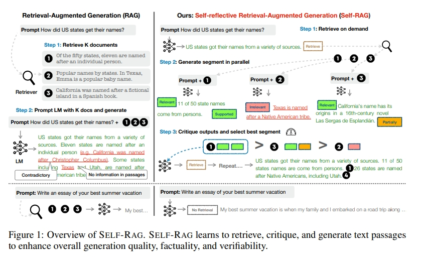

# Self-RAG：一种 通过自我反思实现检索增强生成 的 RAG 策略

> 论文名称：Self-RAG: Learning to Retrieve, Generate, and Critique through Self-Reflection
> 
> 论文地址：https://arxiv.org/abs/2310.11511
> 
> 论文 Github地址：

## 一、前言

尽管其模型和数据规模不断增加，但由于它们**完全依赖于其包含的参数化知识**，最好的LLMs在事实错误方面仍然存在问题。

**检索增强生成（Retrieval-Augmented Generation，RAG）方法（图中左侧）通过检索相关知识来减少这类问题，降低了LLMs在知识密集型任务中的事实错误率）**。

但是，会存在如下的问题：

1. **检索文段与 query 的 不相关性**：这些方法不加区别地检索和合并了一定数量的检索文段，无论是否需要检索或文段是否相关，这会降低LLMs的多功能性或导致生成质量不佳（Shi等人，2023），因为它们不加区别地检索文段，无论事实支持是否有帮助;
2. **生成的结果未必与检索的相关文段一致**（Gao等人，2023）：因为这些模型没有明确训练以利用和遵循所提供文段的事实;

## 二、论文方法

- 方法名称：自我反思检索增强生成（SELF-RAG）
- 论文思路：
  - 通过**按需检索和自我反思来提高LLM的生成质量**，包括其事实准确性，而不损害其多功能性。
  - 论文**以端到端方式训练任意的LLM来学习反思自身的生成过程，通过生成任务输出和间歇性的特殊token**（即反思token）。反思token分为检索和评论token，分别表示检索的需求和生成的质量（图中右侧）

- 论文做法：

1. 给定一个输入提示和先前的生成，**SELF-RAG首先确定是否在继续生成中增加检索文段将会有所帮助**。如果是的话，它会输出一个检索标记，以便按需调用一个检索模型（步骤1）；
2. **SELF-RAG同时处理多个检索文段，评估它们的相关性**，然后生成相应的任务输出（步骤2）；
3. **生成评论标记来批评自己的输出并选择在事实准确性和整体质量方面最好的生成**（步骤3）。这个过程与传统的RAG（图1左侧）不同，后者不管检索是否有必要（例如，底部示例不需要事实知识），都会一律检索固定数量的文档进行生成，并且从不第二次访问生成质量

此外，SELF-RAG为每个部分提供引文，附带自我评估是否输出受文段支持，从而简化了事实验证。

- 训练方式：

1. SELF-RAG训练任意的语言模型（LM），通过**将反思标记整合为来自扩展模型词汇表的下一个标记预测，以生成文本**；
2. 受启发于强化学习中使用的奖励模型，**论文通过训练好的评论模型，将反思token离线插入到原始语料库中原始文本中。这消除了在训练过程中托管评论模型的需求，降低了开销**。评论模型在一定程度上是在通过提示专有的LLM（即GPT-4）收集的输入、输出和相应的反思标记数据集上进行监督学习的。尽管从使用控制标记启动和指导文本生成的研究中汲取灵感，但论文训练的LLM在生成输出的一个部分之后使用评论标记来评估自己的预测，作为生成输出的一个组成部分。
3. SELF-RAG进一步提供了可定制的解码算法，以满足硬性或软性约束，这些约束由反思token的预测定义。特别是，论文的推理算法使我们能够
   1. 在不同的下游应用程序中灵活调整检索频率；
   2. 通过使用反思标记通过基于段的权重线性和作为段分数的算法来定制模型的行为以满足用户的偏好。

## 三、实验结果

实验证据表明，SELF-RAG在六个任务上明显优于具有更多参数的经过预训练和经过指导的LLMs以及广泛采用的具有更高引用准确性的RAG方法。特别是，SELF-RAG在四个任务上优于具有检索增强功能的ChatGPT，Llama2-chat和Alpaca在所有任务中的性能更好。论文的分析证明了使用反思标记进行训练和推理对整体性能提升以及测试时模型自定义（例如，在引文预测和完整性之间的权衡）的有效性。

## 致谢

- Self-RAG: Learning to Retrieve, Generate, and Critique through Self-Reflection: https://arxiv.org/abs/2310.11511
- 【LLM】Self-RAG：通过自我反思实现检索增强生成：https://zhuanlan.zhihu.com/p/662969847

