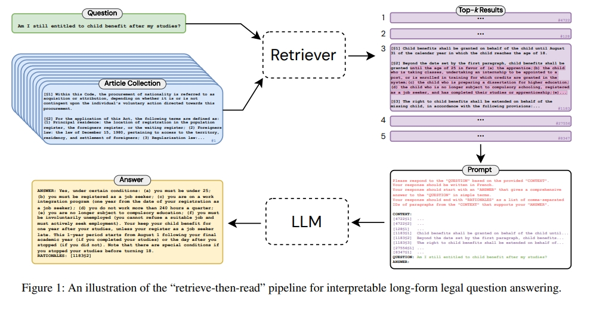

# Long-Form Legal Question Answering 法律QA问答

> 论文名称：Interpretable Long-Form Legal Question Answering with Retrieval-Augmented Large Language Models
> 
> 论文地址:https://arxiv.org/pdf/2309.17050v1.pdf
> 
> 论文 Github地址：https://github.com/maastrichtlawtech/lleqa

## 一、论文动机

许多人可能在一生中的某个时刻面临法律纠纷，但他们缺乏对如何解决这些复杂问题的了解，往往使他们变得脆弱。 自然语言处理的进步为通过开发自动化法律援助系统来弥合法律素养差距开辟了新途径。 然而，现**有的法律问答（LQA）方法往往范围狭窄，要么局限于特定的法律领域，要么仅限于简短、无信息的回答**。

## 二、论文思路

论文提出了一种端到端的方法，**「旨在利用“先检索后阅读”的管道生成任何成文法问题的长格式答案」**。 为了支持这种方法，引入并发布了长格式法律问答 (LLeQA) 数据集，其中包含 1,868 个由专家注释的法语法律问题，以及基于相关法律条款的详细答案。

## 三、实验结果

证明了自动评估指标的良好性能，但定性分析揭示了需要改进的领域。 作为唯一全面的、专家注释的长格式 LQA 数据集之一，LLeQA 不仅有可能加速解决重大现实问题的研究，而且还可以作为评估专业领域 NLP 模型的严格基准

## 致谢

- Interpretable Long-Form Legal Question Answering with Retrieval-Augmented Large Language Models：https://arxiv.org/pdf/2309.17050v1.pdf