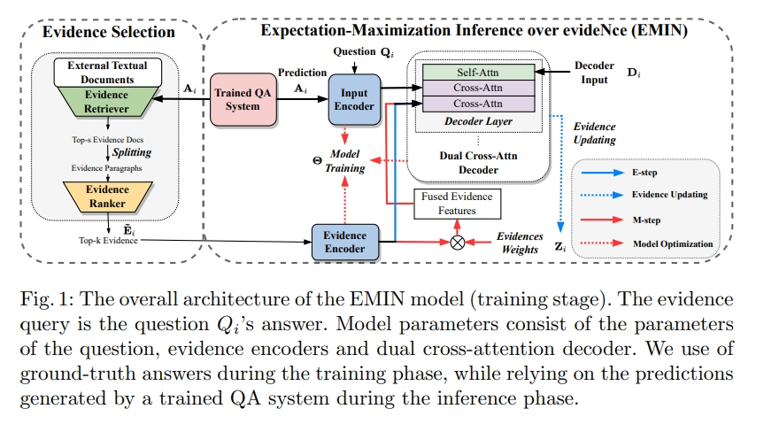

# Medical Question-Answering by Expectation Maximization Inference over Evidence 医疗QA问答

> 论文名称：Generating Explanations in Medical Question-Answering by Expectation Maximization Inference over Evidence
> 
> 论文地址:https://arxiv.org/pdf/2310.01299v1.pdf
> 
> 论文 Github地址：

## 一、论文动机

医疗问答（医疗 QA）系统在协助医护人员寻找问题答案方面发挥着重要作用。然而，**仅通过医学 QA 系统提供答案是不够的，因为用户可能需要解释，即用自然语言进行更多分析性陈述，描述支持答案的元素和上下文**。

## 二、论文思路

论文研究提出了一种新方法，**「为医学 QA 系统预测的答案生成自然语言解释」**。 由于高质量的医学解释需要额外的医学知识，因此我们的系统在解释生成过程中从医学教科书中提取知识以提高解释的质量。

具体来说，作者设计了一种期望最大化方法，可以对这些文本中发现的证据进行推断，提供一种有效的方法来将注意力集中在冗长的证据段落上。 在数据集MQAE-diag、MQAE上证明了文本证据推理框架的有效性，并且本文方法优于最先进的模型。

## 三、实验结果

在两个数据集 MQAEdiag 和 MQAE 上进行的实验结果证明了我们的文本证据推理框架的有效性。 我们的方法优于最先进的模型，在 Rouge-1 分数上实现了 6.86 和 9.43 个百分点的显着提高； 各自数据集上的 Bleu-4 得分分别为 8.23 和 7.82 个百分点。

## 致谢

- Generating Explanations in Medical Question-Answering by Expectation Maximization Inference over Evidence：https://arxiv.org/pdf/2310.01299v1.pdf

