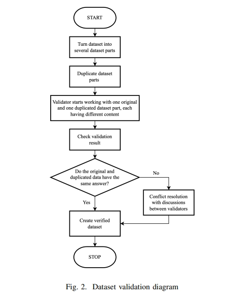

# 宗教QA问答 QASiNa 

> 论文名称：QASiNa: Religious Domain Question Answering using Sirah Nabawiyah
> 
> 论文地址：https://arxiv.org/pdf/2310.08102v1.pdf
> 
> 论文 Github地址：
> 
> 会议：

## 一、论文动机

随着大型语言模型 (LLM)的发展。LLM可以应用于各个领域，但应用于伊斯兰宗教领域时却与信息传输的原则相矛盾。在伊斯兰教中，严格监管信息来源以及谁可以对该来源进行解释。LLM根据自己的解释生成答案的方法类似于tafseer的概念，LLM既不是伊斯兰专家，也不是伊斯兰教所不允许的人。鉴于LLM的影响力较高，本文作者**「对宗教领域的LLM进行评价」**。

## 二、论文思路

论文提出了问答Sirah Nabawiyah (QASiNa)数据集，这是一个根据印尼语Sirah Nabawiyah 文献编译的新颖数据集，并使用 mBERT、XLM-R和IndoBERT验证该数据集，并使用 SQuAD v2.0 的印尼语翻译进行微调。

## 三、实验结果

 XLM-R 模型在 QASiNa 上得出了最佳性能，随后作者将 XLM-R 性能与 Chat GPT-3.5 和 GPT-4 进行比较。两个 ChatGPT 版本都返回了较低的 EM 和 F1-Score。ChatGPT 不适合宗教领域的问答任务，尤其是伊斯兰宗教。

## 致谢

- QASiNa: Religious Domain Question Answering using Sirah Nabawiyah：https://arxiv.org/pdf/2310.08102v1.pdf

