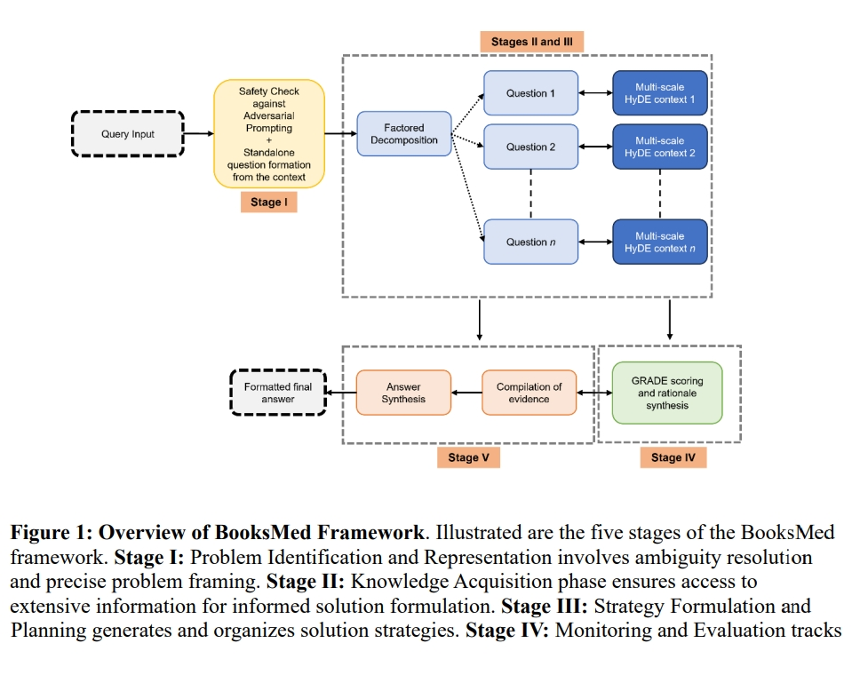

# Expert-Level Medical Question-Answering 医疗可信QA问答

> 论文名称：Emulating Human Cognitive Processes for Expert-Level Medical Question-Answering with Large Language Models
> 
> 论文地址：https://arxiv.org/ftp/arxiv/papers/2310/2310.11266.pdf
> 
> 论文 Github地址：

## 一、论文动机

为了满足医疗保健领域对先进临床问题解决工具的迫切需求。

## 二、论文思路

论文推出了**「BooksMed，这是一种基于大型语言模型(LLM)的新颖框架」**。BooksMed模拟人类认知过程，提供具有依据的可靠响应，利用GRADE（建议、评估、开发和评估）框架量化依据强度。

为了正确评估临床决策，需要经过临床调整和验证的评估指标。为此，作者又推出了 ExpertMedQA，这是一个多专业临床基准，由开放式专家级临床问题组成，并由不同的医疗专业人员群体进行验证。通过要求对最新临床文献的深入理解和批判性评估，ExpertMedQA 严格评估LLMs的表现。 BooksMed 在各种医疗场景中均优于现有最先进的模型 Med-PaLM 2、Almanac 和 ChatGPT。

## 三、实验结果

## 致谢

- Emulating Human Cognitive Processes for Expert-Level Medical Question-Answering with Large Language Models：https://arxiv.org/ftp/arxiv/papers/2310/2310.11266.pdf

