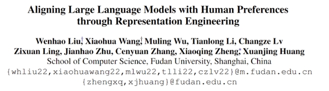
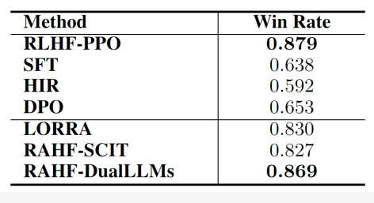
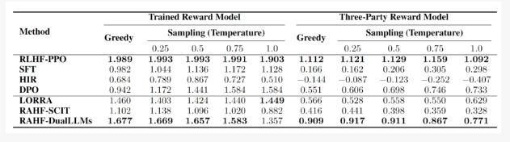

# 基于表征工程的生成式语言大模型人类偏好对齐

- 论文名称：Aligning Large Language Models with Human Preferences through Representation Engineering
- 论文链接：https://arxiv.org/abs/2312.15997

## 一、论文动机

> 图1.不同人类偏好对齐算法的对比。(a)人类反馈的强化学习算法RLHF；(b)基于对比学习的偏好优化方法DPO；(c)基于提示工程的HIR；(d) 基于表征工程的RAHF。

- 构建类似ChatGPT生成式语言大模型一般要经过语言模型、提令精调和强化学习三个主要训练步骤，其中**第三步使用强化学习来实现人类期望对齐既有一定的技术难度，又需要多次人工标注反馈**，因而实现上有一定挑战;
- **经过前两步语言模型和提令精调之后，语言大模型仍然会生成带有偏见、歧视或者令人不适的回答**;
- 为了**提升大模型的安全性、可用性和可信性，与人类期望对齐是必不可少的步骤**;
- 然而目前研究表明利用人类反馈的强化学习算法[1]（RLHF）存在训练不稳定、对超参数敏感和训练代价较高等问题。

针对基于强化学习的人类偏好对齐方法的上述不足，最近提出了一些替代的方法，相关实现思路和方法包括：

1. 借助对比学习的方法[2-4]，代表性工作为DPO（Direct preference optimization）[2]，即提高符合人类偏好回复生成概率的同时，降低人类满意度较低回复的生成概率；
2. 基于提示工程的方法[5-6]，代表性工作为HIR（Hindsight instruction relabeling）[5]，即根据与人类偏好相符程度，设计不同的提示。在推理时使用匹配人类偏好较高的提示，从而引出更好的回答。

虽然上述方法都是Reward-free的方法（即不需要训练奖励评估模型），但实验表明**这些替代强化学习方法存在容易受到训练集中噪声样本的影响**（比如：错误标注、Dull Sentences和较短回复等）。主要原因是**它们都是采用在样本上直接精调的方式实现与人类偏好对齐，因而易受样本质量的影响，而基于人类反馈的强化学习算法先训练评估模型，然后采用评估模型的评分来引导模型的训练过程。即使训练样本存在的噪声，也通过评估模型的“过滤”，对最终模型不会产生直接的影响**。

## 二、论文方法

为了获得轻量级、易实现和Reward-free的人类偏好对齐方法，同时也缓解最终模型受训练样本中噪声数据的不利影响。

受到表征工程Representation Engineering）[7]方面最新进展的启发，我们提出了RAHF（Representation Alignment from Human Feedback）方法。在神经网络中，**网络权重决定了隐层表征、隐层表征决定了网络输出、网络输出决定了网络行为（如：安全、真实、偏见等方面）**。我们通过首先发现模型在生成不同质量回复时网络隐层激发模式及差异，然后利用差异来对模型行为进行调整和操控。具体方法包括以下三个主要步骤：

1. 使用带偏好注释的数据集来让大型语言模型“感知”人类的偏好；
2. 收集模型在不同偏好“刺激”情况下的隐层激活模式；
3. 利用收集到的激活模式及差异来调整模型使其与与人类偏好对齐。

我们尝试了两种方法让模型“感知”人类偏好：单一模型（RAHF-SCIT）和二元模型（RAHF-DualLLMs）。都取得了不错的结果，虽然二元模型RAHF-DualLLMs性能更佳，但单一模型RAHF-SCIT实现更为简单，对硬件资源的要求也更低。

## 三、实验结果

我们在对话任务上对进行了对比实验。实验结果表明所提出的RAHF人类偏好对齐方法在各项指标上都优于其他非强化学习方法，并取得了与RLHF-PPO相媲美的结果。如表1所示，在Anthropic-HH数据集上相对于首选回复的胜率（结果使用GPT-4进行评判），我们所提出的RAHF-DualLLMs超过了除RLHF-PPO之外的所有代替方法，并且与RLHF-PPO仅有0.01的差距。表2报告了在不同生成采样温度下，偏好注释数据上我们自己所训练的奖励模型（Reward model）和第三方提供的奖励模型上的各方法的平均得分比较，这些数据也与表1的结果相吻合，并且表现出相似的趋势。 

> 表1. 在Anthropic-HH数据集上相对于首选回复的胜率（结果使用GPT-4进行评判）。

> 表2. 在不同生成采样温度下，偏好注释数据上所训练的奖励模型（Reward model）和第三方提供的奖励模型上的各方法的平均得分比较。

这项工作我们尝试了一种受认知神经科学理论启发的基于表征工程来实现生成式语言大模型与人类偏好对齐的策略，旨在提出一种轻量级和易实现的解决方案。目前仍然还有许多可改进的空间，我们希望这项研究能够有助于更可控人工智能技术的发展。

## 参考

[1]Ouyang, L., Wu, J., Jiang, X., Almeida, D., Wainwright, C., Mishkin, P., ... & Lowe, R. (2022). Training language models to follow instructions with human feedback. Advances in Neural Information Processing Systems, 35, 27730-27744.

[2]Rafailov, R., Sharma, A., Mitchell, E., Ermon, S., Manning, C. D., & Finn, C. (2023). Direct preference optimization: Your language model is secretly a reward model. arXiv preprint arXiv:2305.18290.

[3]Zhao, Y., Joshi, R., Liu, T., Khalman, M., Saleh, M., & Liu, P. J. (2023). SLIC-HF: Sequence likelihood calibration with human feedback. arXiv preprint arXiv:2305.10425.

[4]Yuan, Z., Yuan, H., Tan, C., Wang, W., Huang, S., & Huang, F. (2023). RRHF: Rank responses to align language models with human feedback without tears. arXiv preprint arXiv:2304.05302.

[5]Zhang, T., Liu, F., Wong, J., Abbeel, P., & Gonzalez, J. E. (2023). The wisdom of Hindsight makes language models better instruction followers. arXiv preprint arXiv:2302.05206.

[6]Liu, H., Sferrazza, C., & Abbeel, P. (2023). Languages are rewards: Hindsight finetuning using human feedback. arXiv preprint arXiv:2302.02676.

[7]Zou, A., Phan, L., Chen, S., Campbell, J., Guo, P., Ren, R., ... & Hendrycks, D. (2023). Representation engineering: A top-down approach to AI transparency. arXiv preprint arXiv:2310.01405.

