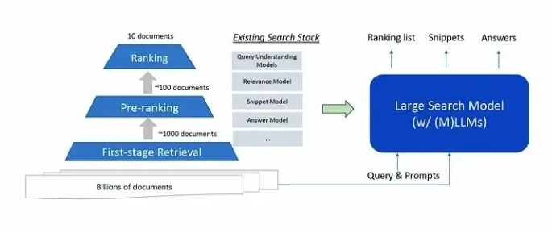

# LSM：如何用好LLMs：大型搜索模型

> 论文名称：Large Search Model: Redefining Search Stack in the Era of LLMs
> 
> 论文地址：https://arxiv.org/abs/2310.14587

## 一、动机

搜索引擎已经成为我们生活中不可或缺的一部分，它们让我们能够即时找到几乎任何想象得到的主题的信息。过去几十年搜索技术的不断发展带来了巨大的进步，从早期的关键词匹配到引入像PageRank这样的排名算法。然而，**尽管当前的搜索系统在许多情况下都非常有效，但在处理复杂的、开放式的信息需求时仍然面临着重大的局限性**。

- 神经网络信息检索基础 局限性：在生成长文本时它们倾向于产生不正确或不相关的信息；
- 检索增强生成 局限性：RAG的最佳训练策略仍是一个未解之谜。人们也对模型利用检索信息的有效性表示担忧；

## 二、大型搜索模型Large Search Models

### 2.1 LSM 思路

作者将大型搜索模型定义为一个定制的大型语言模型，它通过自然语言提示将各种搜索任务统一起来。它重新定义了由查询理解、检索、排名、摘要和问答等许多离散组件组成的传统搜索堆栈。

相反，一个大型的语言模型可以通过将这些任务构建为文本生成问题，以端到端的方式处理所有这些任务。这代表了与当前为每个任务微调专门的小型模型的范式的重大转变。

### 2.2 LSM 优势

- 增强性能：LLM架构和规模使得语言理解和推理能力更强，提高了结果质量。
- 简化堆栈：将不同的组件合并为单一模型，降低了工程复杂性。
- 灵活接口：提示功能可实现无需重新训练即可无缝定制新任务。
- 更好的泛化：统一建模利用了任务间知识转移和数据增强。

### 2.3 Prompt 的作用

与其添加特定任务的参数，提示提供了一个界面来定制大型搜索模型的行为，以适应多样化的任务：

- 下文学习：提供输入输出示例能够实现小样本适应。
- 指令微调：自然语言指令可以在没有示例的情况下指导模型。

这使得在推理时可以实现零样本泛化。例如，通过修改提示，同一个模型就可以处理排名、生成和解释任务。

### 2.4 长上下文建模

许多搜索任务需要对长篇内容进行推理，比如多轮对话或多文档摘要。但是，由于计算限制，当前的大型语言模型（LLM）架构在处理长文本方面存在局限性。

模型训练、推理技术和硬件能力的进步正在迅速扩大上下文长度，从数百个令牌扩展到数万个令牌。但在模型能够充分利用文档级或集合级上下文之前，仍有很大的改进空间。

强大而高效的长上下文建模对于大型搜索模型来说至关重要，它能够生成连贯、相关且全面的输出。这也使得在许多文档上进行检索增强成为可能。

### 2.5 多模态能力

网页内容包括图片、视频和结构化数据等多媒体数据。能够联合处理文本和视觉信息的多模态大型语言模型可以显著提高搜索性能。

它们允许通过多种方式进行查询，并生成格式正确的结果。例如，图像查询可以检索到相关的文本文档。或者，关于历史事件的文本查询可能会生成一个简短的视频摘要。

多模态基础模型，如DALL-E 2和Flamingo，展示了这种搜索潜力。但是，扩大感知模块并确保与语言模型紧密集成仍然是一个未解决的挑战。

## 致谢

- 如何用好LLMs：大型搜索模型 https://zhuanlan.zhihu.com/p/671744859