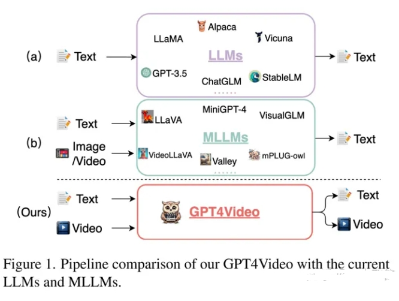

# GPT4Video：统一视频理解和生成的多模态大语言模型

> 论文名称：GPT4Video: A Unified Multimodal Large Language Model for lnstruction-Followed Understanding and Safety-Aware Generation
> 
> 论文地址：https://arxiv.org/abs/2311.16511
> 
> 论文示例：https://gpt4video.github.io/

## 前言

- 论文背景：当前的多模态大语言模型（MLLM）已经验证多模态数据融合的有效性，但没有工作去探索多模态信息的生成；
- 论文方法：
  - 在一个多模态大模型框架下，可以做到视频的理解和生成；
  - 视频生成不需要额外的训练参数，可以任意选择一个预训练好的文生视频的模型。

## 一、背景知识

### 1.1 Text-Text

- 介绍：这是大语言模型最常见的使用方式，主要用于问答和聊天场景。
- 思路：
  - 输入一段文字，输出也是一段相应的文字回复；
  - 输出的文字的具体内容取决于训练数据和训练方式，例如ChatGPT训练过程首先使用大量的网络数据进行预训练，然后使用人工标注的数据进行fine-tune，最后再使用基于人类反馈的强化学习优化模型输出的内容，所以ChatGPT的输出就非常接近于人类对于问题的回复。

### 1.2 Image/Video Conditioned Text-Text

- 介绍：多模态大语言模型的经典结构，主要用于图像和视频的理解任务。
- 思路：
  - 首先融合文本和视觉信息的特征，将融合后的特征输入到解码器得到相应的文本回复；
  - 这个流程本质上还是Text-Text，只是输入的信息不仅仅是文本信息，而是融合了视觉特征的文本特征。

### 1.3 Video Conditioned Text-Text/Video

- 介绍：本文提出的多模态大语言模型，可以用于视频的理解和生层
- 思路：
  - 首先融合视频特征和文本特征，将融合后的特征输入到大语言模型得到视频的描述，将描述文本输入到预训练的Text-Video模型，得到生成的视频。

## 二、GPT4Video总体框架

GPT4Video框架由三个子模块组成：

1. 视频理解模块。首先通过video feature extractor提取视频特征，然后通过video abstractor对齐视频特征和LLM；
2. 大语言模型。使用LLaMA预训练的参数，通过LoRA进行微调；
3. 视频生成模块。将LLM输出的Prompt输入到Text-Video模型，得到生成的视频。

## 致谢

- GPT4Video：统一视频理解和生成的多模态大语言模型 https://zhuanlan.zhihu.com/p/671660004