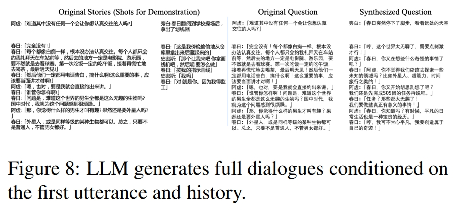
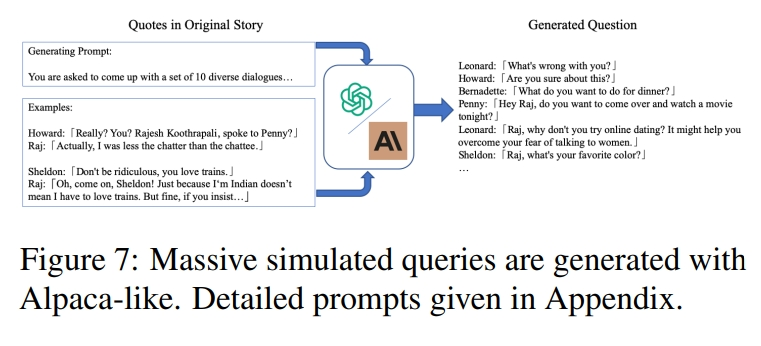
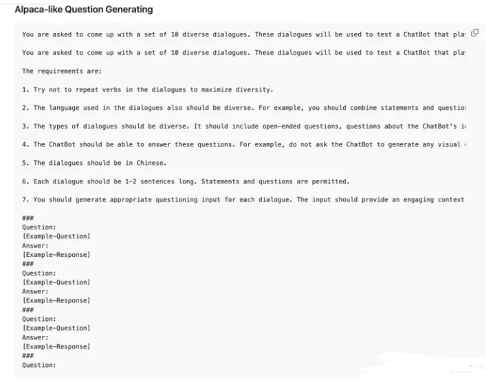

# ChatHaruhi

> 论文名称：ChatHaruhi: Reviving Anime Character in Reality via Large Language Model
> 
> 论文地址：https://arxiv.org/abs/2308.09597
> 
> Github 地址：https://github.com/LC1332/Chat-Haruhi-Suzumiya/tree/main

## 一、Zero-Shot Prompting

进行System Prompting是最简单的方式。

一个常见的Prompt如下（源自ChatHaruhi）：

```s
I want you to act like {character} from {series}.
I want you to respond and answer like {character} using the tone, manner and vocabulary {character} would use. 
Do not write any explanations. 
Only answer like {character}. 
You must know all of the knowledge of {character}. 
My first sentence is "Hi {character}."
```

## 二、ChatHaruhi 优化策略

1. 允许LLM复用few-shot examples。即允许LLM在相似场景下，直接使用角色的对话内容；
2. 在结尾额外加上一段人物性格描述，以强化生成效果。

> eg:一段针对白展堂的System Prompt如下。


## 三、ChatHaruhi Dialogue数据的合成方法

ChatHaruhi主要采用的方法是 **generate dialogue from question**。



- 思路：将目标role发言前的内容作为question，给到LLM，让其继续完成这个dialogue。同时为了优化生成效果，论文也采取了few-shot prompting的策略。在实验中，有50%的概率会生成多轮对话。

可以发现，这一合成方法基于已有的dialogue数据进行再次合成，但对于一些本身数据较少的角色不太友好，因为其本身能用作question的数据不够。

什么不够就生成什么，论文因此又提出了question generation方法。



其思路是：**给LLM一些question-answer示例，让其模仿生成更多的question**。其prompt如下。



通过question generation流程，可以得到更多的question，随后将其送往generation dialogue from question流程，便能够生成更多的dialogue数据。

通过使用这两种方法，ChatHaruhi将原本22K的dialogue数据，扩增到了54K。

## 致谢

- [角色扮演论文浅读：RoleLLM、Character-LLM以及ChatHaruhi](https://zhuanlan.zhihu.com/p/668207639)
