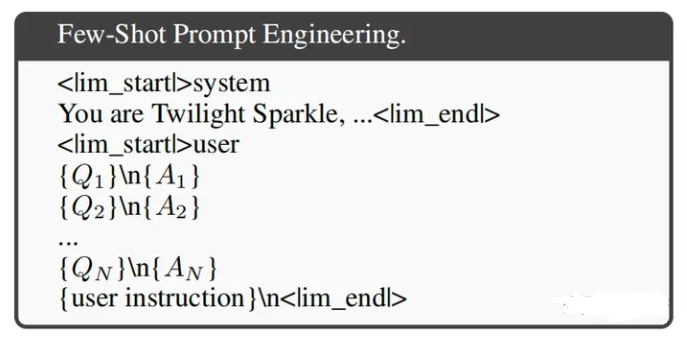
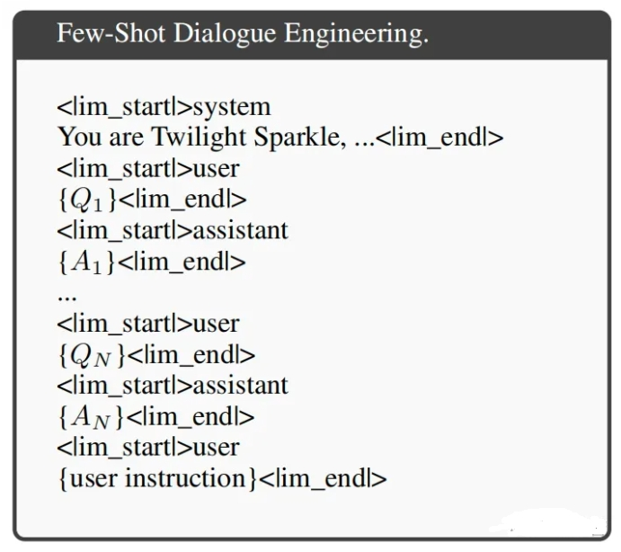
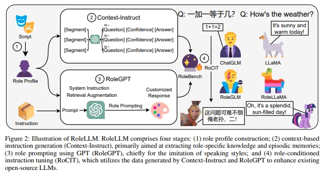

# RoleLLM

> 论文名称：RoleLLM: Benchmarking, Eliciting, and Enhancing Role-Playing Abilities of Large Language Models
> 
> 论文地址：https://arxiv.org/abs/2310.00746

## 一、Few-Shot Prompting / In-Context Learning

加入few-shot examples（从该角色的历史dialogue数据中检索而来），有助于LLM获取相关知识、模仿角色的风格。

## 二、RoleLLM 所用 两种Few-Shot方法

### 2.1 single-turn prompt

- 介绍：在单轮对话中一次性引入examples
- 示例：

### 2.2 multi-turn prompt

- 介绍：RoleLLM称之为dialogue engineering，即将对话过程以user和assistant角色交替写入。
- 示例：

## 二、RoleLLM 数据合成方法

1. 思路一：**general domain**。收集开源的general instructions（如英文领域的Super-NaturalInstruct、中文领域的COIG等），然后给到RoleGPT，**让其在通用问题上，生成模仿某个角色的对话**；
2. 思路二：**role-specific**。即论文所谓的Context-Instruct
   1. 核心思路：根据Role Profile来生成Question、Answer，这样生成的**dialogue数据更加与role本身相关，因此有role-specific的特点**；
   2. Role Profile分为两部分：
      1. role description、catchphrases，这部分由GPT生成；
      2. 结构化好的历史dialogue，也是从剧本数据中提取而来；
   3. 在生成Question、Answer时，将两部分profile分别给到LLM，让其生成question、对应的answer、以及confidence score（置信度），最终仅保留高置信度的非重复数据。

RoleLLM的数据合成方法比较体系化，这样能够增加合成数据的多样性，这是值得学习的一点。

不过其原生方法所生成的数据都是单轮的，这是硬伤（Character-LLM和ChatHaruhi则没有这个问题）。但论文作者也指出，可以借助Baize[5]和CAMEL[6]的技术来生成多轮数据。

