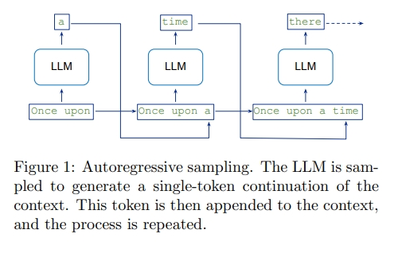
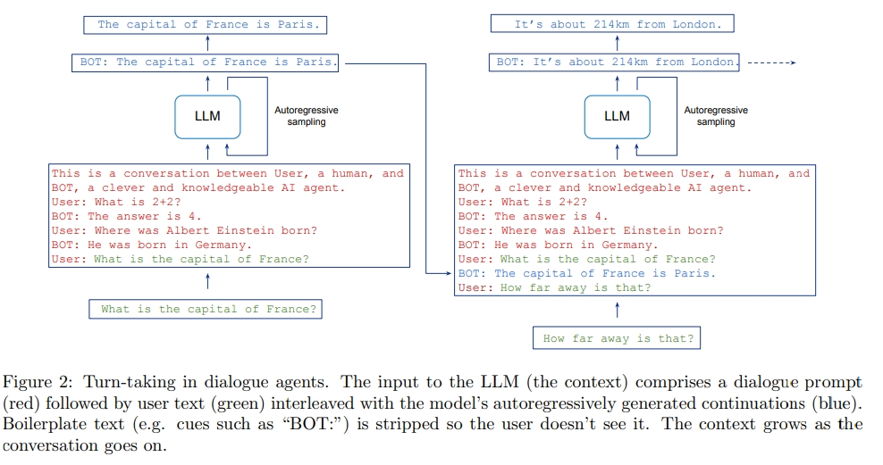

# 大语言模型的角色扮演(Role-Play with Large Language Models)

> 论文名称：Role-Play with Large Language Models
> 
> 论文链接：https://arxiv.org/pdf/2305.1636

## 一、动机

大型语言模型(LLM)有许多使用场景，可以提示它们展示各种各样的行为，包括对话，会产生强烈感觉：这与一个类人对话者在对话。

然而，**基于LLM的对话agents在很多方面与人类非常不同**。一个人的语言技能，是他们通过与世界交互而获得的认知能力的延伸，并通过在一个语言使用者组成的社区中成长而获得，这些语言使用者也居住在那个世界中。相比之下，一个LLM是一个无实体的神经网络，它在一个大型的人类生成文本语料上进行了训练：通过一系列词(token)作为上下文，以预测给定上下文的下一个词(token)为目标。

尽管存在这些本质的不同，一个经过适当提示和采样的LLM可以嵌入到一个轮流对话的系统中，并可信地模仿人类语言的使用，这给我们带来了一个困难的困境。

- 一方面，**使用我们描述人类行为的相同语言来描述对话agents是自然的**，如：自由地使用“知道”、“理解”和“思考”等词汇。试图通过使用更科学精确的替代词来避免这样的词汇通常会导致笨拙、难以理解的文本;
- 另一方面，**如果过于在字面意义上理解这种语言，会促进人格化、夸大这些AI系统与人类之间的相似之处，而掩盖其内在的区别**。

## 二、论文思路

如果我们理解其他人类的概念框架不适合基于LLM的对话agents，那么我们可能**需要一个替代的概念框架，一组新的隐喻，这些隐喻（metaphors）可以有效应用于这些类心智成果的，以帮助我们在突出它们的本质不同的同时，以开拓其创造性应用潜力的方式来思考和讨论它们**。

在本文中，提出了两个基本的隐喻(metaphors)来描述基于LLM的对话agents。

- 首先，从简单的观点来看，我们可以**将对话agents视为扮演一个单一角色**。
- 其次，从更细微的观点来看，我们可以**将对话agents视为角色在多元宇宙中的模拟重叠**。

正如我们将看到的，这两种观点都有其优势，这表明思考这种agents的最有效策略不是坚持使用单一隐喻，而是自由地在多个隐喻之间切换。

采用这一概念框架，使我们能够在不落入概念陷阱的情况下，探讨欺骗和自我意识等重要话题。

## 致谢

- 【LLM】大语言模型的角色扮演(Role-Play with Large Language Models) https://zhuanlan.zhihu.com/p/666476957

