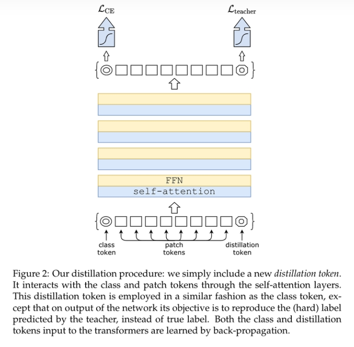

# DeiT：ViT&模型蒸馏

> 论文链接：https://arxiv.org/abs/2012.12877
> 
> 发表单位：FaceBook AI & Sorbonne University
> 
> 源码地址：https://github.com/facebookrese

## 一、什么是 模型蒸馏？

模型蒸馏，作为模型压缩的方法之一，其开山之作是 [Distilling the Knowledge in a Neural Network](https://arxiv.org/abs/1503.02531) 这篇论文，非常经典.

- 模型蒸馏的主要流程:
  - 先使用训练集训练出来一个完整复杂的teacher模型;
  - 然后设计一个小规模的student模型，再固定teacher模型的权重参数;
  - 然后使用训练集和teacher模型的输出同时对student模型进行训练，此时就需要设计一系列loss，让student模型在蒸馏学习的过程中逐渐向teacher模型的表现特性靠拢，使得student模型的预测精度逐渐逼近teacher模型

- 模型蒸馏的关键不揍: loss 函数构建
  - teacher模型输出与student模型输出之间的蒸馏损失(如KL散度)；
  - student模型输出与原始数据标签之间的交叉熵损失；

## 二、DeiT的具体方法

Deit并没有提出比较新颖的模型结构，对比ViT模型结构就是引入了一个distillation token作为蒸馏输出与teacher模型的输出计算蒸馏损失，而teacher模型可以选择Transformer模型也可以选择CNN模型(具体的蒸馏效果，作者做了一些对比实验)

## 致谢

- DeiT：ViT&模型蒸馏 https://zhuanlan.zhihu.com/p/471384477
